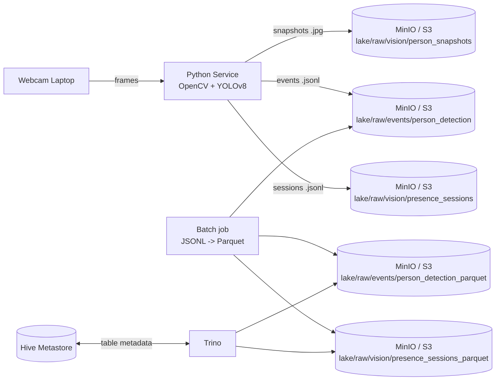

## Biểu đồ mermaid ban đầu

```mermaid
flowchart LR
  CAM[Webcam Laptop] -->|frames| APP[Python Service<br/>OpenCV + YOLOv8]
  APP -->|snapshots .jpg| S3S[(MinIO / S3<br/>lake/raw/vision/person_snapshots)]
  APP -->|events .jsonl| S3E[(MinIO / S3<br/>lake/raw/events/person_detection)]
  APP -->|sessions .jsonl| S3SS[(MinIO / S3<br/>lake/raw/vision/presence_sessions)]

  BATCH[Batch job<br/>JSONL -> Parquet] --> S3E
  BATCH --> S3EP[(MinIO / S3<br/>lake/raw/events/person_detection_parquet)]
  BATCH --> S3SP[(MinIO / S3<br/>lake/raw/vision/presence_sessions_parquet)]

  HMS[(Hive Metastore)] <-->|table metadata| TRINO[Trino]
  TRINO --> S3EP
  TRINO --> S3SP
```