# Mini Data Lake + CDC (Debezium) + Kafka + RabbitMQ + MinIO + Hive Metastore + Trino (+ DVC)

Repo này là một **mini data lake chạy bằng Docker Compose**, mô phỏng một pipeline dữ liệu thực tế với đầy đủ các thành phần phổ biến trong hệ sinh thái data engineering / data platform.

Mục tiêu của repo:
- Hiểu **luồng dữ liệu end-to-end** (OLTP → CDC → Streaming → Data Lake → Query).
- Thực hành **CDC với Debezium + Kafka**.
- Lưu trữ dữ liệu **raw/analytics trên S3 (MinIO)**.
- Query dữ liệu bằng **Trino + Hive Metastore**.
- Tách **alert/event** bằng **RabbitMQ**.
- Version hóa **dataset/model** bằng **DVC**.

---

## 1) Thành phần chính trong hệ thống

- **PostgreSQL (inventory)**  
  Hệ OLTP nguồn (source DB) để demo CDC.

- **Debezium + Kafka Connect**  
  Bắt thay đổi (INSERT/UPDATE/DELETE) từ PostgreSQL thông qua WAL (CDC) và đẩy ra Kafka topic.

- **Kafka**  
  Event bus cho CDC và streaming.

- **RabbitMQ (cluster 2 node)**  
  Messaging cho alert/event nhẹ (pub/sub, routing key).

- **MinIO (S3-compatible)**  
  Data Lake storage (raw zone): Parquet, JSONL, ảnh, frame video…

- **Hive Metastore (HMS) + metastore-db (PostgreSQL)**  
  Metadata catalog cho bảng Hive/Trino.

- **Trino**  
  SQL query engine đọc Parquet trên MinIO thông qua Hive Metastore.

- **DVC**  
  Versioning dataset/model, remote đặt trên MinIO bucket `dvcstore`.

---

## 2) Kiến trúc hệ thống & luồng dữ liệu

### 2.1 Tổng quan (Data Platform)

```mermaid
flowchart LR
  %% =========================
  %% EDGE / AI PRODUCER
  %% =========================
  subgraph EDGE["Edge / AI App (YOLO)"]
    CAM["Camera/RTSP/USB<br/>(OpenCV)"] --> YOLO["YOLO Inference<br/>(person)"]
    YOLO --> AGG["Event Aggregator<br/>(window=5s)<br/>- person_present<br/>- person_count<br/>- conf stats<br/>- frame_uri"]
  end

  %% =========================
  %% REALTIME ALERT PATH (RabbitMQ)
  %% =========================
  subgraph MQ["RabbitMQ (Realtime Alerts)"]
    EX["Exchange: vision.alerts (topic)"]
    Q1["Queue: q_person_present<br/>routingKey=person.present"]
    Q2["Queue: q_person_gone<br/>routingKey=person.gone"]
    EX --> Q1
    EX --> Q2
  end

  AGG -->|"publish JSON<br/>person.present/gone"| EX
  Q1 --> ALERTSVC["Alert Consumer<br/>(Slack/Email/UI)"]
  Q2 --> ALERTSVC

  %% =========================
  %% RAW STORAGE PATH (MinIO)
  %% =========================
  subgraph RAW["Raw Storage (MinIO / S3)"]
    MINIO["MinIO Bucket: lake<br/>raw/vision_events/..."]
    FRAMES["MinIO Bucket: lake<br/>raw/frames/... (optional)"]
  end

  AGG -->|"write Parquet/JSONL<br/>partition by camera/date/hour"| MINIO
  YOLO -->|"optional snapshot<br/>frame image"| FRAMES

  %% =========================
  %% METADATA + QUERY (HMS + Trino)
  %% =========================
  subgraph METAQUERY["Metadata & Query"]
    HMSDB["metastore-db<br/>(Postgres)"]
    HMS["Hive Metastore<br/>(thrift :9083)"]
    TRINO["Trino<br/>Coordinator+Worker<br/>(:8080)"]
    HMSDB <-->|"metadata tables"| HMS
    HMS <-->|"metastore.uri"| TRINO
  end

  %% FIX: escape ':' in s3a://
  MINIO -->|"external_location (s3a&#58;//bucket/path)"| TRINO
  TRINO --> BI["DBeaver / SQL Client<br/>Query hive.raw.vision_events"]

  %% =========================
  %% OLTP + CDC PATH
  %% =========================
  subgraph OLTP["OLTP + CDC"]
    PG["cdc-postgres (inventory)<br/>Table: public.customers<br/>(or vision_events_oltp)"]
    DBZ["Debezium Connector<br/>(Kafka Connect)"]
    KAFKA["Kafka<br/>Topic: pgserver1.public.customers<br/>(and others)"]
    UI["Kafka UI<br/>(:8081)"]
    PG -->|"WAL logical decoding"| DBZ
    DBZ --> KAFKA
    KAFKA --> UI
  end

  %% Optional: landing CDC to MinIO
  subgraph CDC_LANDING["CDC Landing to Data Lake"]
    CDCJOB["Consumer/ETL Job<br/>(kafka consumer)<br/>-> JSONL/Parquet"]
  end

  KAFKA --> CDCJOB -->|"write cdc jsonl/parquet"| MINIO
  TRINO -->|"query CDC landing"| BI

  %% =========================
  %% DVC (DATA VERSIONING)
  %% =========================
  subgraph DVCSUB["DVC (Versioning / Reproducibility)"]
    DVCSTORE["MinIO Bucket: dvcstore<br/>(DVC remote)"]
    PIPE["DVC Pipeline Stages<br/>- generate<br/>- ingest<br/>- validate<br/>- query"]
  end

  PIPE --> DVCSTORE
  MINIO -. "data tracked by dvc<br/>(optional for datasets)" .-> PIPE

```





Cách đọc nhanh (đúng với hệ thống bạn đang build):
- Nhánh YOLO → MinIO: bạn ghi raw events (Parquet/JSONL) vào bucket lake, partition theo camera_id/date/hour. Đây là “data lake raw zone”.
- Hive Metastore + Trino: Hive Metastore chỉ giữ metadata (schema, location) trong metastore-db. Trino dùng metadata đó để query file Parquet trên MinIO.
- Postgres + Debezium + Kafka: dành cho OLTP + CDC (dữ liệu thay đổi liên tục). Debezium đọc WAL → đẩy event vào Kafka topic.
- Kafka → MinIO landing (optional): nếu muốn phân tích CDC bằng Trino, bạn cần 1 job consumer để đổ CDC event về MinIO (jsonl/parquet).
- RabbitMQ: dành cho realtime alert (độ trễ thấp, push/sub). Không thay thế Kafka; nó là nhánh “thông báo tức thời”.
- DVC: versioning dữ liệu/pipeline (lưu artifact/metadata vào dvcstore trên MinIO) để bạn chạy lại pipeline có kiểm soát.

### 2.2 Luồng “Vision Event” - use-case “5 giây còn người thì tiếp tục” (state machine + event types: person_present_start, person_present_heartbeat, person_present_end).

```mermaid
flowchart LR
  %% =========================
  %% Vision app (YOLO) -> Events
  %% =========================
  subgraph Edge["Edge / Vision App"]
    CAM["Camera / RTSP / Webcam"] --> YOLO["YOLO Person Detector\n(15 FPS, window 5s)"]
    YOLO --> EV["Event Builder\n(person_present / person_count / conf)\n+ frame_uri (optional)"]
  end

  %% =========================
  %% Realtime messaging
  %% =========================
  subgraph MQ["Realtime Messaging"]
    RMQ["RabbitMQ\n(vision.alerts exchange)"]
    KAFKA["Kafka\n(topics: vision.events / cdc.*)"]
  end

  EV -->|publish alert| RMQ
  EV -->|publish events| KAFKA

  %% =========================
  %% OLTP & CDC
  %% =========================
  subgraph OLTP["OLTP + CDC"]
    PG["PostgreSQL (inventory)\nTables: customers, ..."]
    DBZ["Debezium Connect\nCDC from Postgres"]
  end

  RMQ -->|consumer writes alerts| PG
  KAFKA -->|stream consumer writes facts| PG

  PG -->|WAL / logical decoding| DBZ
  DBZ -->|CDC events| KAFKA

  %% =========================
  %% Data Lake storage
  %% =========================
  subgraph Lake["Data Lake (Raw Zone)"]
    MINIO["MinIO (S3)\nBuckets: lake / dvcstore"]
    RAWP["Raw Parquet\ns3://lake/raw/vision_events/..."]
    RAWJ["Raw JSONL (CDC dump)\ns3://lake/raw/cdc/..."]
  end

  KAFKA -->|batch/stream sink| RAWP
  KAFKA -->|CDC to JSONL| RAWJ
  RAWP --> MINIO
  RAWJ --> MINIO

  %% =========================
  %% Metadata + Query
  %% =========================
  subgraph MetaQuery["Metadata + Query"]
    HMSDB["metastore-db (Postgres)\nHive Metastore metadata store"]
    HMS["Hive Metastore\n(thrift://:9083)"]
    TRINO["Trino\n(hive catalog -> MinIO)"]
  end

  MINIO -->|external_location| HMS
  HMSDB <-->|schemas/tables| HMS
  HMS -->|table metadata| TRINO
  TRINO -->|SQL query| BI["DBeaver / BI / Client"]

  %% =========================
  %% Versioning / Repro
  %% =========================
  subgraph Repro["Reproducibility"]
    DVC["DVC\ntracks datasets/artifacts"]
    GIT["Git\ncode + configs"]
  end

  MINIO <-->|remote storage| DVC
  DVC --> GIT

  %% Notes
  classDef core fill:#eef,stroke:#447,stroke-width:1px;
  class YOLO,EV,RMQ,KAFKA,PG,DBZ,MINIO,HMS,TRINO core;

```





YOLO → event → RabbitMQ/Kafka → Postgres/MinIO → Hive Metastore → Trino → DBeaver/BI

---

## 3) Port mapping nhanh

| Service | Host port | Ghi chú |
|------|---------|--------|
| MinIO S3 API | 9000 | bucket: lake, iot-time-series, dvcstore |
| MinIO Console | 9001 | UI |
| Trino UI/API | 8080 | /ui |
| Kafka | 9092 | broker |
| Kafka UI | 8081 | UI |
| Kafka Connect | 8083 | REST |
| Postgres metastore-db | 5432 | hive |
| Postgres inventory | 5433 | dbz |
| RabbitMQ node 1 | 5672 / 15672 | AMQP / UI |
| RabbitMQ node 2 | 5673 / 15673 | AMQP / UI |

---

## 4) Chạy hệ thống

```bash
docker compose up -d
docker ps
```

Health check:

```bash
curl -sf http://localhost:9000/minio/health/live && echo OK
curl -sf http://localhost:8080/v1/info && echo OK
curl -sf http://localhost:8083/ && echo OK
```

---

## 5) Kiểm tra bằng DBeaver

### Trino
```sql
SHOW SCHEMAS FROM hive;
SHOW TABLES FROM hive.raw;
SELECT * FROM hive.raw.vision_events LIMIT 10;
```

### PostgreSQL inventory
```sql
SELECT * FROM public.customers;
```

---

## 6) Vai trò từng công nghệ

- **PostgreSQL**: OLTP source
- **Debezium + Kafka**: CDC pipeline
- **Kafka**: event bus
- **RabbitMQ**: alert & workflow
- **MinIO**: data lake storage
- **Hive Metastore**: metadata catalog
- **Trino**: SQL query engine
- **DVC**: dataset/model versioning

---

## 7) Ghi chú
Repo phục vụ học tập và demo pipeline production-like.

Sơ đồ tư duy tổng hợp:
- Dữ liệu sinh ra từ đâu? -> cdc-postgres (nghiệp vụ) và Code Python (camera).
- Dữ liệu đi đường nào? -> Đi qua kafka (CDC) hoặc rabbitmq (Alerts).
- Dữ liệu nằm ở đâu? -> Nằm hết trong minio (S3).
- Làm sao tìm thấy dữ liệu? -> Nhờ hive-metastore chỉ đường.
- Làm sao lấy dữ liệu ra báo cáo? -> Dùng trino viết SQL.