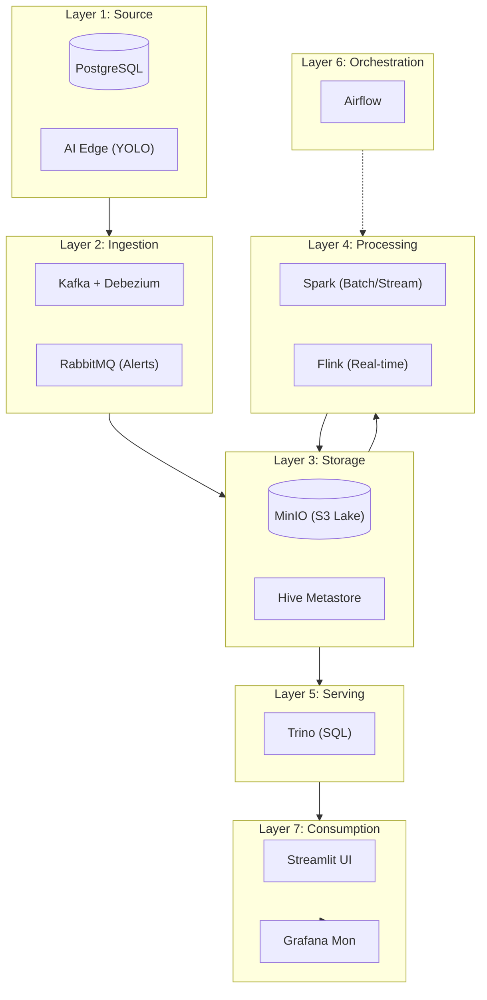

# 🏗️ ARCHITECTURE OVERVIEW - Mini Data Lake
> **Project Context**: End-to-end Data Engineering pipeline with CDC, Streaming, and Batch processing.

---

## 1. 7-Layer Data Platform Architecture

Hệ thống được tổ chức thành 7 lớp chức năng, mỗi lớp đảm nhận một vai trò cụ thể trong vòng đời dữ liệu.

### 🖼️ Data LifeCycle Visualization

*(Lưu ý: Ảnh này được generate tự động để minh họa luồng dữ liệu)*

### Sơ đồ luồng (Flowchart)

---

## 2. Vai Trò Từng Công Nghệ (Technology Stack)

| Layer | Công nghệ | Mục đích sử dụng |
|:---:|:---|:---|
| **1** | **PostgreSQL** | Cơ sở dữ liệu nghiệp vụ (OLTP), nguồn dữ liệu CDC. |
| **1** | **YOLOv11** | Mô hình AI phát hiện đối tượng từ camera video stream. |
| **2** | **Debezium** | Bắt sự kiện thay đổi (CDC) từ Postgres đẩy vào Kafka topic. |
| **2** | **Kafka** | Event Bus truyền tải dữ liệu dung lượng lớn (Vision events, CDC). |
| **2** | **RabbitMQ** | Hệ thống tin nhắn nhẹ cho các cảnh báo tức thời (Real-time Alerts). |
| **3** | **MinIO** | Lưu trữ đối tượng (S3-compatible), đóng vai trò là Data Lake (Raw/Processed). |
| **3** | **Hive Metastore** | Catalog quản lý Metadata (schema, partition) cho Data Lake. |
| **4** | **Apache Spark** | Xử lý dữ liệu quy mô lớn (Batch ETL & Structured Streaming). |
| **4** | **Apache Flink** | Xử lý luồng dữ liệu phức tạp với độ trễ cực thấp (Low-latency Streaming). |
| **5** | **Trino** | Engine SQL phân tán, cho phép query trực tiếp trên MinIO. |
| **6** | **Apache Airflow** | Điều phối toàn bộ quy trình, lên lịch chạy các công việc xử lý. |
| **7** | **Prometheus** | Thu thập các chỉ số vận hành (Metrics) từ toàn bộ hệ thống. |
| **7** | **Grafana** | Hiển thị Dashboard theo dõi sức khỏe và hiệu năng hệ thống. |
| **7** | **Streamlit** | Xây dựng ứng dụng Dashboard tương tác cho người dùng cuối. |

---

## 3. Luồng Dữ Liệu Chi Tiết (Data Interaction)

### Luồng 1: Dữ liệu nghiệp vụ (Business Data)
- **Cơ chế**: CDC (Change Data Capture).
- **Luồng**: `Postgres` -> `Debezium` -> `Kafka` -> `Spark` -> `MinIO` (Parquet).
- **Phục vụ**: Báo cáo tài chính, phân tích khách hàng.

### Luồng 2: Dữ liệu sự kiện AI (Vision Data)
- **Cơ chế**: Streaming.
- **Luồng**: `Camera/YOLO` -> `Kafka` -> `Flink` -> `MinIO` (JSONL/Parquet).
- **Phục vụ**: Theo dõi lượng người, phát hiện xâm nhập vùng cấm.

---

## 4. Thông Tin Cổng Kết Nối (Access Ports)

| Service | Port | Link |
|:---|:---|:---|
| **Streamlit UI** | 8501 | [http://localhost:8501](http://localhost:8501) |
| **MinIO Console** | 9001 | [http://localhost:9001](http://localhost:9001) |
| **Kafka UI** | 8081 | [http://localhost:8081](http://localhost:8081) |
| **Trino UI** | 8080 | [http://localhost:8080](http://localhost:8080) |
| **Airflow UI** | 8085 | [http://localhost:8085](http://localhost:8085) |
| **Grafana UI** | 3000 | [http://localhost:3000](http://localhost:3000) |
| **Spark Master** | 8090 | [http://localhost:8090](http://localhost:8090) |
| **Flink UI** | 8092 | [http://localhost:8092](http://localhost:8092) |

---

## 5. Hướng Dẫn Vận Hành

1. **Khởi động**: `docker compose up -d` tại thư mục chứa file `docker-compose.yml`.
2. **Kiểm tra**: Chạy `./run_tests.sh` để đảm bảo các kết nối giữa các layer đã sẵn sàng.
3. **Giám sát**: Truy cập Grafana để xem các biểu đồ tài nguyên và Prometheus targets.
