# 📊 Data LifeCycle - Vòng Đời Dữ Liệu

> **Tài liệu tổng quan** về hành trình dữ liệu từ nguồn gốc đến tiêu thụ trong kiến trúc Data Platform hiện đại.

DATA LIFECYCLE – REALISTIC MODERN DATA STACK

(Hybrid Batch + Streaming Pipeline)

1. Tổng quan Data Lifecycle

Data Lifecycle mô tả toàn bộ vòng đời của dữ liệu, từ lúc nó được sinh ra cho tới khi:

được phân tích,

phục vụ dashboard,

dùng cho ML,

hoặc được đẩy ngược lại product.

Theo hình kiến trúc, lifecycle gồm 6 stage chính, được điều phối và giám sát bởi Orchestration & Observability layer.

Source → Ingestion → Raw Storage → Processing → Serving → Consumption


Pipeline này được gọi là Hybrid Pipeline vì:

Có Batch (ETL, historical data)

Có Streaming (CDC, real-time events)

2. Stage 1 – Source Systems (Nguồn dữ liệu)
Vai trò

Là nơi dữ liệu được sinh ra lần đầu tiên (system of record).

Các loại source phổ biến

OLTP Database

PostgreSQL, MySQL

Chứa dữ liệu nghiệp vụ: user, order, transaction

Applications / APIs

Log, event, clickstream

Thường là JSON, event-based

External Files

CSV, JSON

FTP, S3, partner data

Cần những gì?

Schema rõ ràng

Primary key / event id

Timestamp (event_time cực kỳ quan trọng)

Công nghệ

PostgreSQL / MySQL

REST API

File system / Object Storage

Lưu ý thực tế ⚠️

Source KHÔNG nên thay đổi để phục vụ data

Data team phải thích nghi với source, không ngược lại

Thiếu timestamp = ác mộng về sau

3. Stage 2 – Ingestion (Thu thập dữ liệu)
Vai trò

Đưa dữ liệu từ source vào hệ thống data một cách:

đáng tin cậy

có thể replay

scalable

Hai kiểu ingestion chính
1️⃣ Streaming Ingestion

Dùng cho:

CDC

Real-time events

Luồng

Source → CDC / Event → Message Broker


Công nghệ

Debezium (CDC)

Kafka / RabbitMQ

2️⃣ Batch Ingestion

Dùng cho:

File

Data pull theo lịch

Luồng

Source → Batch Job → Storage


Công nghệ

Python scripts

Cron / Airflow

Cần những gì?

Retry

Idempotent (chạy lại không nhân đôi)

Logging ingestion status

Lưu ý ⚠️

Ingestion ≠ transformation

Không clean data ở bước này

4. Stage 3 – Raw Storage (Data Lake – Bronze)
Vai trò

Lưu dữ liệu nguyên bản

Là single source of truth

Phục vụ reprocessing

Đặc điểm

Append-only

Không update

Không xóa (trừ khi vi phạm policy)

Dữ liệu lưu ở đây

CDC events

Log

File gốc

Event stream dump

Công nghệ

Object Storage: S3 / MinIO / HDFS

Format:

Parquet

Delta Lake / Hudi / Iceberg

Cần những gì?

Partition (theo date, source)

Naming convention

Metadata catalog

Lưu ý ⚠️

Raw data phải “xấu” và “đầy đủ”

Clean quá sớm = mất khả năng debug.

5. Stage 4 – Processing (The Kitchen)
Vai trò

Biến raw data → data có giá trị

Là nơi business logic xuất hiện

Hai loại processing
1️⃣ Stream Processing (Fast Lane)

Near real-time

Stateful

Window-based

Công nghệ

Spark Streaming

Flink

Use case

Fraud detection

Realtime metrics

Alert

2️⃣ Batch Processing

Historical data

Aggregation

Heavy transformation

Công nghệ

Apache Spark

Cần những gì?

Versioning logic

Test data

Backfill capability

Lưu ý ⚠️

Đừng nhét business logic lung tung

Phải tách:

technical transform

business transform

6. Stage 5 – Serving Storage (Data Warehouse – Gold)
Vai trò

Lưu data đã sạch

Tối ưu cho query

Phục vụ analytics

Dữ liệu ở đây

Fact tables

Dimension tables

Aggregated metrics

Công nghệ

BigQuery / Snowflake / Redshift

dbt (in-warehouse transformation)

Cần những gì?

Schema ổn định

Documentation

Data quality checks

Lưu ý ⚠️

DW không phải Data Lake

Chỉ lưu data “đáng để query”

7. Stage 6 – Consumption (Tiêu thụ dữ liệu)
Vai trò

Biến data thành insight & action

Consumer chính
📊 BI & Analytics

Dashboard

Ad-hoc query

Công nghệ

Tableau

Power BI

Superset

🤖 ML & Feature Store

Training

Online / offline features

Công nghệ

Feature Store

ML pipelines

🔁 Reverse ETL

Đẩy insight ngược về product

Công nghệ

Reverse ETL tools

Custom jobs

Lưu ý ⚠️

Không phải user nào cũng cần raw data

Serving phải phù hợp từng consumer

8. Orchestration & Observability (Xuyên suốt lifecycle)
Vai trò

Điều phối pipeline

Theo dõi health

Phát hiện lỗi sớm

Công nghệ

Airflow (orchestration)

Prometheus (metrics)

Grafana (visualization)

DataHub (data catalog)

Cần những gì?

SLA

Alerting

Lineage

9. Tổng kết – Tư duy đúng về Data Lifecycle

Data Lifecycle không phải là toolchain,
mà là tư duy tổ chức dữ liệu theo vòng đời.

Nguyên tắc sống còn

Raw ≠ Processed ≠ Serving

Batch + Streaming coexist

Orchestration là bắt buộc

Observability không phải optional

Nếu bạn muốn, bước tiếp theo mình có thể:

Viết README cho từng layer

Map lifecycle này vào mini data lake ảnh bạn đang build

Chỉ ra điểm thường sai khi implement lifecycle

Chuyển doc này thành Notion / Confluence-ready

-------

STAGE 1: SOURCE SYSTEMS (NGUỒN)
1. Định nghĩa Stage 1

Source Systems là tất cả các hệ thống:

sinh ra dữ liệu nguyên thủy

phục vụ business operation, không phải analytics

được xem là System of Record (SoR)

Mọi dữ liệu downstream (lake, warehouse, dashboard, ML)
đều phải truy ngược về được source

2. Vai trò của Source Systems trong Data Lifecycle

Stage 1 chịu trách nhiệm:

Sinh dữ liệu đúng (correctness)

Sinh dữ liệu đủ (completeness)

Ghi nhận thời điểm xảy ra sự kiện (time-awareness)

Không phá vỡ downstream khi schema thay đổi

❗ Source KHÔNG chịu trách nhiệm:

clean data

transform

aggregate

phục vụ analytics

3. Phân loại Source Systems (theo kiến trúc trong hình)
3.1 OLTP Databases
Mục đích tồn tại

Phục vụ transaction

Đảm bảo ACID

Độ trễ thấp

Ví dụ dữ liệu

users

orders

images

payments

Đặc điểm kỹ thuật

Có INSERT / UPDATE / DELETE

Schema thay đổi theo product

Rất nhạy cảm với query nặng

Công nghệ phổ biến

PostgreSQL

MySQL

Sai lầm phổ biến ❌

Dùng OLTP để làm analytics

Cho BI query thẳng DB production

Không log update/delete

👉 Đây chính là lý do CDC (Change Data Capture) ra đời

3.2 Applications / APIs (Logs & Events)
Mục đích tồn tại

Ghi lại hành vi hệ thống & user

Event-driven

Ví dụ event
{
  "event_name": "image_uploaded",
  "image_id": "img_123",
  "user_id": "u_01",
  "event_time": "2026-02-06T10:01:23Z"
}

Đặc điểm

Append-only

Không update

Có thể đến out-of-order

Có thể bị duplicate

Công nghệ

Application logs

Event emitters

REST / gRPC

Lưu ý cực kỳ quan trọng ⚠️

event_time bắt buộc phải có

processing_time không đủ để analytics đúng

3.3 External Files
Mục đích tồn tại

Nhận dữ liệu từ bên ngoài

Không realtime

Ví dụ

CSV từ đối tác

JSON config

Export thủ công

Đặc điểm

Batch

Không ổn định

Thiếu metadata

Công nghệ

CSV / JSON

FTP

S3 / Object Storage

4. Dữ liệu từ Source cần đảm bảo những gì?

Đây là phần sống còn, nhiều pipeline fail vì thiếu mấy dòng này.

4.1 Identifier (ID)

Mỗi record / event phải có ID duy nhất.

Loại source	ID
OLTP	Primary Key
Event	event_id
File	natural key hoặc synthetic key

❌ Không có ID → không dedup → không replay → không scale

4.2 Timestamp (cực kỳ quan trọng)

Tối thiểu 1, tốt nhất 2 loại:

Timestamp	Ý nghĩa
event_time	Khi sự kiện thực sự xảy ra
created_at	Khi record được ghi

👉 Streaming, windowing, late-event phụ thuộc hoàn toàn vào timestamp

4.3 Schema rõ ràng

Field name ổn định

Kiểu dữ liệu nhất quán

Không nhét logic vào field

❌ JSON “muốn nhét gì thì nhét” = thảm họa downstream

5. Source KHÔNG nên làm gì?

Đây là danh sách cấm kỵ 🚫

Clean dữ liệu

Join bảng

Aggregate

Business logic cho analytics

Optimize cho BI

Source sinh data cho business, không phải cho data team

6. Source & Ingestion – ranh giới rất rõ

Source chỉ làm:

Sinh dữ liệu → ghi DB / emit event


Ingestion mới làm:

retry

buffering

schema evolution

replay

👉 Nếu source phải “biết Kafka / Data Lake” → thiết kế sai

7. Mapping Source → Data Pipeline
Source	Kiểu ingestion
OLTP DB	CDC → Streaming
App Events	Streaming
External Files	Batch
8. Checklist đánh giá Source (trước khi build pipeline)

Trước khi đụng tới Kafka hay Spark, bắt buộc trả lời:

 Có primary key / event_id không?

 Có event_time không?

 Có update/delete không?

 Volume mỗi ngày?

 Schema có hay đổi không?

 Cho phép CDC không?

👉 Trả lời xong checklist này → mới chuyển sang Stage 2

9. Kết luận Stage 1

Stage 1 quyết định độ khó của 80% hệ thống data

Source tốt → pipeline đơn giản

Source bẩn → pipeline càng phức tạp nhưng vẫn sai


-------

STAGE 2: INGESTION (THU THẬP)

1. Ingestion là gì (hiểu đúng ngay từ đầu)

Data Ingestion là quá trình:

đưa dữ liệu từ Source Systems

vào hệ thống data trung tâm (Kafka / Data Lake / Object Storage)

một cách:

đáng tin cậy

có thể replay

không làm sập source

Ingestion KHÔNG phải ETL
Ingestion KHÔNG làm business logic

2. Vai trò của Stage 2 trong Data Lifecycle

Stage 2 chịu trách nhiệm:

Decouple source & downstream

Bảo toàn dữ liệu gốc

Chịu được failure

Cho phép replay & backfill

Chuẩn bị cho scale

Nếu ingestion thiết kế sai:

Kafka, Spark, Lake phía sau đều vô nghĩa

3. Hai chiến lược Ingestion chính

Trong kiến trúc hybrid pipeline, ingestion chia làm 2 nhánh lớn:

           ┌─ Streaming Ingestion (Realtime)
Source ────┤
           └─ Batch Ingestion (Scheduled)

4. Streaming Ingestion (Realtime / Near-realtime)
4.1 Khi nào dùng Streaming Ingestion?

Dùng khi:

dữ liệu liên tục

cần realtime / near-realtime

source có update/delete

volume lớn

Ví dụ:

CDC từ OLTP DB

user events

system logs

4.2 CDC – Change Data Capture (trụ cột ingestion hiện đại)
CDC là gì?

CDC = kỹ thuật bắt lại mọi thay đổi trong database:

INSERT

UPDATE

DELETE

👉 Thay vì query DB liên tục, ta nghe log nội bộ của DB.

CDC hoạt động như thế nào?
Postgres
  ↓ (WAL / Binlog)
CDC Connector (Debezium)
  ↓
Kafka Topic

Vì sao CDC tốt hơn batch pull?
Batch Pull	CDC
Polling	Event-driven
Miss data	Không miss
Load DB	Nhẹ
Không realtime	Realtime
Khó replay	Replay dễ

👉 Với OLTP, CDC gần như là lựa chọn bắt buộc

CDC event trông như thế nào?
{
  "op": "u",
  "before": {...},
  "after": {...},
  "ts_ms": 1707200000
}


👉 Ingestion không transform, chỉ forward & persist

Lưu ý thiết kế CDC ⚠️

Không filter business logic ở CDC

Không join bảng

Không đổi schema payload

CDC topic = raw change log

5. Message Broker – Backbone của Ingestion
5.1 Vì sao ingestion cần message broker?

Message broker giúp:

buffer data

decouple producer & consumer

scale consumer độc lập

replay dữ liệu

5.2 Kafka vs RabbitMQ (rất hay bị nhầm)
Tiêu chí	Kafka	RabbitMQ
Mục đích	Data stream	Task / message
Replay	✅	❌
Throughput	Rất cao	Trung bình
Ordering	Partition-level	Queue-level
Lưu data	Disk-based	Memory-first

👉 Kafka = ingestion backbone
👉 RabbitMQ = task / control plane

5.3 Kafka trong ingestion dùng để làm gì?

Nhận CDC events

Nhận app events

Là “buffer trung tâm” cho:

stream processing

batch dump xuống lake

5.4 Thiết kế Kafka topic cho ingestion

Nguyên tắc

1 topic = 1 logical data stream

Không trộn nhiều loại event

Ví dụ

cdc.users
cdc.orders
events.image_uploaded

6. Batch Ingestion (Scheduled / Pull-based)
6.1 Khi nào dùng Batch Ingestion?

Dùng khi:

source không hỗ trợ streaming

external files

volume nhỏ

data không cần realtime

6.2 Batch ingestion hoạt động ra sao?
Scheduler
  ↓
Batch Job (Python)
  ↓
Object Storage (Raw Zone)

6.3 Batch ingestion cần đảm bảo gì?

Idempotent (chạy lại không nhân đôi)

Có checkpoint

Có logging

Có schema validation cơ bản

6.4 Sai lầm phổ biến ❌

Overwrite file cũ

Không partition theo time

Không log ingestion status

Hard-code schema

7. Ingestion Output – dữ liệu đi đâu?

Sau ingestion, dữ liệu thường đi vào 2 nơi:

7.1 Message Broker (Kafka)

Cho stream processing

Cho fan-out consumer

7.2 Raw Storage (Data Lake – Bronze)

Dump raw events

Lưu historical data

Backup ingestion

8. Những yêu cầu bắt buộc của Ingestion Layer
8.1 Reliability

At-least-once

Không mất data

8.2 Replayability

Có thể re-consume

Có thể backfill

8.3 Observability

Lag

Throughput

Error rate

9. Những thứ ingestion KHÔNG nên làm 🚫

Business transformation

Join data

Dedup phức tạp

Enrich data

Ingestion mà “thông minh quá” = debug nightmare

10. Ingestion & Data Quality

Ingestion không clean data, nhưng nên:

validate schema

reject record hỏng nặng

log bad records

👉 Clean data là việc của Processing stage

11. Checklist thiết kế Stage 2 (rất thực tế)

Trước khi code ingestion:

 Streaming hay batch?

 Có cần CDC không?

 Kafka topic naming?

 Partition strategy?

 Replay strategy?

 Monitoring metrics?

 Dead-letter queue?

12. Kết luận Stage 2

Stage 2 quyết định pipeline có “sống dai” hay không

Ingestion tốt → downstream dễ

Ingestion yếu → downstream chữa cháy suốt đời
-------

STAGE 3: RAW STORAGE (DATA LAKE)
1. STAGE 3 là gì? (định nghĩa chuẩn)

Raw Storage (Data Lake – Bronze) là nơi:

lưu toàn bộ dữ liệu gốc

ngay sau ingestion

chưa transform

chưa clean

chưa apply business logic

Đây là single source of truth cho toàn bộ hệ thống data.

Nếu mất Raw → mất khả năng replay, audit, debug.

2. Vai trò cốt lõi của Raw Storage

Stage 3 tồn tại để giải quyết 5 vấn đề lớn:

2.1 Bảo toàn dữ liệu gốc

Không mất thông tin

Không bóp méo dữ liệu

2.2 Cho phép reprocessing

Logic sai → chạy lại

Schema đổi → backfill

2.3 Tách ingestion & processing

Ingestion đơn giản

Processing linh hoạt

2.4 Scale rẻ

Lưu trữ rất lớn

Chi phí thấp

2.5 Audit & compliance

Truy vết nguồn dữ liệu

So sánh raw vs processed

3. Bản chất kỹ thuật của Data Lake (Raw)
3.1 Data Lake KHÔNG phải Database
Tiêu chí	Data Lake	Database
Storage	File-based	Row-based
Schema	Schema-on-read	Schema-on-write
Update	❌	✅
Cost	Rẻ	Đắt
Query latency	Chậm	Nhanh

👉 Raw zone không tối ưu cho query, mà cho lưu trữ & xử lý.

3.2 Object Storage là nền tảng

Raw Storage gần như luôn dùng Object Storage:

AWS S3

GCS

Azure Blob

MinIO (on-prem)

Vì sao?

Scale gần như vô hạn

Cheap

Durable

Tách compute & storage

4. Raw Data gồm những loại gì?
4.1 CDC data

Thay đổi từ OLTP

Insert / Update / Delete

4.2 Event data

Logs

User actions

System events

4.3 Batch files

CSV

JSON

External data

👉 Tất cả đều được dump vào Raw

5. Format dữ liệu trong Raw Zone
5.1 File format – lựa chọn cực kỳ quan trọng
❌ Không nên

CSV

JSON (lâu dài)

✅ Nên

Parquet

ORC

👉 Vì:

Columnar

Compress tốt

Read nhanh cho processing

5.2 Table format (rất quan trọng trong hệ hiện đại)

Raw zone nên dùng table format:

Delta Lake

Apache Hudi

Apache Iceberg

Lợi ích

Versioning

Schema evolution

Time travel

6. Thiết kế thư mục & partition (cực kỳ quan trọng)
6.1 Nguyên tắc partition

Partition theo:

Time

Source

Logical entity

❌ Không partition theo user_id, country (high cardinality)

6.2 Ví dụ structure chuẩn
datalake/
 └── bronze/
     └── cdc/
         └── postgres/
             └── users/
                 └── year=2026/
                     └── month=02/
                         └── day=06/
                             ├── part-0001.parquet

6.3 Vì sao partition theo time?

Query nhanh hơn

Dễ lifecycle management

Dễ backfill

Dễ xóa theo policy

7. Metadata & Catalog (thường bị xem nhẹ)
7.1 Raw data KHÔNG = usable data

Muốn downstream dùng được, cần:

schema

table definition

location

7.2 Metadata được quản lý ở đâu?

Hive Metastore

Glue Catalog

DataHub (lineage)

👉 Data Lake không có metadata = Data Swamp

8. Raw Zone & Schema Evolution
8.1 Schema-on-read là con dao hai lưỡi

Linh hoạt

Nhưng:

schema drift

field mất kiểm soát

8.2 Best practices

Cho phép add column

Không rename tùy tiện

Không đổi meaning field

9. Raw Zone KHÔNG nên làm gì 🚫

Danh sách cấm kỵ:

Clean data

Deduplicate phức tạp

Join bảng

Aggregate

Business logic

Raw càng “ngu” → hệ thống càng khỏe

10. Raw Zone & Data Quality

Raw không clean, nhưng nên:

Validate schema basic

Log bad records

Lưu rejected data riêng

Ví dụ:

bronze/
 ├── valid/
 └── rejected/

11. Lifecycle Management (rất thực tế)

Raw data thường:

rất lớn

không query thường xuyên

👉 Cần policy:

Hot (30–90 ngày)

Cold (archive)

Delete theo compliance

12. Những sai lầm kinh điển khiến Data Lake thành Data Swamp

❌ Dump mọi thứ vào 1 folder
❌ Không partition
❌ Không metadata
❌ JSON tràn lan
❌ Overwrite file cũ
❌ Không versioning

👉 Hậu quả:
Không ai dám dùng data

13. Checklist thiết kế STAGE 3 (thực chiến)

Trước khi gọi là “Data Lake”, hãy chắc:

 Object Storage

 Columnar format

 Partition theo time

 Append-only

 Metadata catalog

 Raw ≠ Processed

 Lifecycle policy

14. Kết luận STAGE 3

Raw Storage là nơi bạn “mua bảo hiểm cho tương lai”

Hôm nay chưa dùng

Ngày mai sẽ cứu bạn

Nếu Stage 3 làm đúng:

Stage 4 dễ

Stage 5 sạch

ML & analytics không đau đầu

-------
STAGE 4

STAGE 3 – RAW STORAGE

(Data Lake / Bronze Layer – Kho dữ liệu thô)

4
1. STAGE 3 là gì? (định nghĩa chuẩn)

Raw Storage (Data Lake – Bronze) là nơi:

lưu toàn bộ dữ liệu gốc

ngay sau ingestion

chưa transform

chưa clean

chưa apply business logic

Đây là single source of truth cho toàn bộ hệ thống data.

Nếu mất Raw → mất khả năng replay, audit, debug.

2. Vai trò cốt lõi của Raw Storage

Stage 3 tồn tại để giải quyết 5 vấn đề lớn:

2.1 Bảo toàn dữ liệu gốc

Không mất thông tin

Không bóp méo dữ liệu

2.2 Cho phép reprocessing

Logic sai → chạy lại

Schema đổi → backfill

2.3 Tách ingestion & processing

Ingestion đơn giản

Processing linh hoạt

2.4 Scale rẻ

Lưu trữ rất lớn

Chi phí thấp

2.5 Audit & compliance

Truy vết nguồn dữ liệu

So sánh raw vs processed

3. Bản chất kỹ thuật của Data Lake (Raw)
3.1 Data Lake KHÔNG phải Database
Tiêu chí	Data Lake	Database
Storage	File-based	Row-based
Schema	Schema-on-read	Schema-on-write
Update	❌	✅
Cost	Rẻ	Đắt
Query latency	Chậm	Nhanh

👉 Raw zone không tối ưu cho query, mà cho lưu trữ & xử lý.

3.2 Object Storage là nền tảng

Raw Storage gần như luôn dùng Object Storage:

AWS S3

GCS

Azure Blob

MinIO (on-prem)

Vì sao?

Scale gần như vô hạn

Cheap

Durable

Tách compute & storage

4. Raw Data gồm những loại gì?
4.1 CDC data

Thay đổi từ OLTP

Insert / Update / Delete

4.2 Event data

Logs

User actions

System events

4.3 Batch files

CSV

JSON

External data

👉 Tất cả đều được dump vào Raw

5. Format dữ liệu trong Raw Zone
5.1 File format – lựa chọn cực kỳ quan trọng
❌ Không nên

CSV

JSON (lâu dài)

✅ Nên

Parquet

ORC

👉 Vì:

Columnar

Compress tốt

Read nhanh cho processing

5.2 Table format (rất quan trọng trong hệ hiện đại)

Raw zone nên dùng table format:

Delta Lake

Apache Hudi

Apache Iceberg

Lợi ích

Versioning

Schema evolution

Time travel

6. Thiết kế thư mục & partition (cực kỳ quan trọng)
6.1 Nguyên tắc partition

Partition theo:

Time

Source

Logical entity

❌ Không partition theo user_id, country (high cardinality)

6.2 Ví dụ structure chuẩn
datalake/
 └── bronze/
     └── cdc/
         └── postgres/
             └── users/
                 └── year=2026/
                     └── month=02/
                         └── day=06/
                             ├── part-0001.parquet

6.3 Vì sao partition theo time?

Query nhanh hơn

Dễ lifecycle management

Dễ backfill

Dễ xóa theo policy

7. Metadata & Catalog (thường bị xem nhẹ)
7.1 Raw data KHÔNG = usable data

Muốn downstream dùng được, cần:

schema

table definition

location

7.2 Metadata được quản lý ở đâu?

Hive Metastore

Glue Catalog

DataHub (lineage)

👉 Data Lake không có metadata = Data Swamp

8. Raw Zone & Schema Evolution
8.1 Schema-on-read là con dao hai lưỡi

Linh hoạt

Nhưng:

schema drift

field mất kiểm soát

8.2 Best practices

Cho phép add column

Không rename tùy tiện

Không đổi meaning field

9. Raw Zone KHÔNG nên làm gì 🚫

Danh sách cấm kỵ:

Clean data

Deduplicate phức tạp

Join bảng

Aggregate

Business logic

Raw càng “ngu” → hệ thống càng khỏe

10. Raw Zone & Data Quality

Raw không clean, nhưng nên:

Validate schema basic

Log bad records

Lưu rejected data riêng

Ví dụ:

bronze/
 ├── valid/
 └── rejected/

11. Lifecycle Management (rất thực tế)

Raw data thường:

rất lớn

không query thường xuyên

👉 Cần policy:

Hot (30–90 ngày)

Cold (archive)

Delete theo compliance

12. Những sai lầm kinh điển khiến Data Lake thành Data Swamp

❌ Dump mọi thứ vào 1 folder
❌ Không partition
❌ Không metadata
❌ JSON tràn lan
❌ Overwrite file cũ
❌ Không versioning

👉 Hậu quả:
Không ai dám dùng data

13. Checklist thiết kế STAGE 3 (thực chiến)

Trước khi gọi là “Data Lake”, hãy chắc:

 Object Storage

 Columnar format

 Partition theo time

 Append-only

 Metadata catalog

 Raw ≠ Processed

 Lifecycle policy

14. Kết luận STAGE 3

Raw Storage là nơi bạn “mua bảo hiểm cho tương lai”

Hôm nay chưa dùng

Ngày mai sẽ cứu bạn

Nếu Stage 3 làm đúng:

Stage 4 dễ

Stage 5 sạch

ML & analytics không đau đầu

📌 Bước tiếp theo – STAGE 4: PROCESSING (The Kitchen)
Mình sẽ đi rất sâu vào:

batch vs streaming processing

Spark vs Flink

xử lý CDC đúng cách

phân tách logic kỹ thuật & business

anti-pattern trong processing

Bạn xác nhận mình đi tiếp STAGE 4 nhé.

tiếp tục satge 4, phân tích chi tiết nhé

Rồi, ta vào STAGE 4 – PROCESSING nhé 🔥
Đây là “nhà bếp” của toàn bộ hệ thống data: mọi giá trị business chỉ thực sự xuất hiện ở stage này.
Mình sẽ phân tích rất sâu, đúng kiểu design doc + kinh nghiệm thực chiến.

STAGE 4 – PROCESSING

(Biến raw data thành dữ liệu có ý nghĩa)

4
1. Processing là gì (hiểu cho đúng)

Processing là giai đoạn:

đọc dữ liệu từ Raw Storage (Bronze)

áp dụng logic kỹ thuật + logic business

ghi ra Processed Storage (Silver / Gold)

Nếu ingestion là “vận chuyển”,
thì processing là nấu ăn 🍳

2. Vai trò của STAGE 4 trong Data Lifecycle

Stage 4 chịu trách nhiệm cho:

Data correctness (đúng logic)

Data usability (dùng được)

Business meaning

Performance downstream

Consistency giữa batch & streaming

Nếu stage này sai:

Dashboard sai

ML học sai

Decision sai

3. Hai loại Processing chính
           ┌─ Stream Processing (Realtime)
Raw Data ──┤
           └─ Batch Processing (Historical)


👉 Kiến trúc hiện đại luôn là hybrid, không phải chọn 1.

4. Batch Processing (xương sống của hệ thống)
4.1 Batch Processing là gì?

Xử lý data đã có sẵn

Theo lịch (hourly, daily…)

Chịu được volume lớn

Dễ debug, dễ backfill

4.2 Batch Processing làm những gì?
Các loại transform phổ biến

Technical transform

parse schema

type casting

flatten JSON

normalize field

Business transform

join bảng

derive metric

apply business rules

aggregation

4.3 Công nghệ batch phổ biến

Apache Spark

SQL-based engines

dbt (in warehouse)

👉 Spark = lựa chọn mặc định cho data lake

4.4 Ưu & nhược điểm Batch
Ưu điểm	Nhược điểm
Dễ debug	Không realtime
Backfill dễ	Latency cao
Logic rõ	Không alert tức thì
Stable	

👉 90% business metrics nên dùng batch

5. Stream Processing (fast lane – phức tạp hơn nhiều)
5.1 Stream Processing là gì?

Xử lý dữ liệu đang chảy

Near-realtime

Stateful

Phụ thuộc thời gian

5.2 Stream Processing dùng khi nào?

Chỉ dùng khi thật sự cần:

Fraud detection

Abuse detection

Realtime alert

Online feature cho ML

❗ Nếu KPI chấp nhận trễ 5–15 phút → batch đủ rồi

5.3 Độ phức tạp của streaming

Stream processing phải xử lý:

Out-of-order events

Late events

Event-time vs processing-time

Window (tumbling, sliding, session)

State management

Exactly-once semantics

👉 Debug stream = đau não 😵‍💫

5.4 Công nghệ stream phổ biến

Apache Flink

Spark Structured Streaming

👉 Flink mạnh hơn cho stateful & low latency

6. Xử lý CDC đúng cách trong Processing
6.1 CDC raw ≠ usable table

CDC raw thường có dạng:

before

after

op (c/u/d)

👉 Processing phải:

apply change

rebuild current state

6.2 Hai chiến lược xử lý CDC
1️⃣ Rebuild snapshot (batch)

Đọc toàn bộ CDC

Recompute table state

👍 Dễ, đúng
👎 Chậm

2️⃣ Incremental apply

Apply change theo event

Giữ state

👍 Realtime
👎 Phức tạp

7. Tách logic trong Processing (cực kỳ quan trọng)
7.1 Technical vs Business Logic

❌ Trộn lẫn = ác mộng

✅ Nên tách:

Layer 1 – Technical

schema

type

dedup cơ bản

Layer 2 – Business

join

metric

rule

7.2 Silver & Gold sinh ra từ đây
Bronze (Raw)
   ↓
Silver (Cleaned, normalized)
   ↓
Gold (Aggregated, business-ready)


👉 Stage 4 chính là nơi tạo Silver & Gold

8. Idempotency & Reprocessing

Processing bắt buộc phải:

idempotent

deterministic

replayable

❌ Job chạy lại → data nhân đôi
= thiết kế sai

9. Xử lý lỗi trong Processing
9.1 Bad records

Không drop silent

Lưu riêng

Có thể inspect

9.2 Partial failure

Retry

Checkpoint

Transactional write (Delta / Iceberg)

10. Performance & Cost considerations

Sai lầm thường gặp:

❌ Join quá sớm
❌ Shuffle lớn
❌ Partition sai
❌ Streaming overkill

👉 Processing ăn cost nhiều nhất trong pipeline

11. Anti-patterns trong STAGE 4 🚫

Nhét business logic vào ingestion

Streaming mọi thứ

Không version code

Không test logic

Không backfill strategy

12. Checklist thiết kế STAGE 4

Trước khi build processing:

 Batch hay stream?

 Logic nào cần realtime?

 Có CDC không?

 Idempotent chưa?

 Backfill thế nào?

 Output là Silver hay Gold?

 Monitoring metric gì?

13. Kết luận STAGE 4

Stage 4 là nơi “data engineering trở thành data product”

Là chỗ khó nhất

Là chỗ tốn tiền nhất

Là chỗ tạo ra giá trị nhất

Làm đúng:

downstream nhẹ

business tin data

Làm sai:

dashboard cãi nhau

ML fail

data team bị mất uy tín

-------

STAGE 5
STAGE 5 – SERVING

(Data Warehouse / Gold Layer – Phục vụ phân tích & sản phẩm)

4
1. STAGE 5 là gì? (định nghĩa chuẩn)

Serving Layer là nơi:

lưu dữ liệu đã sẵn sàng để sử dụng

tối ưu cho:

analytics

BI

reporting

product consumption

độ trễ thấp, query nhanh, schema ổn định

Nếu data ở đây khó dùng
→ toàn bộ pipeline coi như thất bại

2. Vai trò cốt lõi của STAGE 5

Stage 5 chịu trách nhiệm cho:

Fast query

Consistent metrics

Business-friendly schema

Concurrency cao

Stable contract với consumer

👉 Đây là layer bị business “đụng” nhiều nhất

3. Serving khác gì Processing?
Processing (Stage 4)	Serving (Stage 5)
Transform	Consume
Logic phức tạp	Logic đơn giản
Batch / Stream	Query
Data engineer	Analyst / BI / Product
Thay đổi thường xuyên	Phải ổn định

Processing có thể “bẩn”
Serving bắt buộc sạch & rõ ràng

4. Dữ liệu trong Serving Layer gồm những gì?
4.1 Gold Tables (chuẩn nhất)

Fact tables

Dimension tables

Aggregated metrics

Ví dụ:

fact_image_uploads

dim_users

daily_image_stats

4.2 Data Marts (theo domain)

Chia theo:

marketing

product

finance

operations

👉 Mỗi team không nên query raw gold lung tung

5. Schema design – linh hồn của Stage 5
5.1 Star Schema (chuẩn BI)

Fact

metric

số lượng lớn

append-only

Dimension

descriptive

thay đổi chậm (SCD)

5.2 Vì sao schema quan trọng?

Analyst không muốn join 10 bảng

BI tool cần schema rõ

Metric phải 1 nghĩa duy nhất

👉 Schema xấu = dashboard loạn

6. Công nghệ cho STAGE 5
6.1 Data Warehouse (managed)

BigQuery

Snowflake

Amazon Redshift

Ưu điểm

Query rất nhanh

Quản lý dễ

Scale tốt

Nhược điểm

Cost cao

Lock-in

6.2 Lakehouse / Query Engine

Trino

Presto

Ưu điểm

Query trực tiếp Data Lake

Linh hoạt

Ít lock-in

Nhược điểm

Ops khó hơn

Performance phụ thuộc data layout

6.3 Khi nào chọn cái nào?
Trường hợp	Nên chọn
Team nhỏ, muốn nhanh	BigQuery
Multi-cloud, scale lớn	Snowflake
On-prem / open-source	Trino
Lake-first strategy	Lakehouse
7. Serving không chỉ là storage
7.1 Semantic Layer (rất quan trọng)

Metric definition

Business logic thống nhất

Công cụ:

dbt

Metric layer

👉 Không có semantic layer → mỗi dashboard một kiểu

7.2 Access Control & Security

Row-level security

Column masking

Role-based access

Serving layer = điểm nhạy cảm nhất về data leak

8. Performance optimization (thực chiến)
8.1 Partition & Clustering

Partition theo time

Cluster theo dimension hay filter

8.2 Pre-aggregation

Daily / hourly stats

Tránh query raw fact quá lớn

8.3 Materialized views

Dùng cho dashboard hot

9. Consumer của STAGE 5
9.1 BI & Analytics

Tableau

Power BI

Superset

👉 BI = workload nặng + concurrency cao

9.2 Product & Application

Feature flags

In-app analytics

Experimentation

👉 Serving phải predictable latency

9.3 Reverse ETL (bắt đầu từ đây)

Đẩy insight ngược về product

CRM, marketing tools

10. Anti-patterns ở STAGE 5 🚫

Query thẳng Bronze / Silver

Business logic trong BI tool

Mỗi team tự định nghĩa metric

Không version schema

Không ownership table

11. Data Contract & Ownership

Mỗi table ở Serving nên có:

Owner

Description

SLA

Freshness

Schema contract

👉 Data = product, không phải file dump

12. Checklist thiết kế STAGE 5

Trước khi gọi là “Serving ready”:

 Schema business-friendly

 Metric có định nghĩa rõ

 Query nhanh

 Access control

 BI tool chạy ổn

 Có owner table

 Có doc

-------

STAGE 6
1. STAGE 6 là gì?

Consumption & Activation là giai đoạn:

dữ liệu được con người hoặc hệ thống sử dụng

để:

phân tích

ra quyết định

hành động

tự động hóa

Nếu data không được dùng ở stage này
→ toàn bộ pipeline phía trước chỉ là chi phí

2. Vai trò của STAGE 6 trong Data Lifecycle

Stage 6 chịu trách nhiệm:

Deliver insight

Enable decision

Drive action

Close the feedback loop

Chứng minh ROI của data platform

Đây là stage gần business nhất, ít kỹ thuật nhất, nhưng ảnh hưởng lớn nhất.

3. Các nhóm Consumer chính

Trong thực tế, consumer chia làm 4 nhóm lớn:

BI / Analytics
Product & App
ML / AI Systems
Reverse ETL / Activation

4. BI & Analytics Consumption
4.1 Mục đích

Hiểu chuyện gì đã xảy ra

Theo dõi KPI

Ra quyết định chiến lược

4.2 Consumer là ai?

Business

PM

Ops

Leadership

4.3 Công nghệ thường dùng

Tableau

Power BI

Superset

4.4 Yêu cầu với data

Đúng

Dễ hiểu

1 metric = 1 nghĩa

Freshness rõ ràng

👉 BI ghét nhất là:

metric không nhất quán

số hôm nay khác hôm qua không rõ lý do

5. Product & Application Consumption
5.1 Mục đích

Cá nhân hóa

Experiment (A/B test)

Feature flag

In-app analytics

5.2 Đặc điểm

Cần latency thấp

Query đơn giản

SLA rõ ràng

5.3 Ví dụ

Hiển thị số ảnh đã upload

Gợi ý nội dung

Cảnh báo bất thường cho user

👉 Không thể cho product query trực tiếp warehouse nặng

6. ML / AI Consumption
6.1 Mục đích

Training model

Inference

Recommendation

Fraud detection

6.2 Offline vs Online
Loại	Dùng cho
Offline features	Training
Online features	Realtime inference

👉 Hai loại phải consistent, nếu không model học một đằng, chạy một nẻo

6.3 Feature Store

Chuẩn hóa feature

Chia sẻ giữa team

Versioning feature

👉 Không có feature store = ML không scale

7. Reverse ETL – Activation (rất quan trọng, hay bị bỏ quên)
7.1 Reverse ETL là gì?

Đưa data từ warehouse/lakehouse
ngược trở lại hệ thống operational

7.2 Ví dụ

Push user segment sang CRM

Push churn score sang app

Push recommendation sang backend

7.3 Vì sao Reverse ETL quan trọng?

Insight không nằm trên dashboard

Insight phải tạo hành động

👉 Không có activation → data chỉ để xem

8. Feedback Loop – vòng đời khép kín

STAGE 6 tạo ra:

Action
  ↓
User behavior
  ↓
New data
  ↓
Source systems


👉 Data Lifecycle không phải đường thẳng, mà là vòng lặp

9. Yêu cầu phi chức năng (rất hay bị quên)
9.1 Trust

Data đúng

Có owner

Có doc

9.2 Usability

Không cần hiểu SQL phức tạp

Metric dễ hiểu

9.3 Timeliness

Freshness rõ

Trễ bao nhiêu cũng phải nói rõ

10. Anti-patterns ở STAGE 6 🚫

Có dashboard nhưng không ai dùng

Mỗi team copy data về Excel

Business tự định nghĩa metric

Insight không dẫn đến action

Không feedback lại data team

11. Checklist đánh giá STAGE 6

Một hệ thống data chỉ thực sự thành công nếu:

 Business dùng dashboard hằng ngày

 Product dùng data trong app

 ML dùng chung feature

 Có reverse ETL

 Insight → action

 Có feedback loop

12. Kết luận STAGE 6

Data chỉ có giá trị khi nó thay đổi quyết định hoặc hành vi

Không dùng → vô nghĩa

Dùng sai → nguy hiểm

Dùng đúng → competitive advantage

STAGE 6 chính là nơi:

data platform chứng minh giá trị

data team chứng minh vai trò chiến lược

13. Tổng kết toàn bộ Data Lifecycle (từ Stage 1 → 6)
Source
 → Ingestion
 → Raw Storage
 → Processing
 → Serving
 → Consumption & Activation
     ↺ (feedback loop)
-------

## 📋 Mục Lục

1. [Data LifeCycle là gì?](#1-data-lifecycle-là-gì)
2. [Sơ Đồ Tư Duy Tổng Hợp](#2-sơ-đồ-tư-duy-tổng-hợp)
3. [The Modern Data Stack - 6 Tầng Kiến Trúc](#3-the-modern-data-stack---6-tầng-kiến-trúc)
4. [Tầng 1: Source Systems (Nguồn)](#4-tầng-1-source-systems-nguồn)
5. [Tầng 2: Ingestion (Thu Thập)](#5-tầng-2-ingestion-thu-thập)
6. [Tầng 3: Raw Storage (Kho Thô - Data Lake)](#6-tầng-3-raw-storage-kho-thô---data-lake)
7. [Tầng 4: Processing (Xử Lý - "The Kitchen")](#7-tầng-4-processing-xử-lý---the-kitchen)
8. [Tầng 5: Serving Storage (Kho Sạch - Data Warehouse)](#8-tầng-5-serving-storage-kho-sạch---data-warehouse)
9. [Tầng 6: Consumption (Tiêu Thụ)](#9-tầng-6-consumption-tiêu-thụ)
10. [Cross-Cutting: Orchestration & Observability](#10-cross-cutting-orchestration--observability)
11. [So Sánh Các Mô Hình Kiến Trúc](#11-so-sánh-các-mô-hình-kiến-trúc)

---

## 1. Data LifeCycle là gì?

### 1.1 Định Nghĩa

**Data LifeCycle** (Vòng đời dữ liệu) mô tả **toàn bộ hành trình của dữ liệu** từ khi được sinh ra, thu thập, lưu trữ, xử lý, phân phối, cho đến khi được tiêu thụ để tạo ra giá trị kinh doanh.

```
📌 Công thức đơn giản:
   Data LifeCycle = Creation → Collection → Storage → Processing → Distribution → Consumption
```

### 1.2 Tại Sao Data LifeCycle Quan Trọng?

| Vấn đề | Không có Data LifeCycle | Có Data LifeCycle |
|--------|-------------------------|-------------------|
| **Data Silos** | Dữ liệu phân tán, không kết nối | Dữ liệu tập trung, có governance |
| **Data Quality** | Không biết nguồn gốc, khó validate | Traceable, có data contracts |
| **Time-to-Insight** | Chờ IT, mất tuần/tháng | Self-service, mất phút/giờ |
| **Scalability** | Bottleneck khi scale | Kiến trúc phân tán, elastic |
| **Cost** | Chi phí ẩn, không optimize | Tối ưu theo tier (hot/warm/cold) |

### 1.3 Các Metrics Quan Trọng

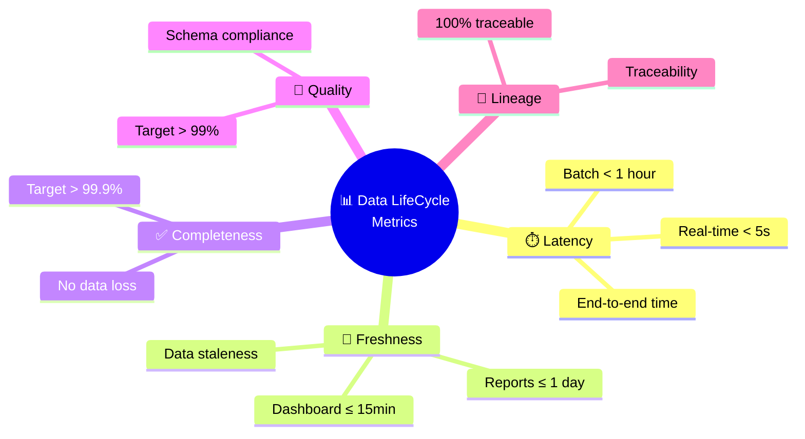
```mermaid
mindmap
  root((📊 Data LifeCycle<br/>Metrics))
    ⏱️ Latency
      End-to-end time
      Real-time < 5s
      Batch < 1 hour
    🔄 Freshness
      Data staleness
      Dashboard ≤ 15min
      Reports ≤ 1 day
    ✅ Completeness
      No data loss
      Target > 99.9%
    🎯 Quality
      Schema compliance
      Target > 99%
    🔗 Lineage
      Traceability
      100% traceable
```

---

## 2. Sơ Đồ Tư Duy Tổng Hợp

### 2.1 Mind Map: Data LifeCycle Ecosystem

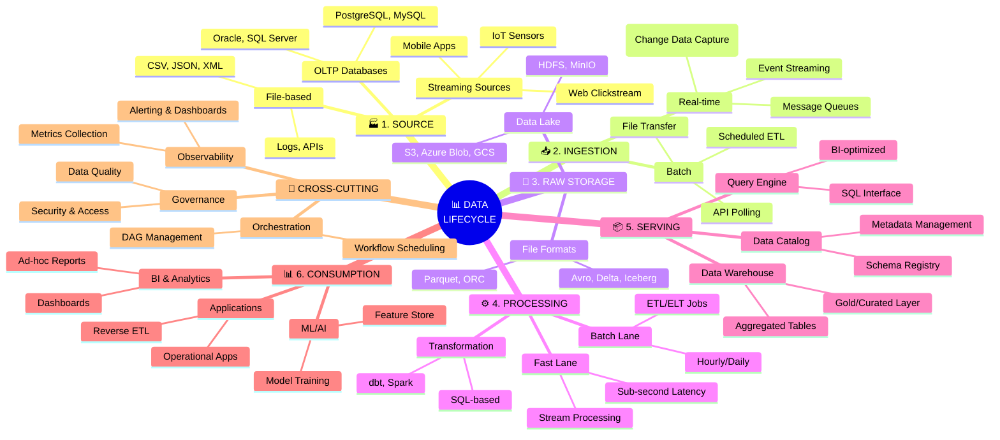
```mermaid
mindmap
  root((📊 DATA<br/>LIFECYCLE))
    🏭 1. SOURCE
      OLTP Databases
        PostgreSQL, MySQL
        Oracle, SQL Server
      Streaming Sources
        IoT Sensors
        Mobile Apps
        Web Clickstream
      File-based
        CSV, JSON, XML
        Logs, APIs
    📥 2. INGESTION
      Real-time
        CDC (Change Data Capture)
        Event Streaming
        Message Queues
      Batch
        Scheduled ETL
        File Transfer
        API Polling
    💾 3. RAW STORAGE
      Data Lake
        S3, Azure Blob, GCS
        HDFS, MinIO
      File Formats
        Parquet, ORC
        Avro, Delta, Iceberg
    ⚙️ 4. PROCESSING
      Fast Lane
        Stream Processing
        Sub-second Latency
      Batch Lane
        ETL/ELT Jobs
        Hourly/Daily
      Transformation
        dbt, Spark
        SQL-based
    📦 5. SERVING
      Data Warehouse
        Gold/Curated Layer
        Aggregated Tables
      Data Catalog
        Metadata Management
        Schema Registry
      Query Engine
        SQL Interface
        BI-optimized
    📊 6. CONSUMPTION
      BI & Analytics
        Dashboards
        Ad-hoc Reports
      ML/AI
        Feature Store
        Model Training
      Applications
        Reverse ETL
        Operational Apps
    🔧 CROSS-CUTTING
      Orchestration
        Workflow Scheduling
        DAG Management
      Observability
        Metrics Collection
        Alerting & Dashboards
      Governance
        Data Quality
        Security & Access
```

### 2.2 Data Flow Architecture

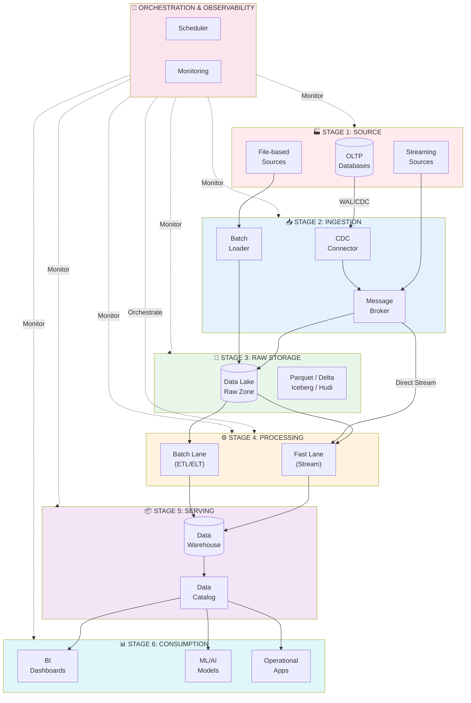
```mermaid
flowchart TB
    subgraph S1["🏭 STAGE 1: SOURCE"]
        OLTP[(OLTP<br/>Databases)]
        STREAM[Streaming<br/>Sources]
        FILES[File-based<br/>Sources]
    end

    subgraph S2["📥 STAGE 2: INGESTION"]
        direction LR
        CDC[CDC<br/>Connector]
        MQ[Message<br/>Broker]
        BATCH_LOAD[Batch<br/>Loader]
    end

    subgraph S3["💾 STAGE 3: RAW STORAGE"]
        LAKE[(Data Lake<br/>Raw Zone)]
        FORMAT["Parquet / Delta<br/>Iceberg / Hudi"]
    end

    subgraph S4["⚙️ STAGE 4: PROCESSING"]
        direction LR
        FAST["Fast Lane<br/>(Stream)"]
        SLOW["Batch Lane<br/>(ETL/ELT)"]
    end

    subgraph S5["📦 STAGE 5: SERVING"]
        DW[(Data<br/>Warehouse)]
        CATALOG[Data<br/>Catalog]
    end

    subgraph S6["📊 STAGE 6: CONSUMPTION"]
        BI[BI<br/>Dashboards]
        ML[ML/AI<br/>Models]
        APPS[Operational<br/>Apps]
    end

    subgraph OPS["🔧 ORCHESTRATION & OBSERVABILITY"]
        ORCH[Scheduler]
        MON[Monitoring]
    end

    OLTP -->|WAL/CDC| CDC
    STREAM --> MQ
    FILES --> BATCH_LOAD
    
    CDC --> MQ
    MQ --> LAKE
    BATCH_LOAD --> LAKE
    
    LAKE --> FAST
    LAKE --> SLOW
    MQ -->|Direct Stream| FAST
    
    FAST --> DW
    SLOW --> DW
    
    DW --> CATALOG
    CATALOG --> BI & ML & APPS
    
    OPS -.->|Orchestrate| S4
    OPS -.->|Monitor| S1 & S2 & S3 & S4 & S5 & S6
    
    style S1 fill:#ffebee
    style S2 fill:#e3f2fd
    style S3 fill:#e8f5e9
    style S4 fill:#fff3e0
    style S5 fill:#f3e5f5
    style S6 fill:#e0f7fa
    style OPS fill:#fce4ec
```

---

## 3. The Modern Data Stack - 6 Tầng Kiến Trúc

### 3.1 Tổng Quan Kiến Trúc

```
┌─────────────────────────────────────────────────────────────────────────────────┐
│                         THE MODERN DATA STACK                                    │
│                        (Hybrid Pipeline Architecture)                            │
├──────────────┬────────────────┬──────────────────────────────────────────────────┤
│   Tầng       │    Vai Trò     │    Công Nghệ Phổ Biến                            │
├──────────────┼────────────────┼──────────────────────────────────────────────────┤
│ 1. Source    │ Sinh dữ liệu   │ PostgreSQL, MySQL, Kafka, IoT, APIs              │
│ 2. Ingestion │ Thu thập       │ Debezium, Kafka Connect, Airbyte, Fivetran       │
│ 3. Raw Store │ Lưu trữ thô    │ S3, GCS, Azure Blob, Delta Lake, Iceberg         │
│ 4. Processing│ Xử lý/biến đổi │ Spark, Flink, dbt, Dataflow                      │
│ 5. Serving   │ Phục vụ query  │ Snowflake, BigQuery, Redshift, Trino             │
│ 6. Consume   │ Tiêu thụ       │ Tableau, Looker, PowerBI, Superset, ML Platform  │
├──────────────┴────────────────┴──────────────────────────────────────────────────┤
│ Cross-Cutting: Airflow, Dagster (Orchestration) │ Prometheus, Grafana (Monitor)  │
└─────────────────────────────────────────────────────────────────────────────────┘
```

### 3.2 Luồng Dữ Liệu Theo Thời Gian

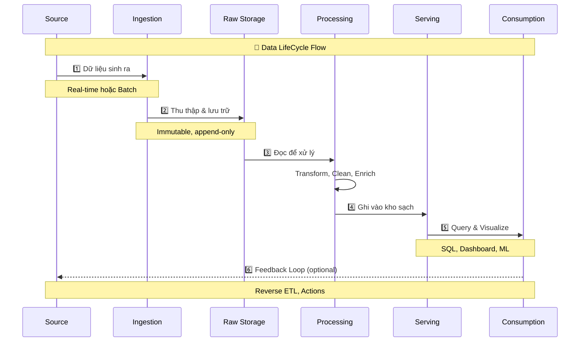
```mermaid
sequenceDiagram
    participant SRC as Source
    participant ING as Ingestion
    participant RAW as Raw Storage
    participant PROC as Processing
    participant SERVE as Serving
    participant CONS as Consumption
    
    Note over SRC,CONS: 🔄 Data LifeCycle Flow
    
    SRC->>ING: 1️⃣ Dữ liệu sinh ra
    Note over SRC,ING: Real-time hoặc Batch
    
    ING->>RAW: 2️⃣ Thu thập & lưu trữ
    Note over ING,RAW: Immutable, append-only
    
    RAW->>PROC: 3️⃣ Đọc để xử lý
    PROC->>PROC: Transform, Clean, Enrich
    PROC->>SERVE: 4️⃣ Ghi vào kho sạch
    
    SERVE->>CONS: 5️⃣ Query & Visualize
    Note over SERVE,CONS: SQL, Dashboard, ML
    
    CONS-->>SRC: 6️⃣ Feedback Loop (optional)
    Note over CONS,SRC: Reverse ETL, Actions
```

---

## 4. Tầng 1: Source Systems (Nguồn)

### 4.1 Định Nghĩa

**Source Systems** là nơi dữ liệu **được sinh ra lần đầu tiên**. Đây là "ground truth" của toàn bộ data pipeline.

### 4.2 Phân Loại Nguồn Dữ Liệu

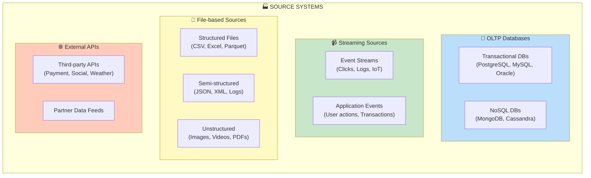
```mermaid
flowchart TB
    subgraph SOURCES["🏭 SOURCE SYSTEMS"]
        direction TB
        
        subgraph OLTP["📁 OLTP Databases"]
            DB1["Transactional DBs<br/>(PostgreSQL, MySQL, Oracle)"]
            DB2["NoSQL DBs<br/>(MongoDB, Cassandra)"]
        end
        
        subgraph STREAM["📹 Streaming Sources"]
            S1["Event Streams<br/>(Clicks, Logs, IoT)"]
            S2["Application Events<br/>(User actions, Transactions)"]
        end
        
        subgraph FILES["📄 File-based Sources"]
            F1["Structured Files<br/>(CSV, Excel, Parquet)"]
            F2["Semi-structured<br/>(JSON, XML, Logs)"]
            F3["Unstructured<br/>(Images, Videos, PDFs)"]
        end
        
        subgraph API["🌐 External APIs"]
            A1["Third-party APIs<br/>(Payment, Social, Weather)"]
            A2["Partner Data Feeds"]
        end
    end
    
    style OLTP fill:#bbdefb
    style STREAM fill:#c8e6c9
    style FILES fill:#fff9c4
    style API fill:#ffccbc
```

### 4.3 Đặc Điểm Quan Trọng

| Đặc điểm | Mô tả | Ví dụ |
|----------|-------|-------|
| **Volume** | Lượng dữ liệu sinh ra | 10GB/ngày vs 10TB/ngày |
| **Velocity** | Tốc độ sinh dữ liệu | Real-time vs Daily batch |
| **Variety** | Đa dạng format | SQL, JSON, Images |
| **Veracity** | Độ tin cậy | 99.9% uptime |

### 4.4 Data Contracts

**Data Contract** là thỏa thuận giữa producer và consumer về:
- **Schema**: Cấu trúc dữ liệu (columns, types)
- **SLA**: Service Level Agreement (uptime, latency)
- **Quality**: Các rules validate (not null, range checks)
- **Versioning**: Cách handle schema evolution

```
📌 Best Practice: Luôn định nghĩa Data Contract trước khi build pipeline
```

---

## 5. Tầng 2: Ingestion (Thu Thập)

### 5.1 Định Nghĩa

**Ingestion Layer** là cầu nối giữa Source và Storage, đảm bảo dữ liệu được **thu thập đáng tin cậy** với **độ trễ phù hợp**.

### 5.2 Hai Mô Hình Thu Thập

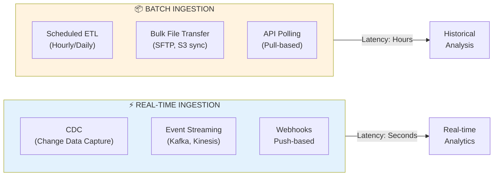
```mermaid
flowchart LR
    subgraph REALTIME["⚡ REAL-TIME INGESTION"]
        direction TB
        CDC["CDC<br/>(Change Data Capture)"]
        STREAMING["Event Streaming<br/>(Kafka, Kinesis)"]
        WEBHOOK["Webhooks<br/>Push-based"]
    end
    
    subgraph BATCH["📦 BATCH INGESTION"]
        direction TB
        ETL["Scheduled ETL<br/>(Hourly/Daily)"]
        BULK["Bulk File Transfer<br/>(SFTP, S3 sync)"]
        POLL["API Polling<br/>(Pull-based)"]
    end
    
    REALTIME --> |"Latency: Seconds"| OUTPUT1["Real-time<br/>Analytics"]
    BATCH --> |"Latency: Hours"| OUTPUT2["Historical<br/>Analysis"]
    
    style REALTIME fill:#e3f2fd
    style BATCH fill:#fff3e0
```

### 5.3 CDC (Change Data Capture)

**CDC** là kỹ thuật bắt các thay đổi (INSERT/UPDATE/DELETE) từ database nguồn mà **không ảnh hưởng performance**.

```
📌 Cách hoạt động:
   Database → Write-Ahead Log (WAL) → CDC Connector → Message Broker → Consumers
```

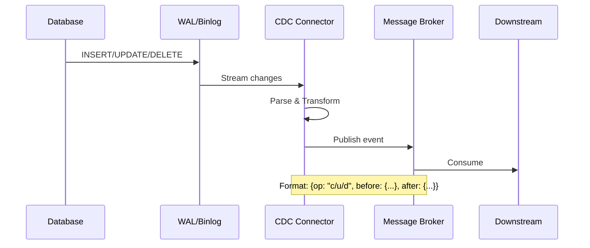
```mermaid
sequenceDiagram
    participant DB as Database
    participant WAL as WAL/Binlog
    participant CDC as CDC Connector
    participant MQ as Message Broker
    participant SINK as Downstream
    
    DB->>WAL: INSERT/UPDATE/DELETE
    WAL->>CDC: Stream changes
    CDC->>CDC: Parse & Transform
    CDC->>MQ: Publish event
    MQ->>SINK: Consume
    
    Note over CDC,MQ: Format: {op: "c/u/d", before: {...}, after: {...}}
```

### 5.4 Message Brokers

| Công nghệ | Use Case | Đặc điểm |
|-----------|----------|----------|
| **Apache Kafka** | High-throughput streaming | Durable, partitioned, replay-able |
| **RabbitMQ** | Low-latency messaging | Simple, flexible routing |
| **AWS Kinesis** | Cloud-native streaming | Managed, auto-scale |
| **Google Pub/Sub** | Event-driven architecture | Serverless, global |

---

## 6. Tầng 3: Raw Storage (Kho Thô - Data Lake)

### 6.1 Định Nghĩa

**Raw Storage** (Data Lake) lưu trữ dữ liệu **nguyên bản, không biến đổi** (immutable). Đây là "single source of truth" cho mọi xử lý downstream.

### 6.2 Kiến Trúc Data Lake

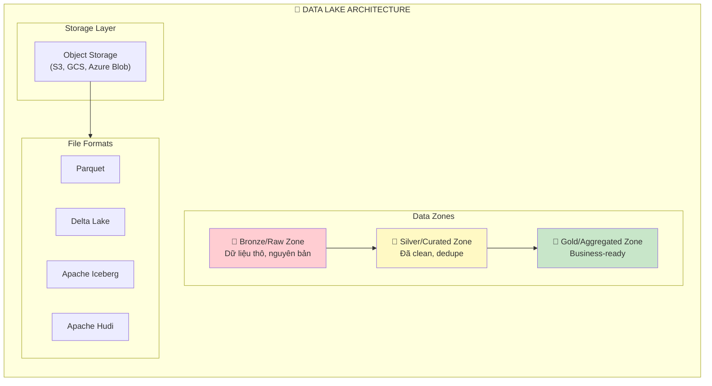
```mermaid
flowchart TB
    subgraph LAKE["💾 DATA LAKE ARCHITECTURE"]
        direction TB
        
        subgraph ZONES["Data Zones"]
            BRONZE["🥉 Bronze/Raw Zone<br/>Dữ liệu thô, nguyên bản"]
            SILVER["🥈 Silver/Curated Zone<br/>Đã clean, dedupe"]
            GOLD["🥇 Gold/Aggregated Zone<br/>Business-ready"]
        end
        
        subgraph STORAGE["Storage Layer"]
            OBJ["Object Storage<br/>(S3, GCS, Azure Blob)"]
        end
        
        subgraph FORMATS["File Formats"]
            F1["Parquet"]
            F2["Delta Lake"]
            F3["Apache Iceberg"]
            F4["Apache Hudi"]
        end
    end
    
    BRONZE --> SILVER --> GOLD
    OBJ --> FORMATS
    
    style BRONZE fill:#ffcdd2
    style SILVER fill:#fff9c4
    style GOLD fill:#c8e6c9
```

### 6.3 Tại Sao Lưu Dữ Liệu Thô?

| Benefit | Giải thích |
|---------|------------|
| **Reproducibility** | Có thể replay/reprocess từ đầu |
| **Flexibility** | Chưa biết use case tương lai? Vẫn có raw data |
| **Audit Trail** | Lịch sử đầy đủ cho compliance |
| **Schema Evolution** | Thay đổi schema mà không mất data |
| **Debug** | Trace ngược khi có issue |

### 6.4 File Formats So Sánh

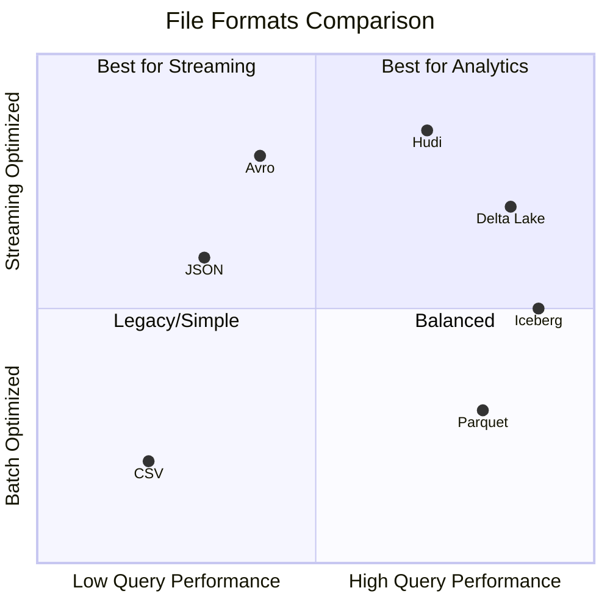
```mermaid
quadrantChart
    title File Formats Comparison
    x-axis Low Query Performance --> High Query Performance
    y-axis Batch Optimized --> Streaming Optimized
    quadrant-1 Best for Analytics
    quadrant-2 Best for Streaming
    quadrant-3 Legacy/Simple
    quadrant-4 Balanced
    
    Parquet: [0.8, 0.3]
    Delta Lake: [0.85, 0.7]
    Iceberg: [0.9, 0.5]
    Hudi: [0.7, 0.85]
    Avro: [0.4, 0.8]
    CSV: [0.2, 0.2]
    JSON: [0.3, 0.6]
```

| Format | Compression | Schema | ACID | Best For |
|--------|-------------|--------|------|----------|
| **Parquet** | ✅ High | Embedded | ❌ | Batch analytics |
| **Delta Lake** | ✅ High | Evolved | ✅ | Lakehouse |
| **Iceberg** | ✅ High | Evolved | ✅ | Data warehousing |
| **Hudi** | ✅ High | Evolved | ✅ | CDC, streaming |

---

## 7. Tầng 4: Processing (Xử Lý - "The Kitchen")

### 7.1 Định Nghĩa

**Processing Layer** là nơi dữ liệu được **biến đổi, làm sạch, và làm giàu** để phục vụ các use case downstream. Được gọi là "The Kitchen" vì đây là nơi "nấu" dữ liệu thô thành "món ăn" có thể tiêu thụ.

### 7.2 Dual-Track Processing

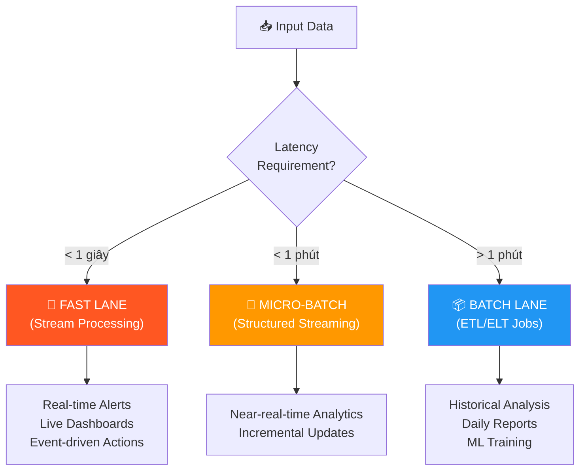
```mermaid
flowchart TB
    INPUT["📥 Input Data"] --> DECISION{Latency<br/>Requirement?}
    
    DECISION -->|"< 1 giây"| FAST["🚀 FAST LANE<br/>(Stream Processing)"]
    DECISION -->|"< 1 phút"| MICRO["🔄 MICRO-BATCH<br/>(Structured Streaming)"]
    DECISION -->|"> 1 phút"| BATCH["📦 BATCH LANE<br/>(ETL/ELT Jobs)"]
    
    FAST --> USE1["Real-time Alerts<br/>Live Dashboards<br/>Event-driven Actions"]
    MICRO --> USE2["Near-real-time Analytics<br/>Incremental Updates"]
    BATCH --> USE3["Historical Analysis<br/>Daily Reports<br/>ML Training"]
    
    style FAST fill:#ff5722,color:#fff
    style MICRO fill:#ff9800,color:#fff
    style BATCH fill:#2196f3,color:#fff
```

### 7.3 Stream Processing vs Batch Processing

| Khía cạnh | Stream Processing | Batch Processing |
|-----------|-------------------|------------------|
| **Latency** | Milliseconds - Seconds | Minutes - Hours |
| **Data Size** | Unbounded (infinite) | Bounded (finite) |
| **Trigger** | Event-driven | Schedule-driven |
| **State** | Stateful, incremental | Stateless, full recompute |
| **Công nghệ** | Flink, Kafka Streams | Spark, dbt |
| **Use case** | Alerts, fraud detection | Reports, ML training |

### 7.4 ETL vs ELT

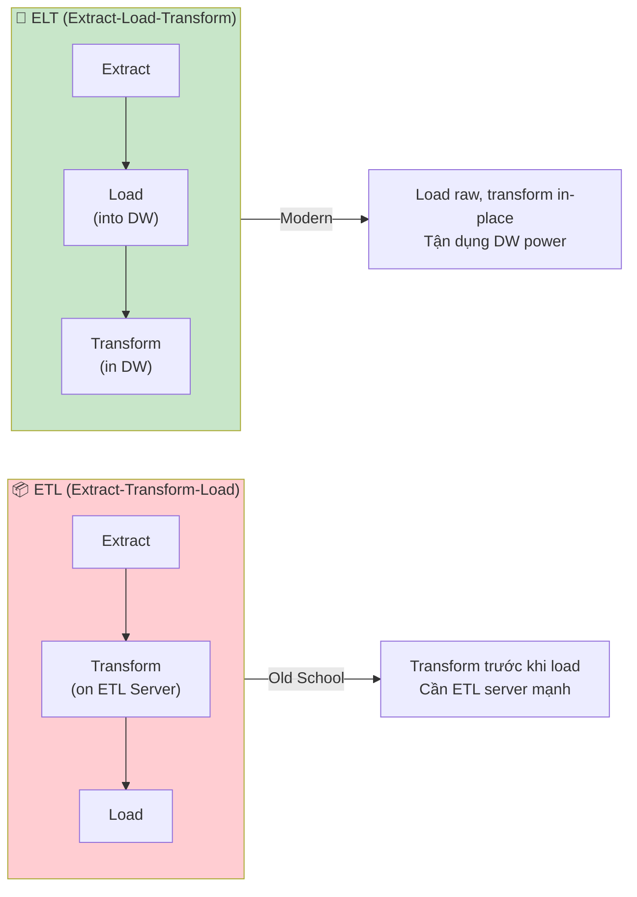
```mermaid
flowchart LR
    subgraph ETL["📦 ETL (Extract-Transform-Load)"]
        E1["Extract"] --> T1["Transform<br/>(on ETL Server)"] --> L1["Load"]
    end
    
    subgraph ELT["🔄 ELT (Extract-Load-Transform)"]
        E2["Extract"] --> L2["Load<br/>(into DW)"] --> T2["Transform<br/>(in DW)"]
    end
    
    ETL --> |"Old School"| DESC1["Transform trước khi load<br/>Cần ETL server mạnh"]
    ELT --> |"Modern"| DESC2["Load raw, transform in-place<br/>Tận dụng DW power"]
    
    style ETL fill:#ffcdd2
    style ELT fill:#c8e6c9
```

```
📌 Trend hiện tại: ELT đang thắng thế nhờ sức mạnh của cloud data warehouse
```

---

## 8. Tầng 5: Serving Storage (Kho Sạch - Data Warehouse)

### 8.1 Định Nghĩa

**Serving Layer** chứa dữ liệu đã được **transform và tối ưu** cho việc query. Đây là nơi "dữ liệu sạch" được phục vụ cho BI tools và end-users.

### 8.2 Kiến Trúc Serving Layer

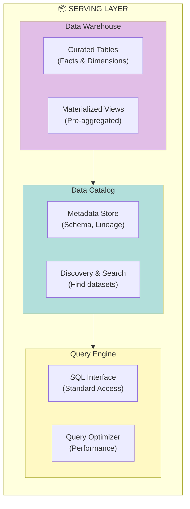
```mermaid
flowchart TB
    subgraph SERVING["📦 SERVING LAYER"]
        direction TB
        
        subgraph DW["Data Warehouse"]
            TABLES["Curated Tables<br/>(Facts & Dimensions)"]
            VIEWS["Materialized Views<br/>(Pre-aggregated)"]
        end
        
        subgraph CATALOG["Data Catalog"]
            META["Metadata Store<br/>(Schema, Lineage)"]
            SEARCH["Discovery & Search<br/>(Find datasets)"]
        end
        
        subgraph ENGINE["Query Engine"]
            SQL["SQL Interface<br/>(Standard Access)"]
            OPT["Query Optimizer<br/>(Performance)"]
        end
    end
    
    DW --> CATALOG --> ENGINE
    
    style DW fill:#e1bee7
    style CATALOG fill:#b2dfdb
    style ENGINE fill:#fff9c4
```

### 8.3 Data Warehouse vs Data Lake

| Khía cạnh | Data Warehouse | Data Lake |
|-----------|----------------|-----------|
| **Dữ liệu** | Structured, cleaned | Raw, any format |
| **Schema** | Schema-on-write | Schema-on-read |
| **Users** | BI Analysts, Business | Data Engineers, Data Scientists |
| **Query** | SQL optimized | Flexible (SQL, Python) |
| **Cost** | Higher per GB | Lower per GB |

### 8.4 Lakehouse Architecture

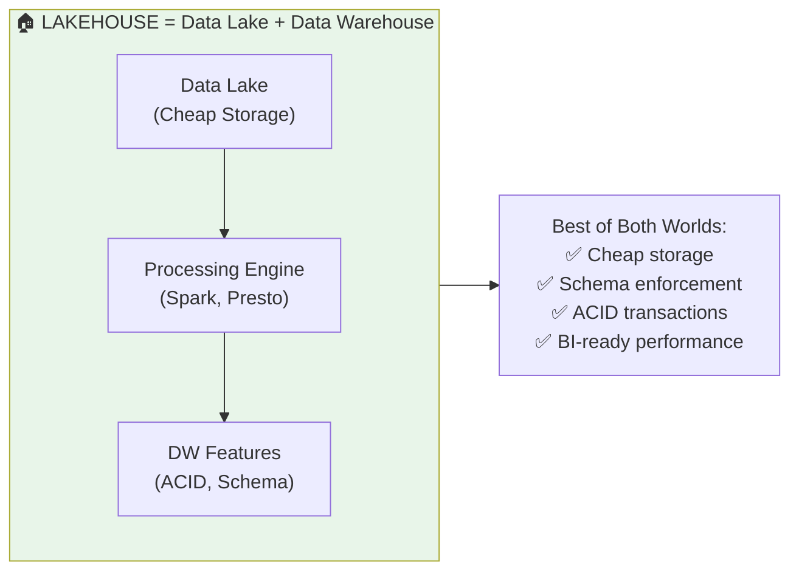
```mermaid
flowchart LR
    subgraph LAKEHOUSE["🏠 LAKEHOUSE = Data Lake + Data Warehouse"]
        LAKE["Data Lake<br/>(Cheap Storage)"] --> ENGINE["Processing Engine<br/>(Spark, Presto)"] --> DW["DW Features<br/>(ACID, Schema)"]
    end
    
    LAKEHOUSE --> BENEFIT["Best of Both Worlds:<br/>✅ Cheap storage<br/>✅ Schema enforcement<br/>✅ ACID transactions<br/>✅ BI-ready performance"]
    
    style LAKEHOUSE fill:#e8f5e9
```

---

## 9. Tầng 6: Consumption (Tiêu Thụ)

### 9.1 Định Nghĩa

**Consumption Layer** là nơi dữ liệu **được sử dụng để tạo giá trị** cho business. Đây là "output" cuối cùng của Data LifeCycle.

### 9.2 Các Hình Thức Tiêu Thụ

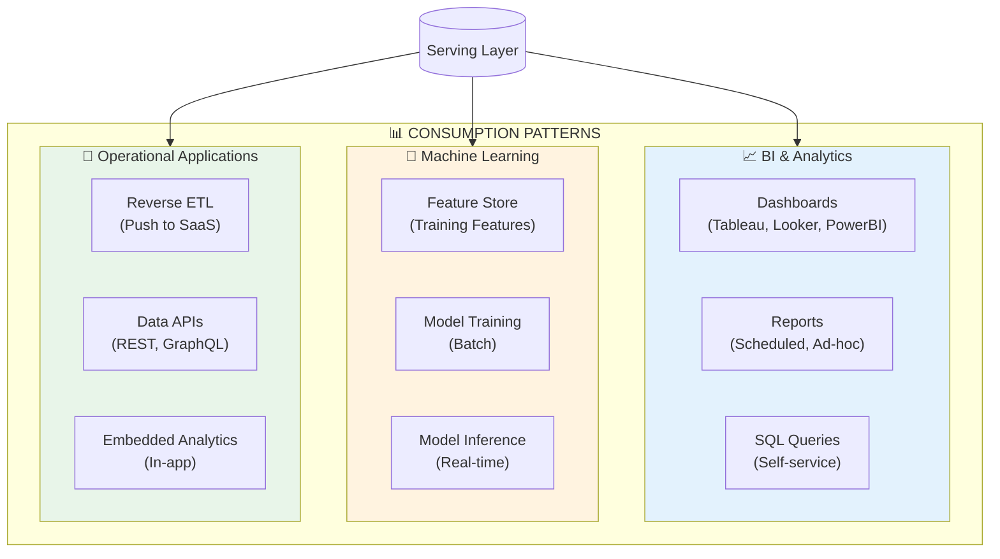
```mermaid
flowchart TB
    DATA[(Serving Layer)]
    
    subgraph CONSUME["📊 CONSUMPTION PATTERNS"]
        direction TB
        
        subgraph BI["📈 BI & Analytics"]
            DASH["Dashboards<br/>(Tableau, Looker, PowerBI)"]
            REPORT["Reports<br/>(Scheduled, Ad-hoc)"]
            ADHOC["SQL Queries<br/>(Self-service)"]
        end
        
        subgraph ML["🤖 Machine Learning"]
            FEATURE["Feature Store<br/>(Training Features)"]
            TRAIN["Model Training<br/>(Batch)"]
            INFER["Model Inference<br/>(Real-time)"]
        end
        
        subgraph OPS["📱 Operational Applications"]
            REVERSE["Reverse ETL<br/>(Push to SaaS)"]
            API["Data APIs<br/>(REST, GraphQL)"]
            EMBED["Embedded Analytics<br/>(In-app)"]
        end
    end
    
    DATA --> BI & ML & OPS
    
    style BI fill:#e3f2fd
    style ML fill:#fff3e0
    style OPS fill:#e8f5e9
```

### 9.3 Reverse ETL

**Reverse ETL** là trend mới: đẩy dữ liệu TỪ Data Warehouse NGƯỢC LẠI vào các operational systems.

```
📌 Ví dụ:
   Data Warehouse → Customer Segments → Push to Salesforce CRM
   Data Warehouse → Churn Scores → Push to Email Marketing Tool
```

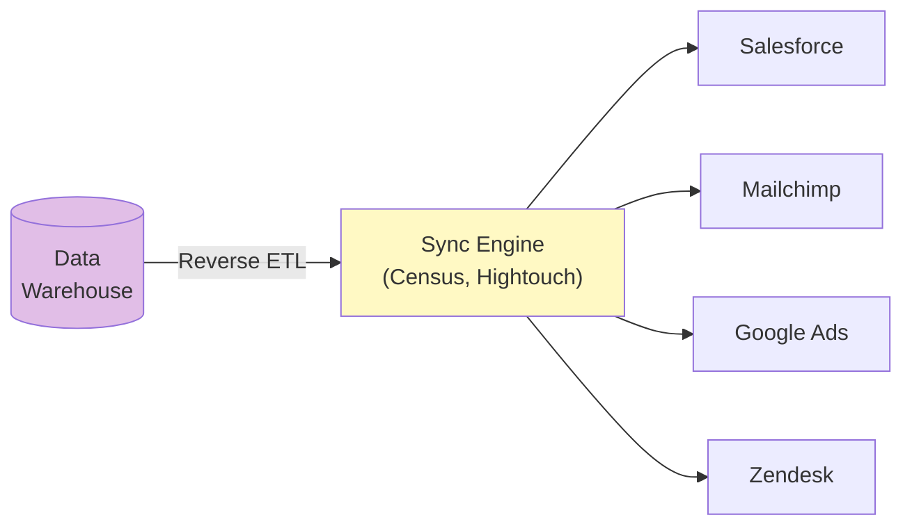
```mermaid
flowchart LR
    DW[(Data<br/>Warehouse)] -->|"Reverse ETL"| SYNC["Sync Engine<br/>(Census, Hightouch)"]
    
    SYNC --> CRM[Salesforce]
    SYNC --> EMAIL[Mailchimp]
    SYNC --> ADS[Google Ads]
    SYNC --> SUPPORT[Zendesk]
    
    style DW fill:#e1bee7
    style SYNC fill:#fff9c4
```

---

## 10. Cross-Cutting: Orchestration & Observability

### 10.1 Orchestration (Điều Phối)

**Orchestration** là việc **lên lịch, điều phối, và quản lý** các tasks trong data pipeline.

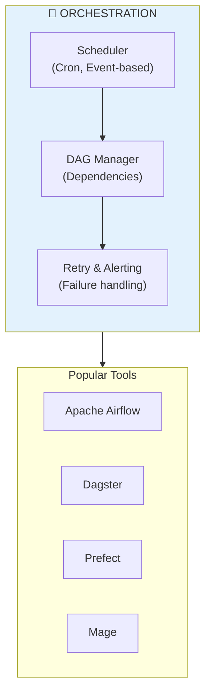
```mermaid
flowchart TB
    subgraph ORCH["🎯 ORCHESTRATION"]
        direction TB
        
        SCHED["Scheduler<br/>(Cron, Event-based)"]
        DAG["DAG Manager<br/>(Dependencies)"]
        RETRY["Retry & Alerting<br/>(Failure handling)"]
        
        SCHED --> DAG --> RETRY
    end
    
    subgraph TOOLS["Popular Tools"]
        AIR["Apache Airflow"]
        DAG_TOOL["Dagster"]
        PREFECT["Prefect"]
        MAGE["Mage"]
    end
    
    ORCH --> TOOLS
    
    style ORCH fill:#e3f2fd
```

### 10.2 Observability (Quan Sát)

**Observability** = Metrics + Logs + Traces để hiểu "what's happening" trong pipeline.

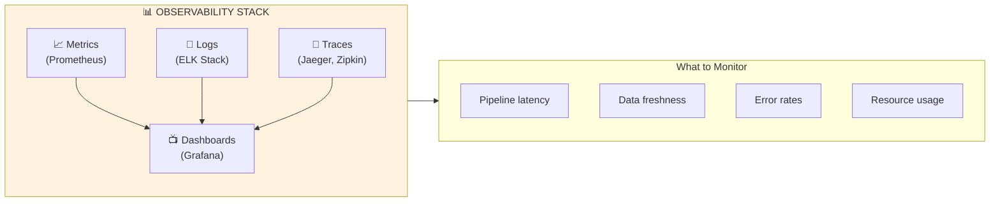
```mermaid
flowchart LR
    subgraph OBS["📊 OBSERVABILITY STACK"]
        direction TB
        
        METRICS["📈 Metrics<br/>(Prometheus)"]
        LOGS["📝 Logs<br/>(ELK Stack)"]
        TRACES["🔗 Traces<br/>(Jaeger, Zipkin)"]
        DASH["📺 Dashboards<br/>(Grafana)"]
        
        METRICS & LOGS & TRACES --> DASH
    end
    
    subgraph MONITOR["What to Monitor"]
        M1["Pipeline latency"]
        M2["Data freshness"]
        M3["Error rates"]
        M4["Resource usage"]
    end
    
    OBS --> MONITOR
    
    style OBS fill:#fff3e0
```

### 10.3 Data Governance

| Aspect | Mô tả | Tools |
|--------|-------|-------|
| **Data Quality** | Validate data meets expectations | Great Expectations, dbt tests |
| **Data Lineage** | Track data origins & transformations | OpenLineage, DataHub |
| **Access Control** | Who can access what | RBAC, Column-level security |
| **Data Catalog** | Discover & understand datasets | DataHub, Amundsen, Atlan |

---

## 11. So Sánh Các Mô Hình Kiến Trúc

### 11.1 Evolution of Data Architecture

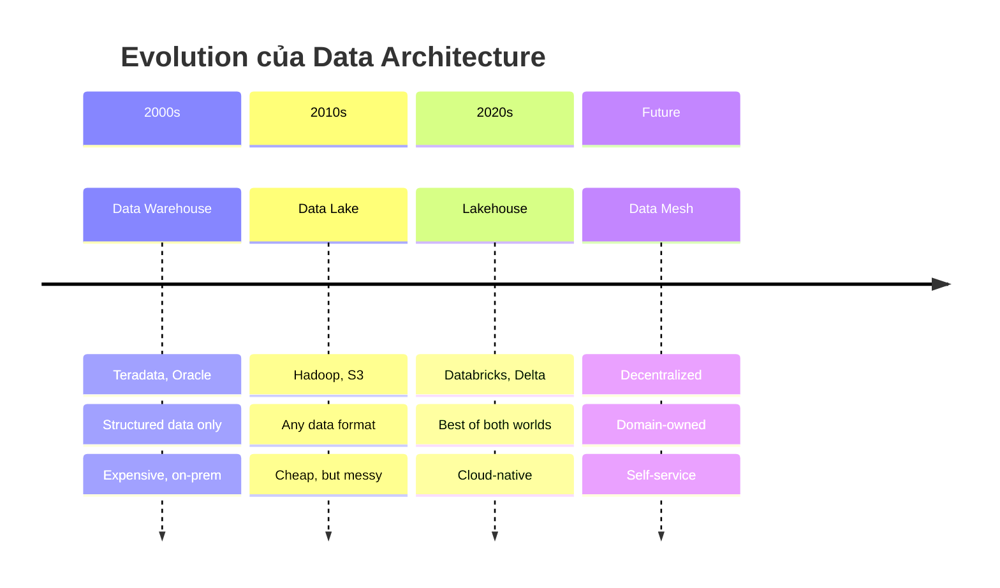
```mermaid
timeline
    title Evolution của Data Architecture
    
    section 2000s
        Data Warehouse : Teradata, Oracle
        : Structured data only
        : Expensive, on-prem
    
    section 2010s
        Data Lake : Hadoop, S3
        : Any data format
        : Cheap, but messy
    
    section 2020s
        Lakehouse : Databricks, Delta
        : Best of both worlds
        : Cloud-native
    
    section Future
        Data Mesh : Decentralized
        : Domain-owned
        : Self-service
```

### 11.2 Kiến Trúc So Sánh

| Architecture | Centralized? | Schema | Best For |
|--------------|--------------|--------|----------|
| **Data Warehouse** | ✅ Yes | Strict | BI, Reporting |
| **Data Lake** | ✅ Yes | Flexible | ML, Raw storage |
| **Lakehouse** | ✅ Yes | Hybrid | Modern analytics |
| **Data Mesh** | ❌ No | Domain-owned | Large organizations |

### 11.3 Decision Framework

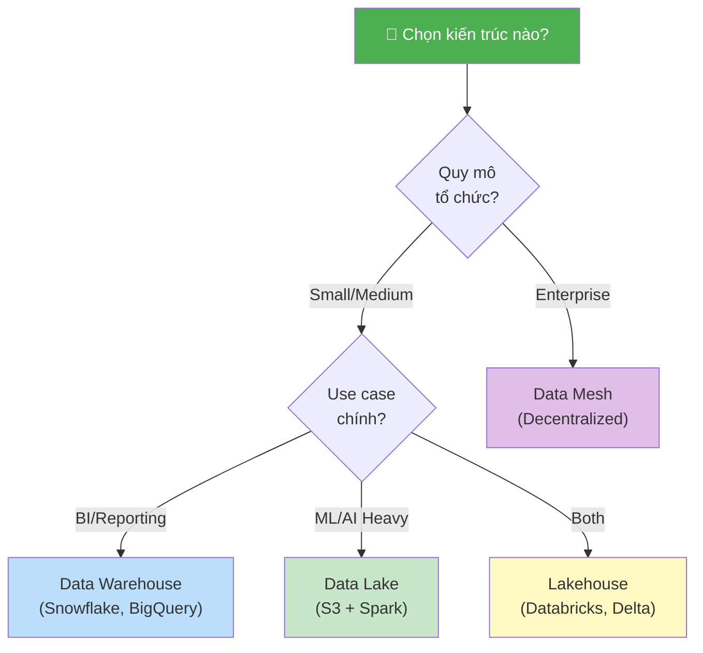
```mermaid
flowchart TD
    START["🤔 Chọn kiến trúc nào?"] --> Q1{Quy mô<br/>tổ chức?}
    
    Q1 -->|Small/Medium| Q2{Use case<br/>chính?}
    Q1 -->|Enterprise| MESH["Data Mesh<br/>(Decentralized)"]
    
    Q2 -->|BI/Reporting| DW["Data Warehouse<br/>(Snowflake, BigQuery)"]
    Q2 -->|ML/AI Heavy| LAKE["Data Lake<br/>(S3 + Spark)"]
    Q2 -->|Both| LH["Lakehouse<br/>(Databricks, Delta)"]
    
    style START fill:#4caf50,color:#fff
    style MESH fill:#e1bee7
    style DW fill:#bbdefb
    style LAKE fill:#c8e6c9
    style LH fill:#fff9c4
```

---

## 📚 Tổng Kết

### Checklist Data LifeCycle

- [ ] **Source**: Định nghĩa data contracts với source systems
- [ ] **Ingestion**: Chọn CDC/Streaming cho real-time, Batch cho historical
- [ ] **Raw Storage**: Lưu data thô trước, đừng bao giờ xóa
- [ ] **Processing**: Fast lane cho alerts, Batch lane cho analytics
- [ ] **Serving**: Tối ưu cho query performance
- [ ] **Consumption**: Enable self-service cho business users
- [ ] **Orchestration**: Automate với DAG-based scheduler
- [ ] **Observability**: Monitor latency, freshness, và quality

### Key Takeaways

```
📌 Rule #1: Luôn lưu dữ liệu thô (Immutable Raw Data)
📌 Rule #2: Separation of concerns giữa các tầng
📌 Rule #3: Right tool for the right job (Stream vs Batch)
📌 Rule #4: Data contracts là nền tảng của mọi pipeline
📌 Rule #5: Observability không phải là optional
```

---

> **📝 Tài liệu này** cung cấp cái nhìn tổng quan về Data LifeCycle và các tầng kiến trúc. Để áp dụng vào project cụ thể, hãy tham khảo thêm tài liệu chi tiết của từng công nghệ.
