# 📊 Data LifeCycle - Vòng Đời Dữ Liệu

> **Tài liệu tổng quan** về hành trình dữ liệu từ nguồn gốc đến tiêu thụ trong kiến trúc Data Platform hiện đại.

---

## 📋 Mục Lục

1. [Tổng Quan Data Lifecycle](#1-tổng-quan-data-lifecycle)
2. [Kiến Trúc Tổng Quan](#2-kiến-trúc-tổng-quan)
3. [Stage 1: Source Systems](#3-stage-1---source-systems-nguồn-dữ-liệu)
4. [Stage 2: Ingestion](#4-stage-2---ingestion-thu-thập-dữ-liệu)
5. [Stage 3: Raw Storage](#5-stage-3---raw-storage-data-lake--bronze)
6. [Stage 4: Processing](#6-stage-4---processing-xử-lý-dữ-liệu)
7. [Stage 5: Serving Storage](#7-stage-5---serving-storage-data-warehouse--gold)
8. [Stage 6: Consumption](#8-stage-6---consumption--activation-tiêu-thụ-dữ-liệu)
9. [Orchestration & Observability](#9-orchestration--observability)
10. [Áp Dụng Vào Dự Án Mini Data Lake](#10-áp-dụng-vào-dự-án-mini-data-lake)
11. [So Sánh & Best Practices](#11-so-sánh--best-practices)
12. [Tổng Kết & Quick Reference](#12-tổng-kết--quick-reference)

---

## 1. Tổng Quan Data Lifecycle

### 1.1 Data Lifecycle Là Gì?

**Data Lifecycle** (Vòng đời dữ liệu) mô tả **toàn bộ hành trình của dữ liệu** từ khi được sinh ra, thu thập, lưu trữ, xử lý, phân phối, cho đến khi được tiêu thụ để tạo ra giá trị kinh doanh.

```
📌 Công thức đơn giản:
   Data Lifecycle = Source → Ingestion → Storage → Processing → Serving → Consumption
                                                                    ↺ (feedback loop)
```

### 1.2 Tại Sao Data Lifecycle Quan Trọng?

| Vấn đề | Không có Data Lifecycle | Có Data Lifecycle |
|--------|-------------------------|-------------------|
| **Data Silos** | Dữ liệu phân tán, không kết nối | Dữ liệu tập trung, có governance |
| **Data Quality** | Không biết nguồn gốc, khó validate | Traceable, có data contracts |
| **Time-to-Insight** | Chờ IT, mất tuần/tháng | Self-service, mất phút/giờ |
| **Scalability** | Bottleneck khi scale | Kiến trúc phân tán, elastic |
| **Cost** | Chi phí ẩn, không optimize | Tối ưu theo tier (hot/warm/cold) |

### 1.3 Hybrid Pipeline - Batch + Streaming

Pipeline hiện đại là **Hybrid Pipeline** vì kết hợp cả hai mô hình xử lý:

| Mô hình | Đặc điểm | Use Cases |
|---------|----------|-----------|
| **Batch** | ETL, historical data, chạy theo lịch | Reports, ML training, analytics |
| **Streaming** | CDC, real-time events, liên tục | Alerts, fraud detection, live dashboard |


*So sánh hai mô hình xử lý dữ liệu: Batch (trái) và Streaming (phải)*

### 1.4 Overview Diagram

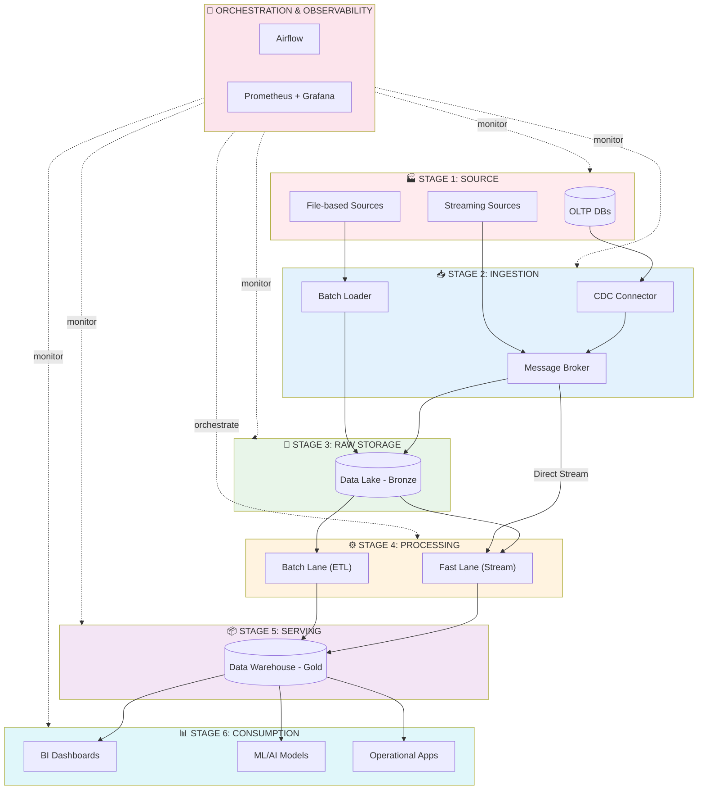

---

## 2. Kiến Trúc Tổng Quan

### 2.1 The Modern Data Stack

```
┌─────────────────────────────────────────────────────────────────────────────────┐
│                         THE MODERN DATA STACK                                    │
│                        (Hybrid Pipeline Architecture)                            │
├──────────────┬────────────────┬──────────────────────────────────────────────────┤
│   Tầng       │    Vai Trò     │    Công Nghệ Phổ Biến                            │
├──────────────┼────────────────┼──────────────────────────────────────────────────┤
│ 1. Source    │ Sinh dữ liệu   │ PostgreSQL, MySQL, Kafka, IoT, APIs              │
│ 2. Ingestion │ Thu thập       │ Debezium, Kafka Connect, Airbyte, Fivetran       │
│ 3. Raw Store │ Lưu trữ thô    │ S3, GCS, Azure Blob, Delta Lake, Iceberg         │
│ 4. Processing│ Xử lý/biến đổi │ Spark, Flink, dbt, Dataflow                      │
│ 5. Serving   │ Phục vụ query  │ Snowflake, BigQuery, Redshift, Trino             │
│ 6. Consume   │ Tiêu thụ       │ Tableau, Looker, PowerBI, Superset, ML Platform  │
├──────────────┴────────────────┴──────────────────────────────────────────────────┤
│ Cross-Cutting: Airflow, Dagster (Orchestration) │ Prometheus, Grafana (Monitor)  │
└─────────────────────────────────────────────────────────────────────────────────┘
```

### 2.2 Data Flow Sequence

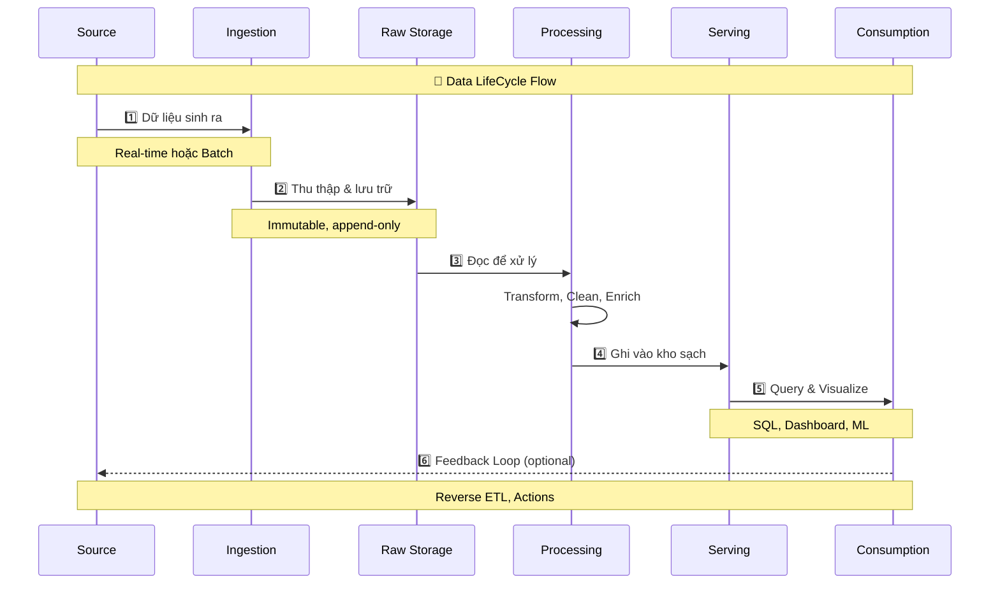

### 2.3 Data Zones Architecture

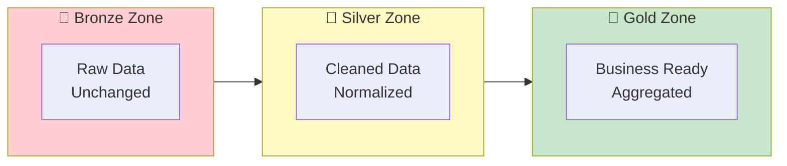

---

## 3. Stage 1 - Source Systems (Nguồn Dữ Liệu)

### 3.1 Định Nghĩa

**Source Systems** là nơi dữ liệu **được sinh ra lần đầu tiên** (System of Record - SoR). Đây là ground truth của toàn bộ data pipeline.

> ⚠️ **Quan trọng**: Source KHÔNG nên thay đổi để phục vụ data team. Data team phải thích nghi với source, không ngược lại.

### 3.2 Phân Loại Nguồn Dữ Liệu

#### 🗄️ OLTP Databases

| Đặc điểm | Mô tả |
|----------|-------|
| **Mục đích** | Phục vụ transaction, đảm bảo ACID, độ trễ thấp |
| **Dữ liệu** | users, orders, payments, images |
| **Đặc điểm kỹ thuật** | Có INSERT/UPDATE/DELETE, schema thay đổi theo product |
| **Công nghệ** | PostgreSQL, MySQL, Oracle, SQL Server |

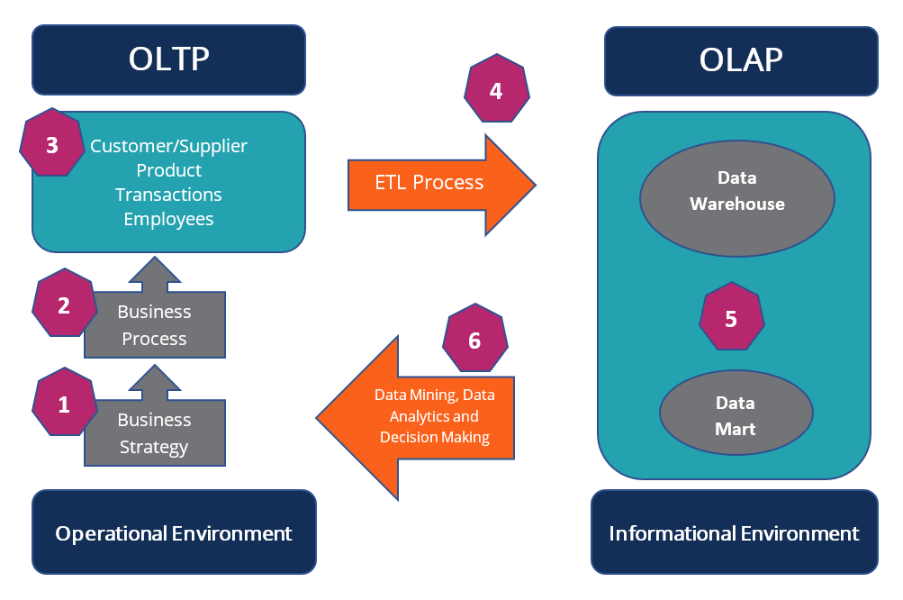
*Luồng dữ liệu từ OLTP (nghiệp vụ) sang OLAP (phân tích)*

#### 📡 Applications / APIs (Logs & Events)

```json
{
  "event_name": "image_uploaded",
  "image_id": "img_123",
  "user_id": "u_01",
  "event_time": "2026-02-06T10:01:23Z"
}
```

| Đặc điểm | Mô tả |
|----------|-------|
| **Mục đích** | Ghi lại hành vi hệ thống & user (event-driven) |
| **Dữ liệu** | Logs, clickstream, user actions, system events |
| **Đặc điểm** | Append-only, có thể out-of-order hoặc duplicate |
| **Công nghệ** | Application logs, REST/gRPC APIs, Event emitters |

#### 📁 External Files

| Đặc điểm | Mô tả |
|----------|-------|
| **Mục đích** | Nhận dữ liệu từ bên ngoài, không realtime |
| **Dữ liệu** | CSV từ đối tác, JSON config, export thủ công |
| **Đặc điểm** | Batch, không ổn định, thiếu metadata |
| **Công nghệ** | CSV/JSON files, FTP, S3/Object Storage |

### 3.3 Yêu Cầu Bắt Buộc Từ Source

| Yêu cầu | Mô tả | Tại sao quan trọng? |
|---------|-------|---------------------|
| **Identifier (ID)** | Primary key / event_id duy nhất | Không có ID → không dedup, không replay, không scale |
| **Timestamp** | `event_time` (khi xảy ra) + `created_at` (khi ghi) | Streaming, windowing, late-event phụ thuộc hoàn toàn vào timestamp |
| **Schema rõ ràng** | Field name ổn định, kiểu dữ liệu nhất quán | JSON "muốn nhét gì thì nhét" = thảm họa downstream |

### 3.4 Input/Output Summary

| | Input | Output |
|--|-------|--------|
| **Stage 1** | Business operations, User actions, External feeds | Raw records với ID, timestamp, schema |

### 3.5 Anti-patterns 🚫

- ❌ Clean dữ liệu tại source
- ❌ Join bảng / Aggregate  
- ❌ Business logic cho analytics
- ❌ Dùng OLTP để làm analytics (query BI thẳng DB production)
- ❌ Thiếu timestamp = ác mộng về sau

### 3.6 Checklist Đánh Giá Source

Trước khi build pipeline, bắt buộc trả lời:

- [ ] Có primary key / event_id không?
- [ ] Có `event_time` không?
- [ ] Có update/delete không?
- [ ] Volume mỗi ngày?
- [ ] Schema có hay đổi không?
- [ ] Cho phép CDC không?

---

## 4. Stage 2 - Ingestion (Thu Thập Dữ Liệu)

### 4.1 Định Nghĩa

**Data Ingestion** là quá trình đưa dữ liệu từ Source Systems vào hệ thống data trung tâm một cách:
- ✅ Đáng tin cậy (reliable)
- ✅ Có thể replay (replayable)
- ✅ Không làm sập source (non-intrusive)

> ⚠️ **Quan trọng**: Ingestion ≠ ETL. Ingestion KHÔNG làm business logic, KHÔNG clean data.

### 4.2 Hai Chiến Lược Ingestion

```
           ┌─ Streaming Ingestion (Realtime)
Source ────┤
           └─ Batch Ingestion (Scheduled)
```

### 4.3 Streaming Ingestion

#### Khi nào dùng?
- Dữ liệu liên tục, cần realtime/near-realtime
- Source có update/delete
- Volume lớn
- CDC từ OLTP DB, user events, system logs

#### CDC - Change Data Capture

**CDC** = kỹ thuật bắt lại mọi thay đổi trong database (INSERT/UPDATE/DELETE) bằng cách nghe log nội bộ của DB thay vì query liên tục.

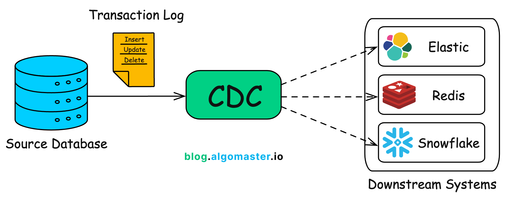
*CDC bắt thay đổi từ Transaction Log và đẩy vào downstream systems*

```
Postgres
  ↓ (WAL / Binlog)
CDC Connector (Debezium)
  ↓
Kafka Topic
```

**CDC Event Format:**
```json
{
  "op": "u",
  "before": {"id": 1, "name": "old"},
  "after": {"id": 1, "name": "new"},
  "ts_ms": 1707200000
}
```

| Batch Pull | CDC |
|------------|-----|
| Polling | Event-driven |
| Miss data | Không miss |
| Load DB nặng | Nhẹ |
| Không realtime | Realtime |
| Khó replay | Replay dễ |

#### Message Broker

| Tiêu chí | Kafka | RabbitMQ |
|----------|-------|----------|
| Mục đích | Data stream | Task/message |
| Replay | ✅ | ❌ |
| Throughput | Rất cao | Trung bình |
| Ordering | Partition-level | Queue-level |
| Lưu data | Disk-based | Memory-first |

> 👉 **Kafka = ingestion backbone**, RabbitMQ = task/control plane

### 4.4 Batch Ingestion

#### Khi nào dùng?
- Source không hỗ trợ streaming
- External files
- Volume nhỏ
- Data không cần realtime

```
Scheduler (Airflow)
  ↓
Batch Job (Python)
  ↓
Object Storage (Raw Zone)
```

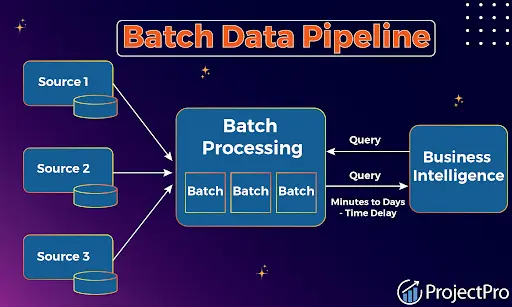
*Batch pipeline: nhiều source → xử lý batch → BI queries*

#### Yêu cầu Batch Ingestion:
- ✅ Idempotent (chạy lại không nhân đôi)
- ✅ Có checkpoint
- ✅ Có logging
- ✅ Có schema validation cơ bản

### 4.5 Input/Output Summary

| | Input | Output |
|--|-------|--------|
| **Stage 2** | Raw records từ Source | Messages trong Kafka / Files trong Raw Storage |

### 4.6 Anti-patterns 🚫

- ❌ Business transformation
- ❌ Join data
- ❌ Dedup phức tạp
- ❌ Enrich data
- ❌ Filter business logic ở CDC

> Ingestion mà "thông minh quá" = debug nightmare

### 4.7 Checklist Thiết Kế Stage 2

- [ ] Streaming hay batch?
- [ ] Có cần CDC không?
- [ ] Kafka topic naming? (ví dụ: `cdc.users`, `events.image_uploaded`)
- [ ] Partition strategy?
- [ ] Replay strategy?
- [ ] Monitoring metrics?
- [ ] Dead-letter queue?

---

## 5. Stage 3 - Raw Storage (Data Lake / Bronze)

### 5.1 Định Nghĩa

**Raw Storage (Data Lake – Bronze)** là nơi lưu toàn bộ dữ liệu gốc, ngay sau ingestion, **chưa transform, chưa clean, chưa apply business logic**.

> 📌 Đây là **Single Source of Truth** cho toàn bộ hệ thống data. Nếu mất Raw → mất khả năng replay, audit, debug.

### 5.2 Vai Trò Cốt Lõi (5 Vấn Đề Lớn)

| Vai trò | Mô tả |
|---------|-------|
| **Bảo toàn dữ liệu gốc** | Không mất thông tin, không bóp méo |
| **Cho phép reprocessing** | Logic sai → chạy lại, Schema đổi → backfill |
| **Tách ingestion & processing** | Ingestion đơn giản, Processing linh hoạt |
| **Scale rẻ** | Lưu trữ rất lớn, chi phí thấp |
| **Audit & compliance** | Truy vết nguồn dữ liệu, so sánh raw vs processed |

### 5.3 Data Lake vs Database

| Tiêu chí | Data Lake | Database |
|----------|-----------|----------|
| Storage | File-based | Row-based |
| Schema | Schema-on-read | Schema-on-write |
| Update | ❌ | ✅ |
| Cost | Rẻ | Đắt |
| Query latency | Chậm | Nhanh |

> 👉 Raw zone không tối ưu cho query, mà cho **lưu trữ & xử lý**.

### 5.4 Object Storage - Nền Tảng

Raw Storage gần như luôn dùng **Object Storage**:
- AWS S3
- Google Cloud Storage (GCS)
- Azure Blob
- MinIO (on-prem)

**Vì sao?** Scale gần như vô hạn, Cheap, Durable, Tách compute & storage


*Kiến trúc Data Lake: Raw data → ETL → Data Warehouse → BI/ML*

### 5.5 File Format - Lựa Chọn Quan Trọng

| ❌ Không nên | ✅ Nên |
|-------------|--------|
| CSV | Parquet |
| JSON (lâu dài) | ORC |

**Lý do**: Columnar, Compress tốt, Read nhanh cho processing

#### Table Format (Hiện đại)

| Format | ACID | Schema Evolution | Time Travel | Best For |
|--------|------|------------------|-------------|----------|
| **Delta Lake** | ✅ | ✅ | ✅ | Lakehouse |
| **Apache Iceberg** | ✅ | ✅ | ✅ | Data warehousing |
| **Apache Hudi** | ✅ | ✅ | ✅ | CDC, streaming |

### 5.6 Thiết Kế Thư Mục & Partition

#### Nguyên tắc Partition:
- ✅ Partition theo: Time, Source, Logical entity
- ❌ Không partition theo: user_id, country (high cardinality)

#### Ví dụ Structure Chuẩn:
```
datalake/
 └── bronze/
     ├── cdc/
     │   └── postgres/
     │       └── users/
     │           └── year=2026/
     │               └── month=02/
     │                   └── day=06/
     │                       └── part-0001.parquet
     └── events/
         └── image_uploaded/
             └── year=2026/...
```

### 5.7 Metadata & Catalog

> ⚠️ **Data Lake không có metadata = Data Swamp** (đầm lầy dữ liệu)

Muốn downstream dùng được, cần:
- Schema
- Table definition
- Location

**Công cụ quản lý metadata:**
- Hive Metastore
- AWS Glue Catalog
- DataHub (lineage)

### 5.8 Input/Output Summary

| | Input | Output |
|--|-------|--------|
| **Stage 3** | Messages từ Kafka / Files từ Batch Job | Parquet files trong Object Storage (Bronze zone) |

### 5.9 Anti-patterns 🚫

- ❌ Clean data
- ❌ Deduplicate phức tạp
- ❌ Join bảng
- ❌ Aggregate
- ❌ Business logic
- ❌ Dump mọi thứ vào 1 folder
- ❌ Không partition
- ❌ Overwrite file cũ
- ❌ Không versioning

> Raw càng "ngu" → hệ thống càng khỏe

### 5.10 Checklist Thiết Kế Stage 3

- [ ] Object Storage (S3/MinIO/GCS)
- [ ] Columnar format (Parquet)
- [ ] Partition theo time
- [ ] Append-only
- [ ] Metadata catalog
- [ ] Raw ≠ Processed
- [ ] Lifecycle policy (Hot/Cold/Delete)

---

## 6. Stage 4 - Processing (Xử Lý Dữ Liệu)

### 6.1 Định Nghĩa

**Processing** là giai đoạn đọc dữ liệu từ Raw Storage (Bronze), áp dụng logic kỹ thuật + business, và ghi ra Processed Storage (Silver/Gold).

> 📌 Nếu ingestion là "vận chuyển", thì processing là **nấu ăn** 🍳 - đây là "The Kitchen" của hệ thống!

### 6.2 Vai Trò Của Stage 4

Stage 4 chịu trách nhiệm cho:
- ✅ Data correctness (đúng logic)
- ✅ Data usability (dùng được)
- ✅ Business meaning
- ✅ Performance downstream
- ✅ Consistency giữa batch & streaming

> ⚠️ Nếu stage này sai → Dashboard sai, ML học sai, Decision sai

### 6.3 Hai Loại Processing

```
           ┌─ Stream Processing (Realtime)
Raw Data ──┤
           └─ Batch Processing (Historical)
```


*So sánh Batch Processing (trái) và Streaming (phải)*

#### Batch Processing (Xương sống của hệ thống)

| Đặc điểm | Mô tả |
|----------|-------|
| **Định nghĩa** | Xử lý data đã có sẵn, theo lịch |
| **Use case** | Historical analysis, reports, ML training |
| **Ưu điểm** | Dễ debug, dễ backfill, logic rõ, stable |
| **Nhược điểm** | Không realtime, latency cao |
| **Công nghệ** | Apache Spark, dbt, SQL engines |

> 👉 **90% business metrics nên dùng batch**

#### Stream Processing (Fast Lane)

| Đặc điểm | Mô tả |
|----------|-------|
| **Định nghĩa** | Xử lý dữ liệu đang chảy, near-realtime, stateful |
| **Use case** | Fraud detection, abuse detection, realtime alert, online ML features |
| **Độ phức tạp** | Out-of-order events, Late events, Window, State management, Exactly-once |
| **Công nghệ** | Apache Flink, Spark Structured Streaming |


*Apache Flink xử lý stream: Event-driven Apps, Streaming Pipelines, Stream & Batch Analytics*

> ⚠️ Nếu KPI chấp nhận trễ 5–15 phút → batch đủ rồi. Debug stream = đau não 😵‍💫

### 6.4 Các Loại Transform

| Technical Transform | Business Transform |
|---------------------|-------------------|
| parse schema | join bảng |
| type casting | derive metric |
| flatten JSON | apply business rules |
| normalize field | aggregation |

### 6.5 Xử Lý CDC Đúng Cách

CDC raw có dạng: `before`, `after`, `op (c/u/d)`

**Hai chiến lược:**

| Chiến lược | Mô tả | Ưu/Nhược |
|------------|-------|----------|
| **Rebuild snapshot (batch)** | Đọc toàn bộ CDC, recompute table state | 👍 Dễ, đúng / 👎 Chậm |
| **Incremental apply** | Apply change theo event, giữ state | 👍 Realtime / 👎 Phức tạp |

### 6.6 Tách Logic - Silver & Gold

```
Bronze (Raw)
   ↓
Silver (Cleaned, normalized) ← Technical logic
   ↓
Gold (Aggregated, business-ready) ← Business logic
```

> 👉 Stage 4 chính là nơi tạo **Silver & Gold layers**

### 6.7 Input/Output Summary

| | Input | Output |
|--|-------|--------|
| **Stage 4** | Parquet files từ Bronze zone / Kafka streams | Silver tables (cleaned) + Gold tables (aggregated) |

### 6.8 Anti-patterns 🚫

- ❌ Nhét business logic vào ingestion
- ❌ Streaming mọi thứ (khi không cần)
- ❌ Không version code
- ❌ Không test logic
- ❌ Không backfill strategy
- ❌ Join quá sớm
- ❌ Shuffle lớn không cần thiết

> Processing ăn **cost nhiều nhất** trong pipeline

### 6.9 Checklist Thiết Kế Stage 4

- [ ] Batch hay stream?
- [ ] Logic nào cần realtime?
- [ ] Có CDC không?
- [ ] Idempotent chưa?
- [ ] Backfill thế nào?
- [ ] Output là Silver hay Gold?
- [ ] Monitoring metric gì?

---

## 7. Stage 5 - Serving Storage (Data Warehouse / Gold)

### 7.1 Định Nghĩa

**Serving Layer** là nơi lưu dữ liệu đã sẵn sàng để sử dụng, tối ưu cho analytics, BI, reporting, product consumption. Có độ trễ thấp, query nhanh, schema ổn định.

> 📌 Nếu data ở đây khó dùng → toàn bộ pipeline coi như **thất bại**

### 7.2 Vai Trò Cốt Lõi

- ✅ Fast query
- ✅ Consistent metrics
- ✅ Business-friendly schema
- ✅ Concurrency cao
- ✅ Stable contract với consumer

> ⚠️ Đây là layer bị business "đụng" nhiều nhất

### 7.3 Dữ Liệu Trong Serving Layer

| Loại | Mô tả | Ví dụ |
|------|-------|-------|
| **Fact tables** | Metric, số lượng lớn, append-only | `fact_image_uploads` |
| **Dimension tables** | Descriptive, thay đổi chậm (SCD) | `dim_users` |
| **Aggregated metrics** | Pre-computed statistics | `daily_image_stats` |
| **Data Marts** | Chia theo domain | marketing, product, finance |

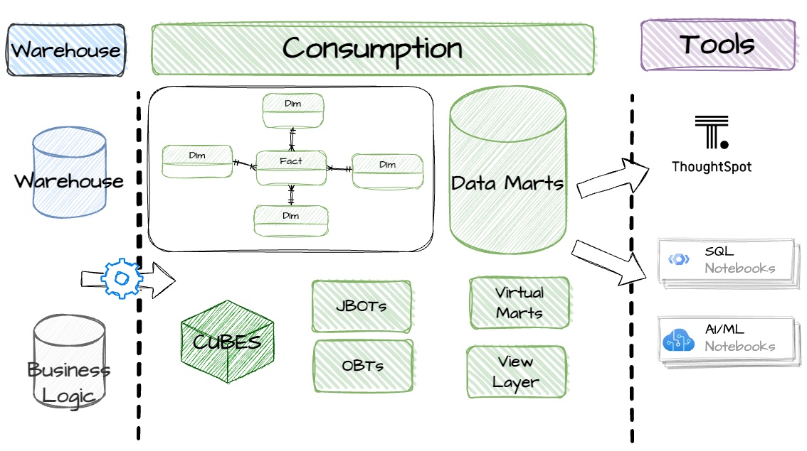
*Kiến trúc Consumption Layer: Warehouse → Business Logic → Data Marts → BI Tools*

### 7.4 Schema Design - Star Schema

| Component | Đặc điểm |
|-----------|----------|
| **Fact** | metric, số lượng lớn, append-only |
| **Dimension** | descriptive, thay đổi chậm (SCD) |

> ⚠️ Schema xấu = dashboard loạn. Analyst không muốn join 10 bảng!

### 7.5 Công Nghệ Serving Layer

| Loại | Công nghệ | Ưu điểm | Nhược điểm |
|------|-----------|---------|------------|
| **Data Warehouse (managed)** | BigQuery, Snowflake, Redshift | Query rất nhanh, quản lý dễ, scale tốt | Cost cao, lock-in |
| **Lakehouse / Query Engine** | Trino, Presto | Query trực tiếp Data Lake, linh hoạt, ít lock-in | Ops khó hơn, performance phụ thuộc data layout |


*Luồng từ Sources → ETL → Data Warehouse → OLAP → Reports*

### 7.6 Semantic Layer

Rất quan trọng để đảm bảo:
- Metric definition thống nhất
- Business logic nhất quán

**Công cụ**: dbt, Metric layer

> ⚠️ Không có semantic layer → mỗi dashboard một kiểu!

### 7.7 Performance Optimization

| Technique | Mô tả |
|-----------|-------|
| **Partition & Clustering** | Partition theo time, cluster theo dimension/filter |
| **Pre-aggregation** | Daily/hourly stats, tránh query raw fact quá lớn |
| **Materialized views** | Dùng cho dashboard hot |

### 7.8 Input/Output Summary

| | Input | Output |
|--|-------|--------|
| **Stage 5** | Silver/Gold tables từ Processing | Optimized tables cho BI query, APIs, ML features |

### 7.9 Anti-patterns 🚫

- ❌ Query thẳng Bronze/Silver
- ❌ Business logic trong BI tool
- ❌ Mỗi team tự định nghĩa metric
- ❌ Không version schema
- ❌ Không ownership table

### 7.10 Data Contract & Ownership

Mỗi table ở Serving nên có:
- **Owner**: Ai chịu trách nhiệm?
- **Description**: Table này làm gì?
- **SLA**: Uptime cam kết?
- **Freshness**: Data update bao lâu một lần?
- **Schema contract**: Cấu trúc columns?

> 👉 **Data = product**, không phải file dump

---

## 8. Stage 6 - Consumption & Activation (Tiêu Thụ Dữ Liệu)

### 8.1 Định Nghĩa

**Consumption & Activation** là giai đoạn dữ liệu được con người hoặc hệ thống sử dụng để phân tích, ra quyết định, hành động, tự động hóa.

> 📌 Nếu data không được dùng ở stage này → toàn bộ pipeline phía trước chỉ là **chi phí**

### 8.2 Vai Trò Cốt Lõi

- ✅ Deliver insight
- ✅ Enable decision
- ✅ Drive action
- ✅ Close the feedback loop
- ✅ **Chứng minh ROI** của data platform

### 8.3 Các Nhóm Consumer

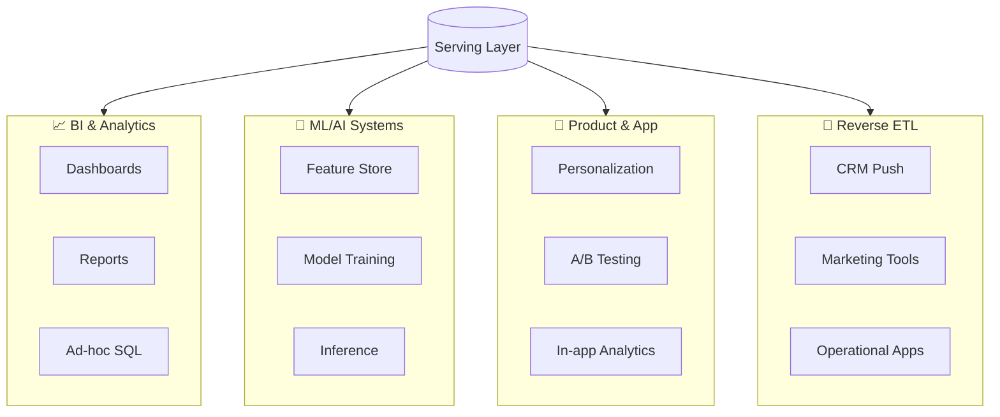

### 8.4 BI & Analytics Consumption

| | Mô tả |
|--|-------|
| **Mục đích** | Hiểu chuyện gì đã xảy ra, theo dõi KPI, ra quyết định chiến lược |
| **Consumer** | Business, PM, Ops, Leadership |
| **Công nghệ** | Tableau, Power BI, Superset, Metabase |
| **Yêu cầu data** | Đúng, dễ hiểu, 1 metric = 1 nghĩa, freshness rõ |

### 8.5 ML/AI Consumption

| Loại | Dùng cho |
|------|----------|
| **Offline features** | Training |
| **Online features** | Realtime inference |

> ⚠️ Hai loại phải **consistent**, nếu không model học một đằng, chạy một nẻo

**Feature Store** chuẩn hóa feature, chia sẻ giữa team, versioning feature.

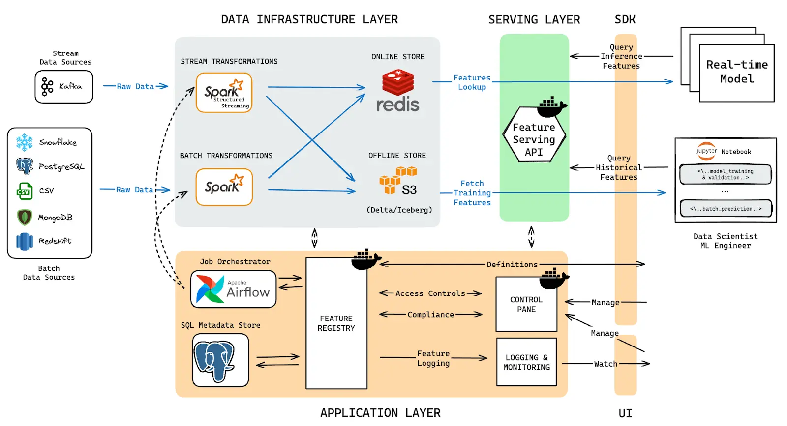
*Kiến trúc Feature Store: Stream/Batch → Online/Offline Store → Serving API → ML Models*

### 8.6 Reverse ETL - Activation

**Reverse ETL** = Đưa data từ warehouse ngược trở lại hệ thống operational.

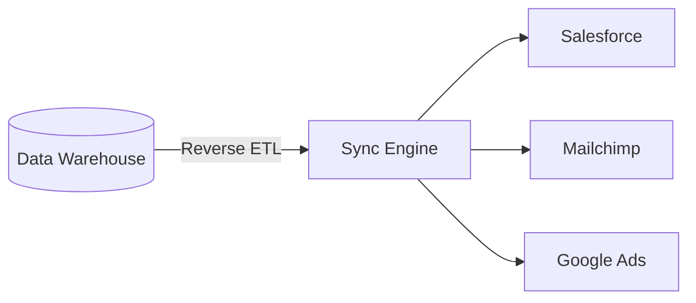

**Ví dụ:**
- Push user segment sang CRM
- Push churn score sang app
- Push recommendation sang backend

> 👉 **Insight không nằm trên dashboard. Insight phải tạo hành động!**

### 8.7 Feedback Loop

```
Action → User behavior → New data → Source systems → ... (vòng lặp)
```

> 📌 Data Lifecycle không phải đường thẳng, mà là **vòng lặp khép kín**

### 8.8 Input/Output Summary

| | Input | Output |
|--|-------|--------|
| **Stage 6** | Optimized tables từ Serving | Insights, Decisions, Actions, Model predictions |

### 8.9 Anti-patterns 🚫

- ❌ Có dashboard nhưng không ai dùng
- ❌ Mỗi team copy data về Excel
- ❌ Business tự định nghĩa metric
- ❌ Insight không dẫn đến action
- ❌ Không feedback lại data team

### 8.10 Checklist Đánh Giá Stage 6

- [ ] Business dùng dashboard hằng ngày?
- [ ] Product dùng data trong app?
- [ ] ML dùng chung feature?
- [ ] Có reverse ETL?
- [ ] Insight → action?
- [ ] Có feedback loop?

---

## 9. Orchestration & Observability

### 9.1 Vai Trò (Xuyên Suốt Lifecycle)

Layer này **xuyên suốt tất cả stages**, chịu trách nhiệm:
- ✅ Điều phối pipeline
- ✅ Theo dõi health
- ✅ Phát hiện lỗi sớm

### 9.2 Orchestration (Điều Phối)

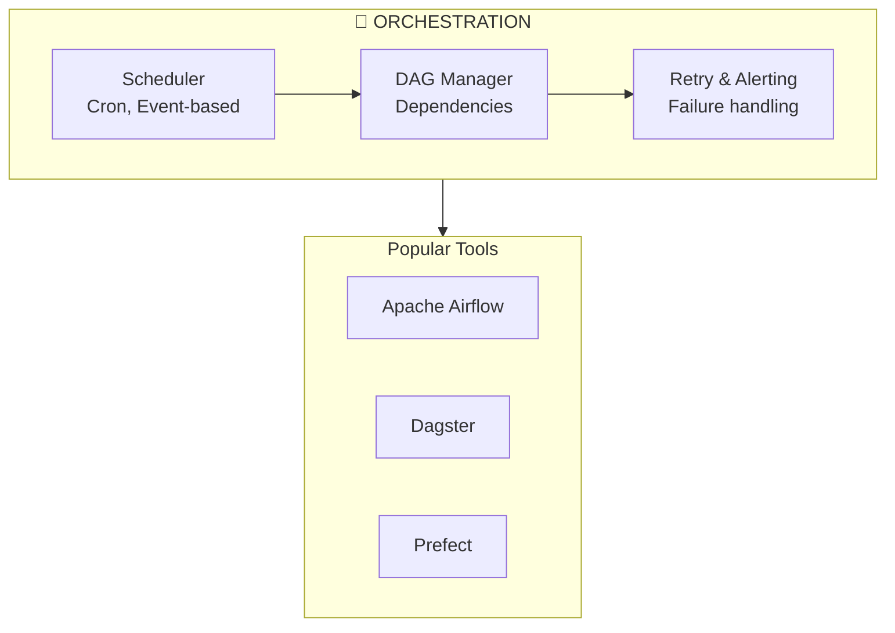

| Công cụ | Đặc điểm |
|---------|----------|
| **Apache Airflow** | DAG-based, mature ecosystem, most popular |
| **Dagster** | Asset-centric, modern approach |
| **Prefect** | Python-native, flexible |

### 9.3 Observability (Quan Sát)

**Observability = Metrics + Logs + Traces**

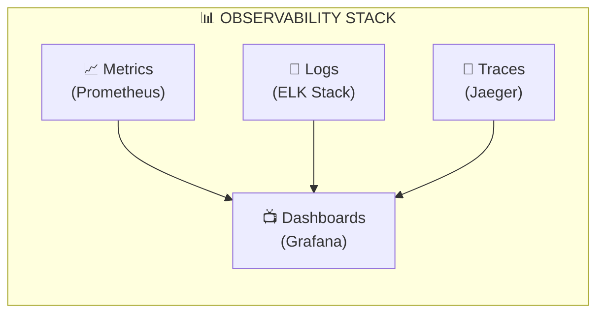

| What to Monitor | Mô tả |
|-----------------|-------|
| Pipeline latency | Thời gian chạy end-to-end |
| Data freshness | Data cũ bao lâu rồi? |
| Error rates | Tỷ lệ lỗi |
| Resource usage | CPU, Memory, Disk |

### 9.4 Data Governance

| Aspect | Mô tả | Tools |
|--------|-------|-------|
| **Data Quality** | Validate data meets expectations | Great Expectations, dbt tests |
| **Data Lineage** | Track data origins & transformations | OpenLineage, DataHub |
| **Data Catalog** | Discover & understand datasets | DataHub, Amundsen |
| **Access Control** | Who can access what? | IAM, Row-level security |

### 9.5 What Orchestration & Observability Needs

- ✅ SLA monitoring
- ✅ Alerting (Slack, PagerDuty)
- ✅ Lineage tracking
- ✅ Cost monitoring
- ✅ Data quality checks

---

## 10. Áp Dụng Vào Dự Án Mini Data Lake

### 10.1 Mapping Stages Vào Project

| Stage | Project Component | Technology |
|-------|-------------------|------------|
| **1. Source** | PostgreSQL (OLTP), AI Edge (YOLO) | PostgreSQL, YOLOv11 |
| **2. Ingestion** | CDC + Event Streaming + Alerts | Debezium, Kafka, RabbitMQ |
| **3. Raw Storage** | Data Lake (Bronze zone) | MinIO, Hive Metastore |
| **4. Processing** | Batch + Stream Processing | Apache Spark, Apache Flink |
| **5. Serving** | Query Engine | Trino |
| **6. Consumption** | Dashboard + Monitoring | Streamlit, Grafana |
| **Cross-cutting** | Orchestration + Monitoring | Airflow, Prometheus |

### 10.2 Luồng Dữ Liệu Trong Project

#### Luồng 1: Dữ liệu nghiệp vụ (Business Data - CDC)
```
PostgreSQL → Debezium → Kafka → Spark → MinIO (Parquet) → Trino → BI
```

#### Luồng 2: Dữ liệu sự kiện AI (Vision Data - Streaming)
```
Camera/YOLO → Kafka → Flink → MinIO (JSONL/Parquet) → Trino → Dashboard
```

### 10.3 Sơ Đồ Kiến Trúc Project

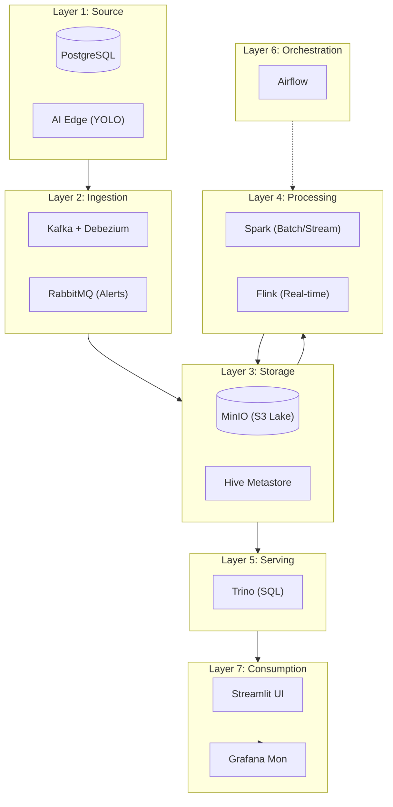

### 10.4 Access Ports

| Service | Port | Link |
|---------|------|------|
| Streamlit UI | 8501 | http://localhost:8501 |
| MinIO Console | 9001 | http://localhost:9001 |
| Kafka UI | 8081 | http://localhost:8081 |
| Trino UI | 8080 | http://localhost:8080 |
| Airflow UI | 8085 | http://localhost:8085 |
| Grafana | 3000 | http://localhost:3000 |
| Spark Master | 8090 | http://localhost:8090 |
| Flink UI | 8092 | http://localhost:8092 |

---

## 11. So Sánh & Best Practices

### 11.1 Batch vs Streaming - Khi Nào Dùng?

| Tiêu chí | Batch | Streaming |
|----------|-------|-----------|
| **Latency** | Minutes - Hours | Seconds |
| **Data Size** | Bounded | Unbounded |
| **Trigger** | Schedule-driven | Event-driven |
| **Complexity** | Lower | Higher |
| **Debug** | Easier | Harder |
| **Use Cases** | Reports, ML training, historical analysis | Alerts, fraud detection, live dashboards |

> 👉 Rule of thumb: **Start with Batch**, add Streaming only when truly needed

### 11.2 Data Lake vs Data Warehouse vs Lakehouse

| | Data Lake | Data Warehouse | Lakehouse |
|--|-----------|----------------|-----------|
| **Data** | Raw, any format | Structured, cleaned | Both |
| **Schema** | Schema-on-read | Schema-on-write | Both |
| **Users** | Data Engineers, Data Scientists | BI Analysts, Business | All |
| **Query** | Flexible (SQL, Python) | SQL optimized | Both |
| **Cost** | Lower per GB | Higher per GB | Balanced |
| **ACID** | ❌ | ✅ | ✅ |

> 👉 Trend: **Lakehouse** đang trở thành lựa chọn phổ biến (best of both worlds)

### 11.3 ETL vs ELT

| ETL | ELT |
|-----|-----|
| Extract → Transform → Load | Extract → Load → Transform |
| Transform trước khi load | Load raw, transform in-place |
| Cần ETL server mạnh | Tận dụng DW power |
| Old School | Modern |

> 👉 Trend: **ELT** đang thắng thế nhờ sức mạnh của cloud data warehouse

### 11.4 Nguyên Tắc Sống Còn

1. **Raw ≠ Processed ≠ Serving** - Mỗi stage có vai trò riêng
2. **Batch + Streaming coexist** - Hybrid pipeline là thực tế
3. **Orchestration là bắt buộc** - Không có điều phối = chaos
4. **Observability không phải optional** - Không monitor = không biết sập
5. **Data chỉ có giá trị khi được sử dụng** - Consumption là mục tiêu cuối

---

## 12. Tổng Kết & Quick Reference

### 12.1 Data Lifecycle Summary

```
Source → Ingestion → Raw Storage → Processing → Serving → Consumption
                                                      ↺ (feedback loop)
```

### 12.2 Technology Stack by Stage

| Stage | Role | Technologies (Project) | Technologies (Industry) |
|-------|------|------------------------|------------------------|
| **1. Source** | Sinh dữ liệu | PostgreSQL, YOLO | PostgreSQL, MySQL, Kafka, IoT |
| **2. Ingestion** | Thu thập | Debezium, Kafka, RabbitMQ | Debezium, Kafka Connect, Airbyte |
| **3. Raw Storage** | Lưu trữ thô | MinIO, Hive Metastore | S3, GCS, Delta Lake, Iceberg |
| **4. Processing** | Xử lý | Spark, Flink | Spark, Flink, dbt |
| **5. Serving** | Phục vụ query | Trino | Snowflake, BigQuery, Redshift |
| **6. Consumption** | Tiêu thụ | Streamlit, Grafana | Tableau, PowerBI, Superset |
| **Cross-cutting** | Điều phối/Giám sát | Airflow, Prometheus | Airflow, Prometheus, DataHub |

### 12.3 Input/Output Quick Reference

| Stage | Input | Output |
|-------|-------|--------|
| **1. Source** | Business operations, User actions | Raw records (ID, timestamp, schema) |
| **2. Ingestion** | Raw records từ Source | Kafka messages / Object Storage files |
| **3. Raw Storage** | Kafka messages / Batch files | Parquet files (Bronze zone) |
| **4. Processing** | Bronze files / Kafka streams | Silver + Gold tables |
| **5. Serving** | Gold tables | Optimized tables for query |
| **6. Consumption** | Query results | Insights, Decisions, Actions |

### 12.4 Key Metrics

| Metric | Target | Mô tả |
|--------|--------|-------|
| **Latency** | Real-time < 5s, Batch < 1 hour | End-to-end processing time |
| **Freshness** | Dashboard ≤ 15min, Reports ≤ 1 day | Data staleness |
| **Completeness** | > 99.9% | No data loss |
| **Quality** | > 99% | Schema compliance |
| **Lineage** | 100% | Traceability |

### 12.5 Tài Liệu Liên Quan

- [ARCHITECTURE_OVERVIEW.md](ARCHITECTURE_OVERVIEW.md) - Chi tiết kiến trúc 7-layer của dự án
- [README.md](README.md) - Hướng dẫn sử dụng dự án

---

> **Kết luận**: Một hệ thống data thành công không phải vì nhiều công nghệ, mà vì **mỗi stage làm đúng vai trò của mình**.

---

*Tài liệu được tạo và duy trì bởi Data Engineering Team*
*Cập nhật lần cuối: 2026-02-07*
