# Mini Data Lake + CDC (Debezium) + Kafka + RabbitMQ + MinIO + Hive Metastore + Trino + Spark + Flink (+ DVC)

Repo này là một **mini data lake chạy bằng Docker Compose**, mô phỏng một pipeline dữ liệu thực tế với đầy đủ các thành phần phổ biến trong hệ sinh thái data engineering / data platform.

Mục tiêu của repo:
- Hiểu **luồng dữ liệu end-to-end** (OLTP → CDC → Streaming → Data Lake → Query).
- Thực hành **CDC với Debezium + Kafka**.
- Lưu trữ dữ liệu **raw/analytics trên S3 (MinIO)**.
- **Xử lý batch và streaming với Apache Spark**.
- **Xử lý real-time streaming với Apache Flink**.
- **Điều phối workflow với Apache Airflow** ⭐ NEW.
- **Giám sát toàn diện với Prometheus & Grafana** ⭐ NEW.
- Query dữ liệu bằng **Trino + Hive Metastore**.
- Tách **alert/event** bằng **RabbitMQ**.
- Version hóa **dataset/model** bằng **DVC**.
- **Tài liệu chi tiết**: [Data Lifecycle & Architecture](doc/data-lifecycle/DATA_LIFECYCLE.md) ⭐ NEW.

---

## 1) Thành phần chính trong hệ thống

- **PostgreSQL (inventory)**  
  Hệ OLTP nguồn (source DB) để demo CDC.

- **Debezium + Kafka Connect**  
  Bắt thay đổi (INSERT/UPDATE/DELETE) từ PostgreSQL thông qua WAL (CDC) và đẩy ra Kafka topic.

- **Kafka**  
  Event bus cho CDC và streaming.

- **RabbitMQ (cluster 2 node)**  
  Messaging cho alert/event nhẹ (pub/sub, routing key).

- **MinIO (S3-compatible)**  
  Data Lake storage (raw zone): Parquet, JSONL, ảnh, frame video…

- **Hive Metastore (HMS) + metastore-db (PostgreSQL)**  
  Metadata catalog cho bảng Hive/Trino.

- **Trino**  
  SQL query engine đọc Parquet trên MinIO thông qua Hive Metastore.

- **Apache Spark** ⭐ NEW  
  Distributed processing engine cho batch và streaming. Gồm 1 Master + 1 Worker.

- **Apache Flink** ⭐ NEW  
  True streaming engine với low-latency. Gồm 1 JobManager + 1 TaskManager.

- **Apache Airflow** ⭐ NEW  
  Orchestration engine để điều phối pipeline và schedule jobs.

- **Prometheus + Grafana** ⭐ NEW  
  Monitoring stack để giám sát metrics và visualization.

- **DVC**  
  Versioning dataset/model, remote đặt trên MinIO bucket `dvcstore`.

---

## 1.5) Kiến trúc 6-Layer Data Pipeline

```
┌─────────────────────────────────────────────────────────────────────────────────┐
│                    ENHANCED 7-LAYER DATA PIPELINE                                │
├──────────────┬────────────────┬──────────────────────────────────────────────────┤
│   Layer      │    Status      │    Technology                                    │
├──────────────┼────────────────┼──────────────────────────────────────────────────┤
│ 1. Source    │     ✅         │ Camera/YOLO, CDC-Postgres (inventory)           │
│ 2. Ingestion │     ✅         │ Kafka + Debezium, RabbitMQ                       │
│ 3. Raw Store │     ✅         │ MinIO (S3), Parquet/JSONL files                  │
│ 4. Processing│     ✅         │ Apache Spark (Batch/Stream), Apache Flink        │
│ 5. Serving   │     ✅         │ Trino + Hive Metastore                           │
│ 6. Consume   │     ✅         │ Streamlit Dashboard, DBeaver, BI Tools           │
│ 7. Ops & Mon │     ✅ NEW     │ Airflow, Prometheus, Grafana                     │
└──────────────┴────────────────┴──────────────────────────────────────────────────┘
```

### Layer 7 - Ops & Monitoring (Airflow + Prometheus + Grafana)

**Apache Airflow (Orchestration):**
- **DAGs**: Schedule Spark jobs, check data quality, coordinate pipeline steps.
- **Port**: 8085 (Web UI)

**Prometheus + Grafana (Monitoring):**
- **Prometheus**: Collect metrics from Kafka, Postgres, MinIO, Spark, Flink, System.
- **Grafana**: Visualize metrics with pre-built dashboards.
- **Exporters**: kafka-exporter, postgres-exporter, node-exporter.
- **Ports**: 9090 (Prometheus), 3000 (Grafana)

### Layer 4 - Processing (Spark + Flink)

**Apache Spark:**
- `spark/jobs/batch_vision_aggregator.py` - Batch job đọc raw Parquet, tạo hourly/daily aggregations
- `spark/jobs/streaming_kafka_processor.py` - Structured Streaming consume CDC từ Kafka
- `spark/jobs/streaming_vision_events.py` - Real-time vision event processing với windowing

**Apache Flink:**
- `flink/jobs/stream_processor.py` - Stream processing cho vision và CDC events
- `flink/jobs/flink_sql_analytics.py` - SQL-based analytics với Flink Table API

---

## 2) Kiến trúc hệ thống & luồng dữ liệu

### 2.1 Tổng quan (Data Platform)

### 2.1 Tổng quan (Data Platform)

Hệ thống được tổ chức thành **7 lớp (Layers)** theo luồng dữ liệu chuẩn, chi tiết như sau:

```mermaid
flowchart LR
  %% =========================
  %% LAYER 1: EDGE / AI PRODUCER
  %% =========================
  subgraph EDGE["Layer 1: Edge / AI App (YOLO)"]
    CAM["Camera/RTSP/USB<br/>(OpenCV)"] --> YOLO["YOLO Inference<br/>(person)"]
    YOLO --> AGG["Event Aggregator<br/>(window=5s)<br/>- person_present<br/>- person_count<br/>- conf stats<br/>- frame_uri"]
  end

  %% =========================
  %% LAYER 2: INGESTION & MESSAGING
  %% =========================
  subgraph MQ["Layer 2: Ingestion & Messaging"]
    direction TB
    subgraph RABBIT["RabbitMQ (Realtime Alerts)"]
        EX["Exchange: vision.alerts (topic)"]
        Q1["Queue: q_person_present<br/>routingKey=person.present"]
        Q2["Queue: q_person_gone<br/>routingKey=person.gone"]
        EX --> Q1
        EX --> Q2
    end
    
    subgraph KAFKASYS["Kafka Ecosystem"]
        KAFKA["Kafka Broker<br/>(Event Bus)"]
        CONN["Kafka Connect<br/>(Debezium Source)"]
    end
  end

  AGG -->|"publish JSON<br/>person.present/gone"| EX
  AGG -->|"publish events<br/>(vision.events)"| KAFKA
  
  Q1 --> ALERTSVC["Consumer App<br/>(Slack/Email/UI)"]
  Q2 --> ALERTSVC

  %% =========================
  %% LAYER 1 (OLTP Source)
  %% =========================
  subgraph OLTP["Layer 1: OLTP Source"]
    PG["cdc-postgres (inventory)<br/>Table: public.customers"]
    PG -->|"WAL logical decoding"| CONN
    CONN -->|"CDC Events"| KAFKA
  end

  %% =========================
  %% LAYER 3: RAW STORAGE
  %% =========================
  subgraph RAW["Layer 3: Raw Storage (MinIO / S3)"]
    MINIO["MinIO Bucket: lake<br/>raw/vision_events/..."]
    FRAMES["MinIO Bucket: lake<br/>raw/frames/... (optional)"]
  end

  AGG -->|"direct write (optional)<br/>Parquet/JSONL"| MINIO
  YOLO -->|"snapshot frame"| FRAMES

  %% =========================
  %% LAYER 4: PROCESSING
  %% =========================
  subgraph PROC["Layer 4: Processing"]
    SPARK["Apache Spark<br/>(Batch/Streaming)"]
    FLINK["Apache Flink<br/>(Real-time State)"]
  end

  KAFKA -->|"Streaming Source"| SPARK
  KAFKA -->|"Streaming Source"| FLINK
  SPARK -->|"Write Parquet/Delta"| MINIO
  FLINK -->|"Write State/Results"| MINIO
  
  %% =========================
  %% LAYER 6: ORCHESTRATION
  %% =========================
  subgraph ORCH["Layer 6: Orchestration"]
    AIRFLOW["Apache Airflow<br/>(DAG Scheduler)"]
  end

  AIRFLOW -.->|"Trigger Job"| SPARK
  AIRFLOW -.->|"Check Data"| MINIO

  %% =========================
  %% LAYER 5: METADATA & QUERY
  %% =========================
  subgraph METAQUERY["Layer 5: Metadata & Query"]
    HMSDB["metastore-db<br/>(Postgres)"]
    HMS["Hive Metastore<br/>(thrift :9083)"]
    TRINO["Trino<br/>Coordinator+Worker<br/>(:8080)"]
    HMSDB <-->|"metadata tables"| HMS
    HMS <-->|"metastore.uri"| TRINO
  end

  %% FIX: escape ':' in s3a://
  MINIO -->|"external_location (s3a&#58;//bucket/path)"| TRINO
  TRINO --> BI["DBeaver / SQL Client<br/>Query hive.raw.vision_events"]

  %% =========================
  %% LAYER 7: MONITORING
  %% =========================
  subgraph MON["Layer 7: Monitoring"]
    PROM["Prometheus<br/>(Metrics Collection)"]
    GRAF["Grafana<br/>(Dashboards)"]
    PROM --> GRAF
  end

  %% Implicit monitoring links (simplified to avoid clutter)
  KAFKA -.-> PROM
  SPARK -.-> PROM
  FLINK -.-> PROM
  AIRFLOW -.-> PROM

  %% =========================
  %% DVC (DATA VERSIONING)
  %% =========================
  subgraph DVCSUB["DVC (Versioning / Reproducibility)"]
    DVCSTORE["MinIO Bucket: dvcstore<br/>(DVC remote)"]
    PIPE["DVC Pipeline Stages<br/>- generate<br/>- ingest<br/>- validate<br/>- query"]
  end

  PIPE --> DVCSTORE
  MINIO -. "data tracked by dvc<br/>(optional)" .-> PIPE
```





**Cách đọc nhanh (Kiến trúc 7 Layer):**
*   **Layer 1 (Source)**: Dữ liệu sinh ra từ **Camera AI** (Video/Image) và **Postgres OLTP** (Transaction).
*   **Layer 2 (Ingestion)**:
    *   **Kafka**: Nhận luồng dữ liệu lớn (CDC, Vision Events) để phân phối cho các consumer.
    *   **RabbitMQ**: Nhận các cảnh báo tức thời (Alerts) cần độ trễ thấp (gửi email, noti).
*   **Layer 3 (Storage)**: **MinIO** đóng vai trò Data Lake, lưu trữ toàn bộ dữ liệu thô (Raw) và đã xử lý (Processed) dưới dạng Parquet/JSONL.
*   **Layer 4 (Processing)**:
    *   **Apache Spark**: Chạy các job ETL batch hàng ngày hoặc xử lý streaming phức tạp.
    *   **Apache Flink**: Xử lý stream thời gian thực (Stateful Stream Processing).
*   **Layer 5 (Query & Serving)**: **Trino** truy vấn trực tiếp dữ liệu trên MinIO thông qua metadata từ **Hive Metastore**.
*   **Layer 6 (Orchestration)**: **Airflow** lên lịch và điều phối toàn bộ các task xử lý dữ liệu.
*   **Layer 7 (Monitoring)**: **Prometheus** thu thập metrics từ toàn bộ hệ thống, **Grafana** hiển thị dashboard theo dõi sức khỏe pipeline.

### 2.2 Luồng “Vision Event” - use-case “5 giây còn người thì tiếp tục” (state machine + event types: person_present_start, person_present_heartbeat, person_present_end).

```mermaid
flowchart LR
  %% =========================
  %% Vision app (YOLO) -> Events
  %% =========================
  subgraph Edge["Edge / Vision App"]
    CAM["Camera / RTSP / Webcam"] --> YOLO["YOLO Person Detector\n(15 FPS, window 5s)"]
    YOLO --> EV["Event Builder\n(person_present / person_count / conf)\n+ frame_uri (optional)"]
  end

  %% =========================
  %% Realtime messaging
  %% =========================
  subgraph MQ["Realtime Messaging"]
    RMQ["RabbitMQ\n(vision.alerts exchange)"]
    KAFKA["Kafka\n(topics: vision.events / cdc.*)"]
  end

  EV -->|publish alert| RMQ
  EV -->|publish events| KAFKA

  %% =========================
  %% OLTP & CDC
  %% =========================
  subgraph OLTP["OLTP + CDC"]
    PG["PostgreSQL (inventory)\nTables: customers, ..."]
    DBZ["Debezium Connect\nCDC from Postgres"]
  end

  RMQ -->|consumer writes alerts| PG
  KAFKA -->|stream consumer writes facts| PG

  PG -->|WAL / logical decoding| DBZ
  DBZ -->|CDC events| KAFKA

  %% =========================
  %% Data Lake storage
  %% =========================
  subgraph Lake["Data Lake (Raw Zone)"]
    MINIO["MinIO (S3)\nBuckets: lake / dvcstore"]
    RAWP["Raw Parquet\ns3://lake/raw/vision_events/..."]
    RAWJ["Raw JSONL (CDC dump)\ns3://lake/raw/cdc/..."]
  end

  KAFKA -->|batch/stream sink| RAWP
  KAFKA -->|CDC to JSONL| RAWJ
  RAWP --> MINIO
  RAWJ --> MINIO

  %% =========================
  %% Metadata + Query
  %% =========================
  subgraph MetaQuery["Metadata + Query"]
    HMSDB["metastore-db (Postgres)\nHive Metastore metadata store"]
    HMS["Hive Metastore\n(thrift://:9083)"]
    TRINO["Trino\n(hive catalog -> MinIO)"]
  end

  MINIO -->|external_location| HMS
  HMSDB <-->|schemas/tables| HMS
  HMS -->|table metadata| TRINO
  TRINO -->|SQL query| BI["DBeaver / BI / Client"]

  %% =========================
  %% Versioning / Repro
  %% =========================
  subgraph Repro["Reproducibility"]
    DVC["DVC\ntracks datasets/artifacts"]
    GIT["Git\ncode + configs"]
  end

  MINIO <-->|remote storage| DVC
  DVC --> GIT

  %% Notes
  classDef core fill:#eef,stroke:#447,stroke-width:1px;
  class YOLO,EV,RMQ,KAFKA,PG,DBZ,MINIO,HMS,TRINO core;

```




YOLO → event → RabbitMQ/Kafka → Postgres/MinIO → Hive Metastore → Trino → DBeaver/BI

---

## 3) Port mapping nhanh

| Service | Host port | Ghi chú |
|------|---------|--------|
| MinIO S3 API | 9000 | bucket: lake, iot-time-series, dvcstore |
| MinIO Console | 9001 | UI |
| Trino UI/API | 8080 | /ui |
| Kafka | 9092 | broker |
| Kafka UI | 8081 | UI |
| Kafka Connect | 8083 | REST |
| Postgres metastore-db | 5432 | hive |
| Postgres inventory | 5433 | dbz |
| RabbitMQ node 1 | 5672 / 15672 | AMQP / UI |
| RabbitMQ node 2 | 5673 / 15673 | AMQP / UI |
| Spark Master | 7077 / 8090 | RPC / Web UI |
| Spark Worker | 8091 | Web UI |
| Flink JobManager | 6123 / 8092 | RPC / Web UI |
| Flink TaskManager | - | Internal only |

---

## 4) Chạy hệ thống

```bash
docker compose up -d
docker ps
```

Health check:

#### Manual Health Check (Quick)
```bash
curl -sf http://localhost:9000/minio/health/live && echo OK
curl -sf http://localhost:8080/v1/info && echo OK
curl -sf http://localhost:8083/ && echo OK
```

#### Automated Health Check (Recommended)
Sử dụng bộ test suite toàn diện để kiểm tra tất cả các layer:
```bash
cd homework3
./run_tests.sh
```

---

## 5) Kiểm tra bằng DBeaver

### Trino
```sql
SHOW SCHEMAS FROM hive;
SHOW TABLES FROM hive.raw;
SELECT * FROM hive.raw.vision_events LIMIT 10;
```

### PostgreSQL inventory
```sql
SELECT * FROM public.customers;
```

---

## 6) Vai trò từng công nghệ

- **PostgreSQL**: OLTP source
- **Debezium + Kafka**: CDC pipeline
- **Kafka**: event bus
- **RabbitMQ**: alert & workflow
- **MinIO**: data lake storage
- **Apache Spark**: batch & streaming processing ⭐ NEW
- **Apache Flink**: real-time stream processing ⭐ NEW
- **Hive Metastore**: metadata catalog
- **Trino**: SQL query engine
- **DVC**: dataset/model versioning

---

## 7) Spark & Flink Usage ⭐ NEW

### Khởi động Spark Cluster

```bash
# Start Spark Master + Worker
cd mini_datalake_cdc_dvc
docker compose up -d spark-master spark-worker

# Check status
docker compose ps | grep spark

# View Spark Master UI
open http://localhost:8090
```

### Submit Spark Jobs

```bash
# Batch job - Vision Event Aggregator
docker exec spark-master spark-submit \
    --master spark://spark-master:7077 \
    --packages org.apache.hadoop:hadoop-aws:3.3.4,com.amazonaws:aws-java-sdk-bundle:1.12.262 \
    /opt/bitnami/spark/jobs/batch_vision_aggregator.py

# Streaming job - Kafka CDC Processor
docker exec spark-master spark-submit \
    --master spark://spark-master:7077 \
    --packages org.apache.spark:spark-sql-kafka-0-10_2.12:3.5.0 \
    /opt/bitnami/spark/jobs/streaming_kafka_processor.py
```

### Khởi động Flink Cluster

```bash
# Start Flink JobManager + TaskManager
cd mini_datalake_cdc_dvc
docker compose up -d flink-jobmanager flink-taskmanager

# Check status
docker compose ps | grep flink

# View Flink Web UI
open http://localhost:8092
```

### Run Flink Jobs

```bash
# Run in demo mode (local)
cd homework3
python flink/jobs/stream_processor.py

# Run with PyFlink (requires apache-flink package)
USE_FLINK=true python flink/jobs/stream_processor.py
```

---

## 8) Streamlit Dashboard

```bash
# Start the dashboard
cd homework3
streamlit run main_st.py

# Open http://localhost:8501
```

**Dashboard Pages:**
- 🎥 **Live Detection** - Real-time YOLO person detection
- 📁 **Data Explorer** - Browse MinIO S3 buckets
- 📈 **Statistics** - Query Trino for analytics
- 🔔 **Real-time Alerts** - RabbitMQ alert monitoring
- 🔄 **CDC Monitor** - Kafka CDC event browser
- 🔥 **Spark Monitor** - Spark cluster & jobs status
- 🌊 **Flink Monitor** - Flink cluster & jobs status
- ⚡ **Processing Demo** - Processing layer visualization
- 📊 **Monitoring Dashboard** - Integrates Airflow, Prometheus, Grafana ⭐ NEW
- ⚙️ **System Status** - All services health check

---

## 9) Orchestration & Monitoring ⭐ NEW

### Apache Airflow

```bash
# Start Airflow
docker compose up -d airflow-postgres airflow-init
docker compose up -d airflow-webserver airflow-scheduler

# Access UI: http://localhost:8085
# Login: admin / admin123
```

**Available DAGs:**
- `spark_batch_daily`: Run daily Spark aggregation jobs
- `data_quality_check`: Validate data presence and freshness
- `pipeline_orchestrator`: Coordinate full pipeline execution

### Prometheus & Grafana

```bash
# Start Monitoring Stack
docker compose up -d prometheus grafana node-exporter kafka-exporter postgres-exporter

# Access Grafana: http://localhost:3000
# Access Prometheus: http://localhost:9090
```

**Grafana Dashboards:**
- **Data Pipeline Overview**: Comprehensive view of system health, resources, and critical metrics.

---

## 10) Ghi chú

Repo phục vụ học tập và demo pipeline production-like.

Sơ đồ tư duy tổng hợp:
- Dữ liệu sinh ra từ đâu? -> cdc-postgres (nghiệp vụ) và Code Python (camera).
- Dữ liệu đi đường nào? -> Đi qua kafka (CDC) hoặc rabbitmq (Alerts).
- Dữ liệu nằm ở đâu? -> Nằm hết trong minio (S3).
- Dữ liệu được xử lý thế nào? -> Dùng Spark (batch/streaming) hoặc Flink (real-time).
- Làm sao tìm thấy dữ liệu? -> Nhờ hive-metastore chỉ đường.
- Làm sao lấy dữ liệu ra báo cáo? -> Dùng trino viết SQL.

---

## 11) Testing Suite ⭐ NEW

Hệ thống đi kèm với bộ test toàn diện sử dụng **Pytest** để đảm bảo tính ổn định của các layer.

### Cấu trúc bộ test:
- `tests/test_pipeline.py`: Kiểm tra sức khỏe (Health Check) toàn bộ 7 lớp.
- `tests/test_spark_flink.py`: Kiểm tra cụm Spark và Flink (Master, Worker, Slots, Jobs).
- `tests/test_airflow.py`: Kiểm tra Orchestration (API, DAGs, Scheduler status).
- `tests/test_monitoring.py`: Kiểm tra Monitoring (Prometheus targets, Grafana datasources).
- `tests/test_e2e_flow.py`: Kiểm tra luồng dữ liệu End-to-End (Data ingestion -> Storage).

### Cách chạy test:
```bash
# Cấp quyền thực thi và chạy script wrapper
chmod +x run_tests.sh
./run_tests.sh

# Hoặc chạy trực tiếp bằng pytest (verbose mode)
python -m pytest tests/ -v
```

Bộ test sẽ tự động tạo báo cáo `test_report.html` sau khi hoàn thành.