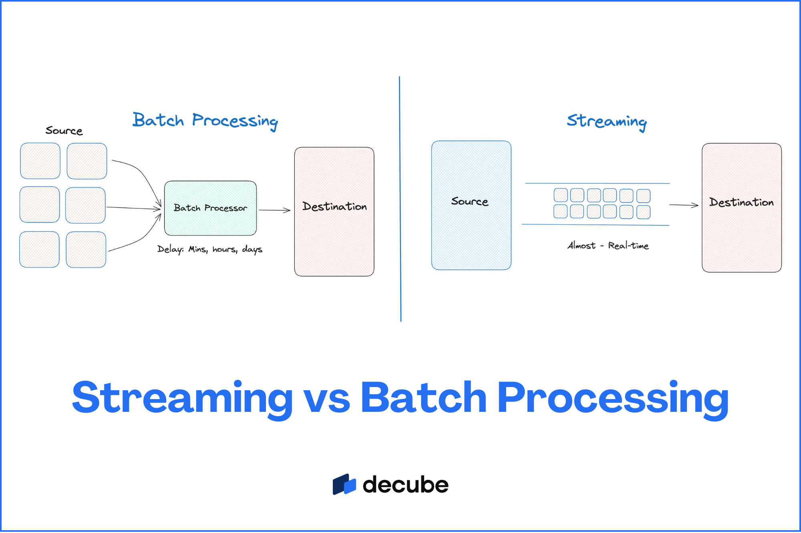
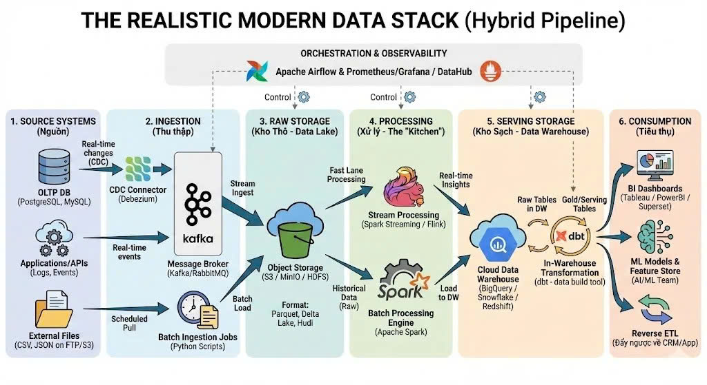
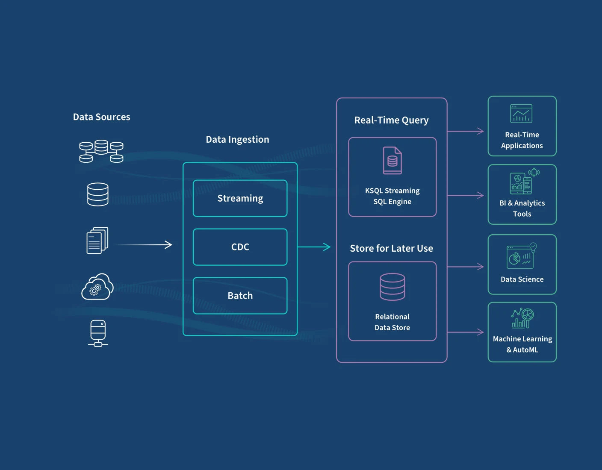
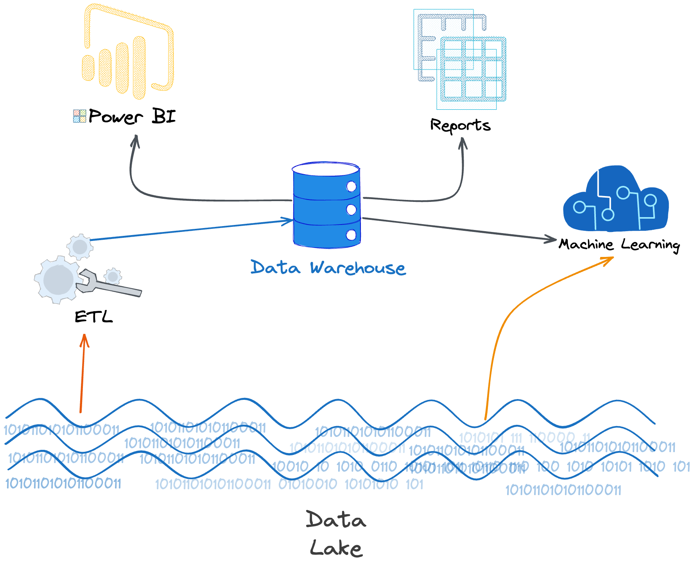
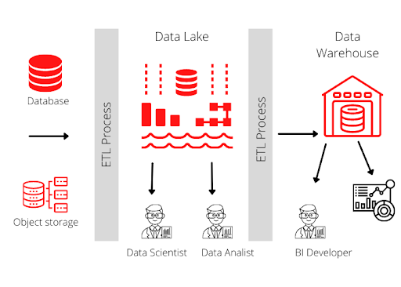
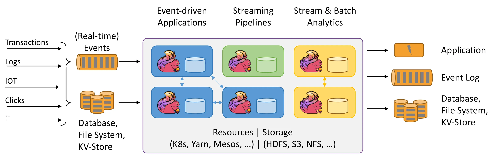
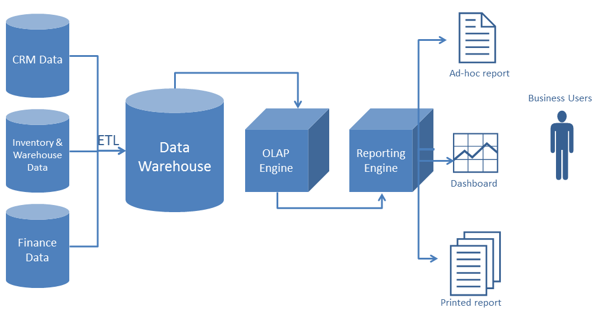
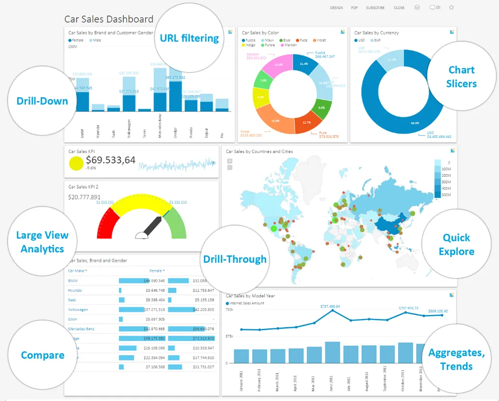
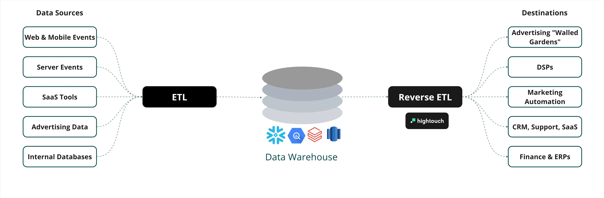

# 📊 Data LifeCycle - Vòng Đời Dữ Liệu

> **Tài liệu đào tạo** về hành trình dữ liệu từ nguồn gốc đến tiêu thụ trong kiến trúc Data Platform hiện đại.

---

## 📋 Mục Lục

1. [Tổng Quan Data Lifecycle](#1-tổng-quan-data-lifecycle)
2. [Kiến Trúc Tổng Quan](#2-kiến-trúc-tổng-quan)
3. [Stage 1: Source Systems](#3-stage-1---source-systems-nguồn-dữ-liệu)
4. [Stage 2: Ingestion](#4-stage-2---ingestion-thu-thập-dữ-liệu)
5. [Stage 3: Raw Storage](#5-stage-3---raw-storage-data-lake--bronze)
6. [Stage 4: Processing](#6-stage-4---processing-xử-lý-dữ-liệu)
7. [Stage 5: Serving Storage](#7-stage-5---serving-storage-data-warehouse--gold)
8. [Stage 6: Consumption](#8-stage-6---consumption--activation-tiêu-thụ-dữ-liệu)
9. [Cross-Cutting Concerns](#9-cross-cutting-concerns-điều-phối--giám-sát)
10. [So Sánh & Chiến Lược](#10-so-sánh--chiến-lược)
11. [Tổng Kết & Quick Reference](#11-tổng-kết--quick-reference)

---

## 1. Tổng Quan Data Lifecycle

### 1.1 Data Lifecycle Là Gì?

**Data Lifecycle** (Vòng đời dữ liệu) là bản đồ mô tả **toàn bộ hành trình của dữ liệu** - từ lúc được sinh ra, di chuyển, biến đổi, lưu trữ, cho đến khi mang lại giá trị thực tế.

Hiểu đơn giản, dữ liệu giống như "nguyên liệu thô":
- Cần được **khai thác** (Source)
- Cần được **vận chuyển** (Ingestion)
- Cần được **lưu kho** (Storage)
- Cần được **chế biến** (Processing)
- Cần được **bày bán** (Serving)
- Để người dùng **tiêu thụ** (Consumption)

```
📌 Công thức:
   Data Lifecycle = Source → Ingestion → Storage → Processing → Serving → Consumption
                                                                    ↺ (feedback loop)
```

### 1.2 Tại Sao Cần Quản Lý Lifecycle?

Nếu không có quy trình rõ ràng, hệ thống dữ liệu sẽ gặp các vấn đề lớn:

| Vấn đề | Giải thích | Lợi ích khi chuẩn hóa |
|--------|------------|-----------------------|
| **Data Silos** | Dữ liệu nằm rải rác, mạnh ai nấy giữ | Dữ liệu tập trung, dễ truy cập (Democratization) |
| **Data Quality** | Dữ liệu lỗi, không ai chịu trách nhiệm | Truy vết được nguồn gốc (Lineage), có cam kết chất lượng |
| **Latency** | Mất nhiều ngày để có báo cáo | Có số liệu sau vài phút hoặc vài giờ |
| **Scalability** | Hệ thống sập khi dữ liệu tăng | Kiến trúc mở rộng được theo nhu cầu |

### 1.3 Hybrid Pipeline: Batch + Streaming

Trong thực tế, một hệ thống dữ liệu hiện đại thường kết hợp cả hai mô hình:

* **Batch Processing (Xử lý theo lô)**: Dành cho báo cáo lịch sử, độ chính xác tuyệt đối, chi phí thấp. Ví dụ: Báo cáo doanh thu cuối ngày.
* **Streaming Processing (Xử lý luồng)**: Dành cho sự kiện thời gian thực, phản ứng nhanh. Ví dụ: Phát hiện gian lận thẻ tín dụng ngay lập tức.


*Sự khác biệt giữa xử lý Batch (gom nhóm) và Streaming (xử lý từng sự kiện)*

---

## 2. Kiến Trúc Tổng Quan

### 2.1 The Modern Data Stack

Đây là mô hình tham chiếu phổ biến cho các Data Platform hiện đại:

```
┌─────────────────────────────────────────────────────────────────────────────────┐
│                         THE MODERN DATA STACK                                    │
│                        (Reference Architecture)                                  │
├──────────────┬────────────────┬──────────────────────────────────────────────────┤
│   Tầng       │    Vai Trò     │    Công Nghệ Tiêu Biểu (Industry Standard)       │
├──────────────┼────────────────┼──────────────────────────────────────────────────┤
│ 1. Source    │ Sinh dữ liệu   │ Databases (Postgres, MySQL), SaaS Apps, IoT      │
│ 2. Ingestion │ Thu thập       │ Kafka, Debezium, Airbyte, Fivetran               │
│ 3. Raw Store │ Lưu trữ thô    │ S3, Google Cloud Storage, Azure Blob, MinIO      │
│ 4. Processing│ Xử lý/biến đổi │ Apache Spark, Apache Flink, dbt                  │
│ 5. Serving   │ Phục vụ query  │ Snowflake, BigQuery, Databricks, Trino           │
│ 6. Consume   │ Tiêu thụ       │ Tableau, PowerBI, Looker, Superset               │
├──────────────┴────────────────┴──────────────────────────────────────────────────┤
│ Cross-Cutting: Orchestration (Airflow) & Observability (Prometheus/Grafana)      │
└─────────────────────────────────────────────────────────────────────────────────┘
```


*Các lớp kiến trúc dữ liệu chi tiết*

> 💡 **Phân tích hình ảnh**:
> Mô hình này minh họa rõ sự phân tách trách nhiệm (Separation of Concerns):
> - **Ingest Layer**: Chỉ lo việc lấy dữ liệu vào, không xử lý logic phức tạp.
> - **Storage Layer**: Chỉ lo lưu trữ an toàn, chi phí thấp.
> - **Processing Layer**: Tách biệt Compute (tính toán) và Storage (lưu trữ), giúp mở rộng linh hoạt.
> - **Consumption Layer**: Phục vụ nhiều đối tượng khác nhau (Business User, Data Scientist, App) từ cùng một nguồn dữ liệu đã xử lý.


---
### 2.2 Sơ Đồ Luồng Dữ Liệu (Logical Flow)


*Sơ đồ luồng dữ liệu tổng quát từ Source đến Consumption*

---

## 3. Stage 1 - Source Systems (Nguồn Dữ Liệu)

### 3.1 Định Nghĩa

**Source Systems** là nơi dữ liệu được sinh ra. Trong một công ty, đây thường là các phần mềm quản lý (ERP, CRM), ứng dụng mobile, hoặc cảm biến IoT.

> 🎓 **Nguyên tắc**: Data Engineer không kiểm soát Source. Chúng ta phải thích nghi và thu thập bất kỳ dữ liệu nào Source tạo ra mà không làm ảnh hưởng đến hoạt động của nó.

### 3.2 Các Loại Nguồn Dữ Liệu Chính

#### A. Database Nghiệp Vụ (OLTP)
Dùng để vận hành ứng dụng (tạo đơn hàng, đăng ký user...).
* **Đặc điểm**: Dữ liệu thay đổi liên tục (INSERT, UPDATE, DELETE).
* **Ví dụ**: MySQL lưu thông tin user, PostgreSQL lưu đơn hàng.


*Sự khác biệt: OLTP tối ưu cho giao dịch nhanh, OLAP tối ưu cho phân tích dữ liệu lớn*

#### B. Logs & Events
Ghi lại "những gì đã xảy ra" (hành vi người dùng, lỗi hệ thống).
* **Đặc điểm**: Chỉ ghi thêm (Append-only), số lượng rất lớn, không bao giờ sửa đổi.
* **Ví dụ**: Clickstream (người dùng bấm nút nào), Access log (ai truy cập web).

#### C. External Files (Dữ liệu bên ngoài)
Dữ liệu từ đối tác hoặc hệ thống thứ ba.
* **Đặc điểm**: Thường là file CSV, Excel, JSON gửi theo lịch.

### 3.3 Yêu Cầu Đối Với Source

Để xây dựng hệ thống dữ liệu tốt, Source cần đáp ứng:

1.  **Có định danh (ID)**: Mỗi bản ghi phải có ID duy nhất để phân biệt.
2.  **Có thời gian (Timestamp)**: Phải biết sự kiện xảy ra **khi nào** (`created_at`, `updated_at`).
3.  **Schema ổn định**: Cấu trúc dữ liệu không nên thay đổi đột ngột mà không báo trước.

---

## 4. Stage 2 - Ingestion (Thu Thập Dữ Liệu)

### 4.1 Định Nghĩa

**Ingestion** là quá trình di chuyển dữ liệu từ Source về "kho tập trung" (Data Lake).
Mục tiêu là mang dữ liệu về **an toàn** và **đầy đủ**, chưa cần xử lý đúng sai.

> 🎓 **Khái niệm**: 
> *   **Extract**: Rút dữ liệu từ nguồn.
> *   **Load**: Nạp vào kho đích.
> *   Ingestion thường tương ứng với quy trình **EL (Extract-Load)**.


*Minh họa quá trình thu thập dữ liệu đa nguồn*

> 💡 **Phân tích hình ảnh**:
> Quá trình Ingestion thực tế rất hỗn độn vì Source rất đa dạng:
> - **Structured**: Database (CRM, ERP).
> - **Semi-structured**: Logs, JSON, XML.
> - **Unstructured**: Email, PDF, Images.
> Mũi tên hội tụ về một điểm cho thấy mục tiêu của Ingestion: **Chuẩn hóa quy trình đưa mọi thứ về một đầu mối duy nhất**, dù nguồn gốc có khác nhau thế nào.


### 4.2 Các Phương Pháp Thu Thập

#### Phương Pháp 1: Batch Ingestion (Định kỳ)
Cứ mỗi giờ hoặc mỗi ngày, hệ thống sẽ chạy một lần để lấy dữ liệu mới.
*   **Ưu điểm**: Đơn giản, dễ cài đặt.
*   **Nhược điểm**: Có độ trễ (ví dụ: dữ liệu hôm nay thì ngày mai mới xem được).


#### Phương Pháp 2: Streaming Ingestion (Real-time)
Dữ liệu vừa sinh ra sẽ được chuyển đi ngay lập tức.
*   **CDC (Change Data Capture)**: Kỹ thuật nghe lén database log để bắt mọi thay đổi ngay khi nó xảy ra.
*   **Message Queue (Kafka)**: Đóng vai trò như "băng chuyền" chuyển dữ liệu tốc độ cao.


*Mô hình CDC: Bắt thay đổi từ Database Log → Đẩy vào Kafka → Người dùng hạ nguồn nhận được ngay*

### 4.3 Checklist Thiết Kế

*   [ ] Chọn Batch hay Streaming dựa trên nhu cầu nghiệp vụ?
*   [ ] Đảm bảo không làm treo hệ thống Source? (Ví dụ: không query nặng vào giờ cao điểm)
*   [ ] Xử lý thế nào nếu mạng bị đứt giữa chừng? (Cơ chế Retry)

---

## 5. Stage 3 - Raw Storage (Data Lake / Bronze)

### 5.1 Định Nghĩa

**Raw Storage** (hay Bronze Zone) là nơi lưu trữ dữ liệu **nguyên bản 100%**.
Dữ liệu ở đây giống hệt như ở Source, chưa bị sửa đổi, cắt gọt hay làm sạch.

> 📌 **Tại sao cần lưu dữ liệu thô (xấu)?** 
> Để nếu sau này phát hiện logic xử lý bị sai, ta luôn có thể làm lại từ đầu (Replay) mà không cần truy cập lại vào Source.

### 5.2 Công Nghệ: Data Lake

Data Lake là một kho chứa khổng lồ, giá rẻ, có thể lưu trữ mọi loại dữ liệu (có cấu trúc, phi cấu trúc).




*Tổng quan về lưu trữ dữ liệu đa tầng*

> 💡 **Phân tích hình ảnh**:
> Hình ảnh nhấn mạnh sự "tiến hóa" của dữ liệu trong quá trình lưu trữ:
> - Từ **Raw Data** (hỗn độn, chưa xác định rõ giá trị).
> - Qua các bước xử lý để trở thành **Information** (Thông tin có cấu trúc).
> - Và cuối cùng là **Knowledge/Wisdom** (Kiến thức để ra quyết định).
> Data Lake không chỉ là "kho chứa rác", mà là nơi bắt đầu của chuỗi giá trị này.


### 5.3 Định Dạng File (File Format)

Trong Data Lake, chúng ta không lưu file Excel hay CSV vì chúng chậm và tốn chỗ.
Chuẩn công nghiệp là **Parquet** hoặc **Avro**.

| Format | Đặc điểm | Tại sao dùng? |
|--------|----------|---------------|
| **CSV/JSON** | Dễ đọc bằng mắt | Chậm, tốn dung lượng, khó quản lý schema |
| **Parquet** | Lưu theo cột (Columnar) | Nén cực tốt, truy vấn cực nhanh cho Analytics |

### 5.4 Tổ Chức Dữ Liệu (Partitioning)

Dữ liệu trong Lake cần được chia nhỏ (Partition) để dễ tìm, thường là theo thời gian.
Ví dụ cấu trúc thư mục chuẩn:
```
data_lake/
  └── orders/
      ├── year=2024/
      │   └── month=01/
      │       └── day=01/
      │           └── data.parquet
```

---

## 6. Stage 4 - Processing (Xử Lý Dữ Liệu)

### 6.1 Định Nghĩa

**Processing** là giai đoạn "nấu ăn": Biến dữ liệu thô (Raw) thành dữ liệu sạch và có ý nghĩa (Refined).

Các tác vụ chính:
1.  **Cleaning**: Loại bỏ dữ liệu lỗi, null, duplicate.
2.  **Standardization**: Chuẩn hóa format (ví dụ: `2024/01/01` thành `2024-01-01`).
3.  **Transformation**: Tính toán, kết hợp nhiều nguồn dữ liệu (Join).

### 6.2 Silver & Gold Layers

Mô hình **Medallion Architecture** chia dữ liệu làm 3 lớp:

1.  **Bronze (Raw)**: Dữ liệu thô.
2.  **Silver (Refined)**: Dữ liệu đã làm sạch, chuẩn hóa, có thể query được nhưng vẫn ở dạng chi tiết.
3.  **Gold (Aggregated)**: Dữ liệu đã tổng hợp theo nghiệp vụ (ví dụ: Doanh thu theo ngày), sẵn sàng cho báo cáo.

### 6.3 Công Nghệ Xử Lý

*   **Apache Spark**: "Vua" của xử lý dữ liệu lớn (Big Data Processing).
*   **Apache Flink**: Chuyên gia xử lý luồng (Stream Processing) với độ trễ cực thấp.
*   **dbt (data build tool)**: Công cụ hiện đại để viết logic transform bằng SQL ngay trong Data Warehouse.


*Flink giúp xử lý các sự kiện liên tục không ngừng nghỉ*

---

## 7. Stage 5 - Serving Storage (Data Warehouse / Gold)

### 7.1 Định Nghĩa

Sau khi chế biến xong, món ăn cần được bày biện đẹp mắt. **Serving Layer** chính là nơi đó.
Đây là nơi chứa dữ liệu **Gold**, được tối ưu hóa tối đa cho tốc độ truy vấn (Query Speed).

### 7.2 Công Nghệ: Data Warehouse

Data Warehouse là cơ sở dữ liệu đặc biệt, không tối ưu cho ghi (insert) mà tối ưu cho đọc (select) lượng lớn dữ liệu cùng lúc.

*   **Hiện đại (Cloud)**: BigQuery, Snowflake, Redshift.
*   **Query Engine**: Trino/Presto (cho phép query SQL trực tiếp lên Data Lake).



### 7.3 Mô Hình Dữ Liệu: Star Schema

Để báo cáo chạy nhanh, dữ liệu thường được thiết kế theo mô hình Ngôi Sao (Star Schema):
*   **Fact Table**: Bảng chứa số liệu, sự kiện (Doanh thu, Giao dịch). Rất dài.
*   **Dimension Table**: Bảng chứa thông tin mô tả (Khách hàng, Sản phẩm, Thời gian). Rất rộng.

---

## 8. Stage 6 - Consumption (Tiêu Thụ Dữ Liệu)

### 8.1 Định Nghĩa

Đây là điểm cuối cùng - khi dữ liệu tạo ra giá trị. Dữ liệu nằm trong kho mà không ai dùng là dữ liệu chết.

### 8.2 Các Cách Tiêu Thụ Chính

#### A. Business Intelligence (BI)
Dùng biểu đồ, dashboard để nhìn lại quá khứ và hiện tại.
*   **Công cụ**: Power BI, Tableau, Superset.
*   **Câu hỏi**: "Doanh thu tháng trước bao nhiêu?", "Tại sao đơn hàng giảm?"



*Các tính năng tiêu biểu của Dashboard phân tích*

> 💡 **Phân tích hình ảnh**:
> Một Dashboard hiệu quả (như hình minh họa) thường trả lời được 3 câu hỏi:
> 1.  **What happened?** (Số liệu tổng quan, KPI).
> 2.  **Why it happened?** (Biểu đồ xu hướng, so sánh).
> 3.  **What next?** (Gợi ý hành động).
> Lưu ý cách bố trí: Các số to, quan trọng nhất (Big Numbers) thường nằm trên cùng bên trái.


#### B. Machine Learning (AI)
Dùng dữ liệu để dự đoán tương lai.
*   **Công cụ**: Python, TensorFlow, PyTorch.
*   **Câu hỏi**: "Khách hàng nào sắp rời bỏ?", "Sản phẩm nào user sẽ thích?"
*   **Feature Store**: Kho chứa các "đặc trưng" đã tính toán sẵn cho AI.


#### C. Reverse ETL (Activation)
Đẩy dữ liệu ngược trở lại các ứng dụng vận hành.
*   **Ví dụ**: Gửi danh sách khách hàng VIP từ Data Warehouse ngược vào hệ thống gửi Email Marketing để chạy chiến dịch.

---

## 9. Cross-Cutting Concerns (Điều Phối & Giám Sát)

Đây là những thành phần "chạy ngầm" nhưng không thể thiếu để hệ thống vận hành trơn tru.

### 9.1 Orchestration (Điều Phối)
Giống như nhạc trưởng chỉ huy dàn nhạc.
Hệ thống cần biết: Job A chạy xong mới được chạy Job B. Nếu Job A lỗi thì thử lại hay dừng?
*   **Công cụ tiêu chuẩn**: **Apache Airflow**.

### 9.2 Observability (Giám Sát)
Hệ thống camera an ninh cho pipeline.
*   **Metrics**: Tốc độ xử lý bao nhiêu dòng/giây?
*   **Alerts**: Báo động khi hệ thống sập hoặc dữ liệu bị sai.
*   **Công cụ**: **Prometheus & Grafana**.

---

## 10. So Sánh & Chiến Lược

### 10.1 Khi Nào Chọn Batch vs Streaming?

| Tiêu chí | Batch (Lô) | Streaming (Luồng) |
|----------|------------|-------------------|
| **Độ trễ** | Chấp nhận trễ (Phút/Giờ/Ngày) | Cần tức thì (Giây/Mili-giây) |
| **Độ khó** | Dễ triển khai, dễ sửa lỗi | Khó, phức tạp, cần kỹ thuật cao |
| **Chi phí** | Thấp hơn | Cao hơn (hạ tầng chạy 24/7) |
| **Quy tắc** | **Luôn bắt đầu với Batch** | Chỉ dùng Streaming khi nghiệp vụ bắt buộc |


*Mô hình Streaming phức tạp với Redpanda và Flink*

> 💡 **Phân tích hình ảnh**:
> Đây là kiến trúc "hạng nặng" cho Streaming:
> - **Redpanda (thay thế Kafka)**: Đóng vai trò bộ đệm tốc độ cao, lưu trữ sự kiện.
> - **Flink**: Đóng vai trò bộ não xử lý thời gian thực (Stateful processing).
> - **Complexity**: Bạn có thể thấy nhiều mũi tên đan xen, minh họa cho việc xử lý Streaming phức tạp hơn Batch rất nhiều (phải xử lý out-of-order data, windowing, watermarks).


### 10.2 Data Lake vs Data Warehouse vs Lakehouse

*   **Data Lake**: Kho chứa rẻ, hổ lốn, linh hoạt.
*   **Data Warehouse**: Kho chứa đắt, ngăn nắp, query nhanh.
*   **Data Lakehouse**: Xu hướng mới, kết hợp cả hai - lưu rẻ như Lake nhưng quản lý xịn như Warehouse (dùng Delta Lake/Iceberg).

---

## 11. Tổng Kết & Quick Reference

### 11.1 Tóm Tắt Vòng Đời

1.  **Source**: Sinh dữ liệu.
2.  **Ingestion**: Mang về kho thô.
3.  **Raw Storage**: Lưu giữ bản gốc.
4.  **Processing**: Làm sạch & nấu nướng.
5.  **Serving**: Bày biện lên bàn ăn.
6.  **Consumption**: Ăn (Sử dụng) để có sức khỏe (Giá trị kinh doanh).

### 11.2 Bảng Công Nghệ Tham Chiếu (Industry Standard)

| Stage | Loại Công Nghệ | Ví Dụ Phổ Biến |
|-------|----------------|----------------|
| **Ingestion** | Message Queue | Kafka, RabbitMQ |
| | CDC Tool | Debezium |
| **Storage** | Object Store | AWS S3, MinIO, GCS |
| | Table Format | Delta Lake, Apache Iceberg |
| **Processing**| Compute Engine | Apache Spark, Flink |
| **Serving** | Data Warehouse | Snowflake, BigQuery |
| | Query Engine | Trino, Presto |
| **Orchestration** | Workflow Manager | Apache Airflow |

---
> 🎓 **Lời khuyên**: Đừng học thuộc lòng tên công nghệ. Hãy hiểu rõ **vai trò (Role)** của từng thành phần trong vòng đời dữ liệu. Công nghệ có thể thay đổi, nhưng kiến trúc cốt lõi thì rất ít khi thay đổi.
---
